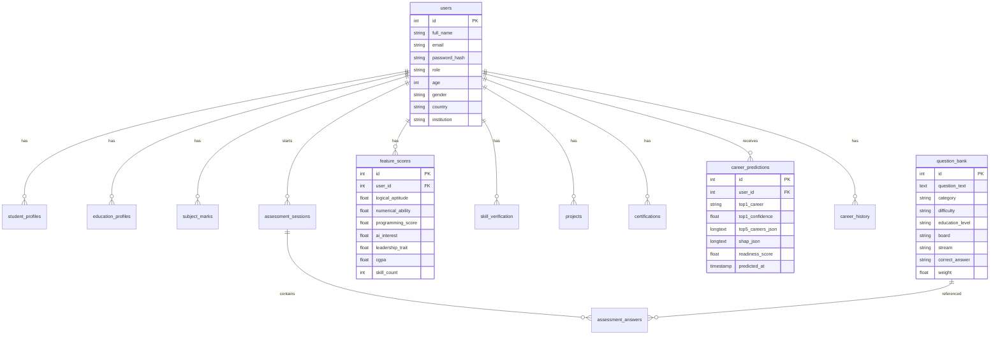

# 🚀 AI Career Recommendation System

> An intelligent, full-stack platform that leverages Machine Learning to recommend highly personalized career paths based on a student's academic performance, psychometric traits, technical skills, and domain interests — with transparent AI explainability via SHAP.

<div align="center">


</div>

---

## 📋 Table of Contents

- [Overview](#-overview)
- [Key Features](#-key-features)
- [Tech Stack](#%EF%B8%8F-tech-stack)
- [System Architecture](#-system-architecture)
- [Project Structure](#-project-structure)
- [Database Schema](#%EF%B8%8F-database-schema)
- [API Reference](#-api-reference)
- [ML Pipeline](#-machine-learning-pipeline)
- [Frontend Pages](#%EF%B8%8F-frontend-pages)
- [Getting Started](#-getting-started)
- [Environment Variables](#-environment-variables)
- [Default Credentials](#-default-credentials)
- [Contributing](#-contributing)
- [License](#-license)

---

## 🧩 Overview

The **AI Career Recommendation System** is a full-stack web application designed to guide students across all education levels — from Class 7 to Postgraduate — towards the most suitable career paths. It combines a dynamic aptitude assessment engine, psychometric profiling, skill verification, and a trained XGBoost ML model to generate personalized top-5 career recommendations along with detailed SHAP-based explanations of *why* each career was recommended.

The system is fully self-contained: it features a pure HTML/CSS/JS frontend, a Flask REST API backend, a normalized 15-table MySQL database, and a pre-trained ML pipeline. Both the **frontend and backend are served from a single command** — `python app.py` — run from the project root.

---

## ✨ Key Features

| Feature | Description |
|---|---|
| 🧠 **XGBoost ML Engine** | Trained on 61 features (demographics, psychometrics, academics, skills) to predict top-5 career matches with high accuracy |
| 📊 **SHAP Explainability (XAI)** | Reveals exactly *which* skills, traits, or academic scores drove each career recommendation |
| 🛡️ **Fallback Prediction Mode** | If ML artifacts fail to load, the backend gracefully switches to a heuristic engine so the UI never breaks |
| 📝 **Dynamic Assessment Engine** | Adaptive question bank (200+ questions) filtered by education level, stream, board, and degree |
| 🎓 **Multi-Level Education Support** | Supports Class 7–12 (All Boards), Undergraduate (BTech/BSc/BCA etc.), and Postgraduate levels |
| 📈 **Comprehensive Dashboard** | Visualizes career readiness score, confidence charts, SHAP explanations, and learning roadmaps |
| 👤 **Student Profile System** | Collects academic history, skills, certifications, projects, and interests in a structured wizard |
| 🔄 **Prediction History** | Stores and displays all past assessment results with career trends over time |
| 🔒 **JWT Authentication** | Secure login/register with token-based auth and role-based access control (Student / Admin) |
| 🛠️ **Admin Portal** | Full admin dashboard with user management, question bank CRUD, and analytics |
| 🌗 **Dark/Light Mode** | System-wide theme toggle with persisted preference |
| ⚡ **Single Command Launch** | Both frontend and backend start with `python app.py` from the project root |

---

## 🛠️ Tech Stack

### 🖥️ Frontend (Client-Side)

| Technology | Purpose |
|---|---|
| HTML5 | Page structure and semantic markup |
| Vanilla JavaScript | Client-side logic, DOM manipulation, API fetching |
| Vanilla CSS | Custom design system and tokens (no frameworks) |

### ⚙️ Backend (Server-Side)

| Technology | Version | Purpose |
|---|---|---|
| Python | 3.10+ | Core runtime |
| Flask | 3.1.3 | REST API framework and static file server |
| Flask-CORS | 6.x | Cross-origin request handling |
| PyJWT | 2.13.0 | JWT token generation and validation |
| Werkzeug | 3.1.8 | Password hashing |
| mysql-connector-python | 26.7.0 | MySQL connection pooling |
| python-dotenv | 1.2.2 | Environment variable management |

### 🤖 Machine Learning Pipeline

| Technology | Version | Purpose |
|---|---|---|
| XGBoost | 3.3.0 | Primary classification model |
| LightGBM | 4.7.0 | Ensemble component |
| CatBoost | 1.2.10 | Ensemble component |
| Scikit-Learn | 1.9.0 | Encoding, scaling, preprocessing |
| SHAP | >=0.46.0 | Explainable AI feature importances |
| Pandas | 3.x | Data manipulation |
| NumPy | 2.x | Numerical computation |

### 🗄️ Database

| Technology | Version | Purpose |
|---|---|---|
| MySQL | 8.0+ | Relational database (15 normalized tables) |

---

## 🏗️ System Architecture

```mermaid
graph TD
    subgraph Client ["Browser"]
        UI[Assessment Wizard] -->|Collects 61 Features| APIClient[Fetch / JS Client]
        Dashboard[Dashboard Page] -->|Displays Results| APIClient
    end

    subgraph Server ["Flask Server :5000  -  python app.py"]
        APIClient -->|JSON POST /api/assessment/submit| Auth[JWT Middleware]
        Auth --> Controller[Feature Extraction and Preprocessing]
        APIClient -->|GET /api/dashboard| DashCtrl[Dashboard Controller]
        APIClient -->|POST /api/auth/login| AuthCtrl[Auth Controller]
        Server -->|Serves static files| Static["frontend/dist/ HTML/CSS/JS"]
    end

    subgraph ML ["Machine Learning Engine"]
        Controller --> Preprocessor[Data Preprocessing]
        Preprocessor -->|OrdinalEncoder| Cat[Categorical Features]
        Preprocessor -->|StandardScaler| Num[Numerical Features]
        Cat & Num --> Model[XGBoost Classifier]
        Model --> Output["Top-5 Predictions + Confidence"]
        Model --> SHAP[SHAP Explainer]
        SHAP --> Explanations[Feature Importances JSON]
    end

    subgraph DB ["MySQL - 15 Normalized Tables"]
        Controller <-->|career_predictions| Pred[(Predictions Table)]
        DashCtrl <-->|users, feature_scores| Users[(Users and Scores)]
    end

    Controller -->|"If ML artifacts fail"| Fallback[Heuristic Mock Engine]
    Fallback --> Output
    Output & Explanations -->|JSON 200 OK| Dashboard
```

---

## 📂 Project Structure

```text
Career_Recommendation_System/
|
|-- app.py                          # ROOT LAUNCHER - run this to start everything
|
|-- backend/
|   |-- app.py                      # Core Flask app - all routes, ML inference, DB logic
|   |-- career_system_db.sql        # Complete SQL schema for the 15-table database
|   |-- requirements.txt            # Python package dependencies (pinned versions)
|   |-- .env                        # Environment config - NOT committed to git
|   |-- core/
|   |   `-- db_config.py            # Database configuration helper
|   `-- models/                     # Trained ML artifacts (loaded at server startup)
|       |-- career_model.pkl            # Trained XGBoost / Ensemble model
|       |-- label_encoder.pkl           # LabelEncoder for target class (career names)
|       |-- ordinal_encoder.pkl         # OrdinalEncoder for categorical input features
|       |-- scaler.pkl                  # StandardScaler for numeric input features
|       |-- feature_columns.pkl         # Ordered list of all 61 feature column names
|       |-- cat_feature_names.pkl       # List of categorical feature names
|       |-- numeric_feature_names.pkl   # List of numeric feature names
|       |-- model_type.pkl              # String identifier of the model type
|       |-- shap_explainer.pkl          # Pre-computed SHAP TreeExplainer
|       `-- career_dataset.csv          # Training dataset
|
|-- frontend/
|   `-- dist/                       # Served as static files by Flask
|       |-- index.html              # Home page
|       |-- login.html              # Login page
|       |-- register.html           # Registration page
|       |-- dashboard.html          # Career Dashboard
|       |-- assessment.html         # 8-step assessment wizard
|       |-- test.html               # Dynamic skill verification test
|       |-- history.html            # Assessment history
|       |-- settings.html           # User settings
|       |-- admin.html              # Admin portal
|       |-- admin-login.html        # Admin login
|       |-- css/
|       |   `-- style.css           # Global design system and theme
|       `-- js/
|           |-- app.js              # Shared utilities (Auth, Theme, API)
|           |-- home.js             # Home page logic
|           |-- dashboard.js        # Dashboard logic
|           |-- assessment.js       # Assessment wizard logic
|           |-- history.js          # History page logic
|           |-- settings.js         # Settings logic
|           `-- admin.js            # Admin panel logic
|
|-- .gitattributes                  # Git line ending configuration
`-- README.md                       # This file
```

---

## 🗄️ Database Schema

The system uses a **fully normalized 15-table MySQL schema**. All tables are auto-created on first backend startup via `init_db()`.

### Table Summary

| # | Table | Purpose |
|---|---|---|
| 1 | `users` | Core user accounts (students and admins) |
| 2 | `student_profiles` | Extended bio, LinkedIn, GitHub, portfolio |
| 3 | `education_profiles` | Degree, board, stream, CGPA, attendance |
| 4 | `subject_marks` | Per-subject marks by semester |
| 5 | `question_bank` | 200+ adaptive MCQ questions |
| 6 | `assessment_sessions` | Assessment session tracking |
| 7 | `assessment_answers` | Per-question answers with correctness |
| 8 | `feature_scores` | Computed 61-feature vector for ML input |
| 9 | `skills` | Master skill catalog |
| 10 | `skill_verification` | Per-student skill levels and verification |
| 11 | `projects` | Student projects portfolio |
| 12 | `certifications` | Student certifications |
| 13 | `career_predictions` | ML output - top-5 careers + SHAP JSON |
| 14 | `career_history` | Historical prediction timeline |
| 15 | `roadmaps` | Career-specific learning roadmaps |

### Entity Relationships



---

## 📡 API Reference

**Base URL:** `http://localhost:5000`
**Authentication:** `Authorization: Bearer <JWT_TOKEN>` header

### 🔐 Auth Endpoints

| Method | Endpoint | Auth | Description |
|---|---|---|---|
| `GET` | `/api/health` | None | Health check - returns server and ML status |
| `POST` | `/api/auth/register` | None | Register a new student account |
| `POST` | `/api/auth/login` | None | Login and receive a JWT token |

#### POST `/api/auth/register`
```json
{
  "full_name": "John Doe",
  "email": "john@example.com",
  "password": "StrongPass@123",
  "phone": "9876543210",
  "age": 21,
  "gender": "Male",
  "country": "India",
  "state": "Tamil Nadu",
  "institution": "Anna University"
}
```

#### POST `/api/auth/login`
```json
{ "email": "john@example.com", "password": "StrongPass@123" }
```
**Response:**
```json
{
  "status": "success",
  "token": "<JWT>",
  "user": { "id": 1, "full_name": "John Doe", "role": "student" }
}
```

---

### 👤 User Endpoints

| Method | Endpoint | Auth | Description |
|---|---|---|---|
| `GET` | `/api/user/profile` | Student JWT | Get current user's full profile |
| `PUT` | `/api/user/profile` | Student JWT | Update profile fields |
| `GET` | `/api/dashboard` | Student JWT | Get prediction results, roadmap and SHAP data |
| `GET` | `/api/history` | Student JWT | Get list of past career predictions |

---

### 📝 Assessment Endpoints

| Method | Endpoint | Auth | Description |
|---|---|---|---|
| `GET` | `/api/questions` | None | Fetch filtered questions by education level, stream, board |
| `POST` | `/api/assessment/submit` | Optional JWT | Submit assessment - triggers ML prediction - returns dashboard data |

#### GET `/api/questions` — Query Parameters

| Parameter | Type | Example | Description |
|---|---|---|---|
| `education_level` | string | `Undergraduate` | Education level filter |
| `stream` | string | `Science` | Stream filter (Higher Secondary) |
| `board` | string | `CBSE` | Board filter |
| `degree` | string | `BTech` | Degree filter |
| `specialization` | string | `Computer Science` | Specialization filter |
| `limit` | int | `20` | Max questions to return (default: 20) |

#### POST `/api/assessment/submit` — Request Body
```json
{
  "education_level": "Undergraduate",
  "degree": "BTech",
  "specialization": "Computer Science",
  "cgpa": 8.5,
  "attendance": 85,
  "semester_marks": 78,
  "psychometric_traits": {
    "leadership": 4,
    "teamwork": 5,
    "curiosity": 5,
    "creativity": 3
  },
  "interest_scores": {
    "ai_interest": 5,
    "technology_interest": 5,
    "business_interest": 2
  },
  "skill_scores": { "Python": 4, "Machine Learning": 3 },
  "certifications": ["AWS Certified", "Google Data Analytics"],
  "projects": ["ML Sentiment Analysis"]
}
```

**Response:**
```json
{
  "status": "success",
  "top_career": "Data Scientist",
  "top5": [
    { "career": "Data Scientist", "confidence": 0.87 },
    { "career": "ML Engineer", "confidence": 0.76 }
  ],
  "readiness_score": 82.4,
  "shap_top_features": [
    { "feature": "AI Interest", "value": 0.34 },
    { "feature": "Programming Score", "value": 0.28 }
  ],
  "roadmap": {}
}
```

---

### 🛡️ Admin Endpoints

> All admin endpoints require an **Admin JWT** token.

| Method | Endpoint | Description |
|---|---|---|
| `GET` | `/api/admin/users` | List all registered users |
| `PUT` | `/api/admin/users/<uid>/role` | Promote/demote user role |
| `DELETE` | `/api/admin/users/<uid>` | Delete a user account |
| `GET` | `/api/admin/questions` | List all questions in question bank |
| `POST` | `/api/admin/questions` | Add a new question |
| `PUT` | `/api/admin/questions/<qid>` | Edit an existing question |
| `DELETE` | `/api/admin/questions/<qid>` | Soft-delete a question |
| `GET` | `/api/admin/analytics` | Platform analytics (students, assessments, top careers, daily trend) |

---

## 🤖 Machine Learning Pipeline

### Feature Engineering (61 Features)

| Category | Examples | Count |
|---|---|---|
| **Demographics** | Age, Gender, Country, State | 4 |
| **Academics** | CGPA, Attendance %, Semester Marks | 3 |
| **Education Context** | Education Level, Board, Stream, Degree, Specialization | 5 |
| **Aptitude Scores** | Logical, Numerical, Verbal, Spatial | 4 |
| **Psychometric Traits** | Leadership, Teamwork, Communication, Resilience, Curiosity, Creativity, Problem Solving, Adaptability | 8 |
| **Interest Scores** | AI, Technology, Healthcare, Business, Arts, Research, Education, Engineering, Law, Environment | 10 |
| **Skills and Experience** | Programming, Science, Business, Creative, Medical scores; Skill count, Cert count | 7 |
| **Certifications and Projects** | Certification score, Project score, Internship score, Skill verified score | 4 |
| **Computed Scores** | Academic score, Career readiness composite | 2+ |

### Inference Flow

```
Raw JSON Payload (Assessment)
         ↓
   Feature Extraction
  (61-feature dict → Pandas DataFrame)
         ↓
  Categorical Features → OrdinalEncoder
  Numerical Features   → StandardScaler
         ↓
       XGBoost Classifier
      predict_proba()
         ↓
  Top-5 Classes + Confidence Scores
         ↓
    SHAP TreeExplainer
  (Per-feature contribution values)
         ↓
  Store in career_predictions table
         ↓
  Return JSON to Frontend Dashboard
```

### Fallback Mode

If `career_model.pkl` or any artifact fails to load at startup (e.g., Python version mismatch), the backend automatically activates a **heuristic-based Mock Prediction Engine** that:
- Uses weighted interest scores and skill scores to rank careers
- Returns the same JSON structure as the real ML model
- Ensures the frontend Dashboard always renders correctly

---

## 🖥️ Frontend Pages

| Route | Page | Auth Required | Description |
|---|---|---|---|
| `/` or `/index.html` | Home | No | Landing page - features, how it works, CTA |
| `/register.html` | Register | No | New student registration |
| `/login.html` | Login | No | Student login |
| `/admin-login.html` | Admin Login | No | Admin portal login |
| `/assessment.html` | Assessment | Yes | Multi-step wizard collecting all 61 features |
| `/test.html` | Dynamic Test | Yes | Adaptive MCQ aptitude test |
| `/dashboard.html` | Dashboard | Yes | ML results, SHAP chart, career roadmap |
| `/history.html` | History | Yes | Past predictions timeline |
| `/settings.html` | User Settings | Yes | Profile and account settings |
| `/admin.html` | Admin Portal | Admin only | User management, question bank, analytics |

---

## 🚀 Getting Started

### Prerequisites

- **Python** v3.10+ — [Download](https://www.python.org/downloads/)
- **MySQL Server** v8.0+ — [Download](https://dev.mysql.com/downloads/)
- **Git** — [Download](https://git-scm.com/)

> **Node.js is NOT required** — the frontend is pure HTML/CSS/JS served directly by Flask.

---

### Step 1 — Clone the Repository

```bash
git clone https://github.com/your-username/Career_Recommendation_System.git
cd Career_Recommendation_System
```

---

### Step 2 — Database Setup

1. Start your local MySQL server.
2. Open MySQL shell and create the database:
   ```sql
   CREATE DATABASE career_system_db;
   ```
3. *(Optional)* Import the provided schema dump:
   ```bash
   mysql -u root -p career_system_db < backend/career_system_db.sql
   ```
   > **Note:** All 15 tables are auto-created on first startup via `init_db()`, so importing the SQL dump is optional.

---

### Step 3 — Python Environment Setup

```bash
# Navigate to the backend directory to create the virtual environment
cd backend

# Create a virtual environment
python -m venv venv

# Activate the virtual environment
# Windows:
.\venv\Scripts\activate
# macOS / Linux:
source venv/bin/activate

# Install all Python dependencies
pip install -r requirements.txt

# Return to the project root
cd ..
```

---

### Step 4 — Configure Environment Variables

Create a `.env` file inside the `backend/` directory:

```env
DB_HOST=localhost
DB_USER=root
DB_PASSWORD=your_mysql_password
DB_NAME=career_system_db
JWT_SECRET=career_super_secret_key_2026
```

---

### Step 5 — Start the Application

Run **one command** from the **project root**:

```bash
python app.py
```

The root `app.py` launcher will:
- Set up the correct Python path and working directory
- Initialise the database (create all 15 tables and seed the admin account)
- Load all ML artifacts from `backend/models/`
- Start the Flask server which serves **both the API and the frontend**

Expected output:

```
============================================================
  AI Career Recommendation System
  Starting server...
============================================================
[OK] Database initialised.

  ✅  Frontend + Backend running at: http://127.0.0.1:5000
  ✅  API health check:              http://127.0.0.1:5000/api/health
  Press CTRL+C to stop.
```

Open **`http://127.0.0.1:5000`** in your browser to use the system.

---

### Step 6 — Verify Setup

Check the backend health endpoint:

```
GET http://localhost:5000/api/health
```

Expected response:
```json
{
  "status": "ok",
  "ml_loaded": true,
  "message": "Career Recommendation System API is running"
}
```

---

## 🔐 Environment Variables

Create a `.env` file inside the `backend/` directory:

```env
# MySQL Database
DB_HOST=localhost
DB_USER=root
DB_PASSWORD=your_mysql_password
DB_NAME=career_system_db

# JWT Authentication
JWT_SECRET=career_super_secret_key_2026
```

| Variable | Description | Default |
|---|---|---|
| `DB_HOST` | MySQL server host | `localhost` |
| `DB_USER` | MySQL username | `root` |
| `DB_PASSWORD` | MySQL password | *(required)* |
| `DB_NAME` | MySQL database name | `career_system_db` |
| `JWT_SECRET` | Secret key for signing JWT tokens | `career_super_secret_key_2026` |

> Warning: Never commit your `.env` file to version control. It is already listed in `.gitignore`.

---

## 🔑 Default Credentials

The backend seeds a default admin account on first startup:

| Role | Email | Password |
|---|---|---|
| **Admin** | `admin@gmail.com` | `Admin@123` |

> Change this password immediately after your first login in a production environment.

---

## 🧑‍💻 Development Reference

### Running the Application

```bash
# From the project root (recommended) - starts everything in one command
python app.py

# Alternatively, run the backend directly (from backend/ with venv active)
cd backend
python app.py
```

### Frontend Development

No build step is required. The frontend is pure HTML, CSS, and JS.
Edit files in `frontend/dist/` directly and refresh your browser to see changes instantly.

### Updating Python Dependencies

```bash
cd backend
# Install a new package
pip install <package-name>
# Save updated dependencies
pip freeze > requirements.txt
```

---

## 🤝 Contributing

1. Fork the repository
2. Create your feature branch: `git checkout -b feature/your-feature-name`
3. Commit your changes: `git commit -m 'feat: add your feature'`
4. Push to the branch: `git push origin feature/your-feature-name`
5. Open a Pull Request

### Commit Convention

| Prefix | Usage |
|---|---|
| `feat:` | New feature |
| `fix:` | Bug fix |
| `docs:` | Documentation changes |
| `refactor:` | Code restructuring |
| `chore:` | Build process or tooling changes |

---

## 📄 License

This project is licensed under the **MIT License** — see the [LICENSE](LICENSE) file for details.

---

<div align="center">
Made with ❤️ | AI Career Recommendation System
</div>