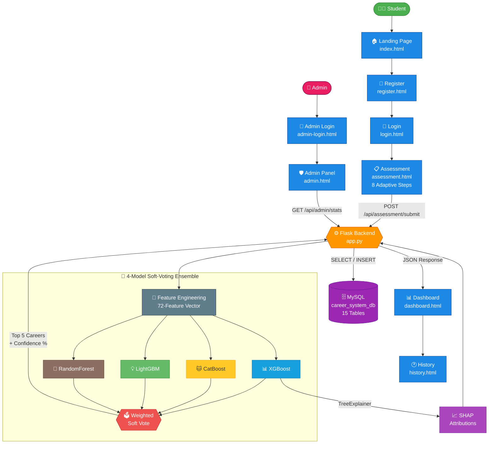
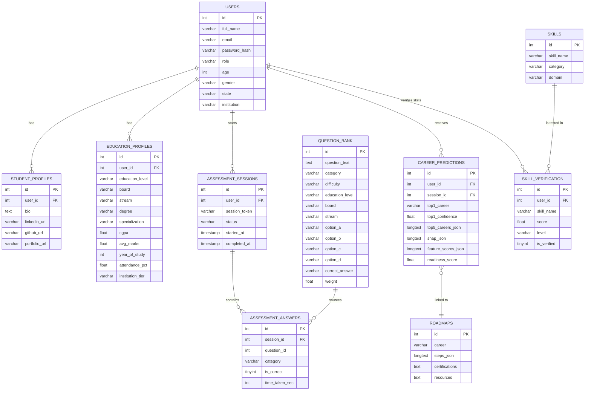
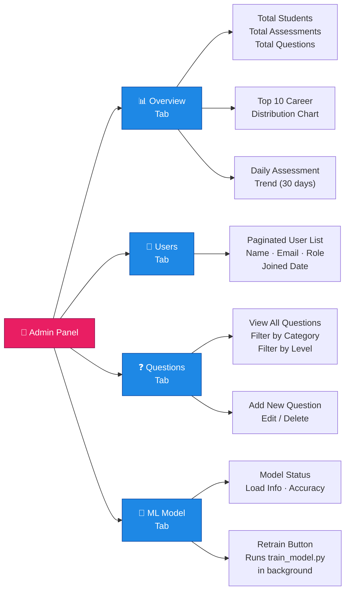

<div align="center">

<h1>🎓 CareerAI — Personalized Career Recommendation System</h1>
<p><b>An intelligent, full-stack AI career guidance platform delivering personalized Top-5 career predictions<br>through adaptive multi-step assessments, a 4-model ML ensemble, and SHAP explainability.</b></p>

<p>
  
  
  
  
  
  
  
</p>

<p>
  
  
  
  
  
  
  
</p>

<p>
  
  
  
  
  
</p>

</div>

---

## 📌 Table of Contents

| # | Section |
|---|---|
| 1 | [Project Overview](#-project-overview) |
| 2 | [System Architecture](#-system-architecture) |
| 3 | [Frontend — All Pages](#-frontend--all-pages) |
| 4 | [Assessment Flow](#-assessment-flow-diagram) |
| 5 | [ML Architecture & Features](#-ml-architecture--72-features) |
| 6 | [Education Level Adaptations](#-education-level-adaptations) |
| 7 | [Database Schema](#-database-schema) |
| 8 | [Backend & API Reference](#-backend--api-reference) |
| 9 | [Admin Panel](#-admin-panel) |
| 10 | [Supported Careers (30)](#-supported-careers-30) |
| 11 | [Setup & Installation](#-setup--installation) |
| 12 | [Prediction Tips](#-tips-for-90-confidence) |

---

## 🔍 Project Overview

**CareerAI** is a full-stack AI-powered web application that helps students from **Class 7 through Postgraduate** discover the most suitable career for them. The system works in three major phases:

```
Phase 1: ASSESS → Student completes an 8-step adaptive assessment (academic, aptitude, psychometric, interests, skills)
Phase 2: PREDICT → 72-feature vector is passed through XGBoost + CatBoost + LightGBM + RandomForest ensemble
Phase 3: EXPLAIN → SHAP values computed live and displayed as feature attribution bar chart on dashboard
```

### What makes it unique?
- 🏫 **Board-aware**: Subjects auto-load by board — Kerala (10), CBSE (5), ICSE (6)
- 🎓 **School-adaptive**: Steps 7 & 8 auto-skip for Class 7–10; CGPA auto-derived from marks
- 🧠 **Age-derived**: Class level maps to realistic age (Class 7=12yrs, Class 10=15yrs, etc.)
- 🎯 **53 skill quizzes**: Each skill is quiz-verified, not self-rated
- 📈 **SHAP explainability**: Students see *why* each career was recommended

---

## 🏗 System Architecture



---

## 🖥 Frontend — All Pages

The app is branded as **CareerAI** and uses a premium dark-mode design system with glassmorphism, gradient text, and smooth animations.

### 1. 🏠 Landing Page (`index.html`)
The public-facing marketing page. Fully dynamic via `home.js`.

**Sections:**
| Section | Content |
|---|---|
| **Hero** | Tagline, "Start Free Assessment" CTA, live preview of sample results (Tech/Business/Healthcare/Creative profiles) |
| **Stats Strip** | 272 Careers · 9 Stages · 40K+ Records Trained · 10 min assessment |
| **How It Works** | 3-step process: Tell Us → Take Assessment → Get Career Report |
| **What You Get** | Feature cards — Top 5 careers, salary, roadmap, SHAP explanation |
| **Career Domains** | Cards for every domain: Technology, Healthcare, Business, Engineering, Arts, Law, etc. |
| **Assessment Pipeline** | Visual pipeline of all 9 steps with descriptions |
| **Who Is It For** | Eligibility cards: Class 7–10, Class 11–12, UG, PG, Diploma |
| **Student Reviews** | Testimonials from different education levels |
| **FAQ** | Common questions accordion |
| **CTA** | Final call-to-action to start assessment |

### 2. 📝 Register Page (`register.html`)
New student registration.

**Fields**: Full Name · Email · Password · Confirm Password  
**Auth**: JWT token stored in localStorage on success  
**Redirect**: → Assessment page after registration

### 3. 🔑 Login Page (`login.html`)
Existing student login.

**Fields**: Email · Password  
**Auth**: JWT issued by `/api/auth/login`  
**Redirect**: → Assessment if no results, → Dashboard if results exist

### 4. 📋 Assessment Page (`assessment.html`) — *Core Feature*
The 8-step adaptive assessment form. Powered entirely by `assessment.js` (~143 KB).

**See detailed Assessment Flow diagram below.**

### 5. 📊 Dashboard Page (`dashboard.html`)
Displays the AI prediction results after assessment completion. Rendered dynamically by `dashboard.js`.

**Sections:**
| Widget | Content |
|---|---|
| **Welcome Banner** | Personalized greeting with student name |
| **Metric Cards (4)** | Career Readiness Score · Top Career Match · Skills Verified · Assessments Taken |
| **AI Career Matches** | Top 5 careers — each with: Rank · Name · Confidence % · Progress bar · Salary · Degree · Companies · Growth % |
| **SHAP Chart** | Feature attribution bar chart (why this career?) |
| **Learning Roadmap** | 4-step personalized action plan: Strengthen Skills → Certifications → Projects → Apply |

### 6. 🕐 History Page (`history.html`)
All past assessment sessions with trend charts. Powered by `history.js`.

**Content**: Assessment session list with dates, top career per session, confidence scores, trend line chart over time.

### 7. ⚙️ Settings Page (`settings.html`)
Profile update page. Powered by `settings.js`.

**Fields**: Full Name · Phone · Gender · State · District · Institution · Language  
**Actions**: Update Profile · Change Password

### 8. 🔐 Admin Login (`admin-login.html`)
Separate login page for admin users only.

### 9. 🛡️ Admin Panel (`admin.html`)
Full administration dashboard. Powered by `admin.js`.

**See Admin Panel section below for full details.**

---

## 📝 Assessment Flow Diagram

```mermaid
flowchart TD
    START(["🚀 Student Opens\nassessment.html"]) --> S1

    S1["📚 STEP 1\nEducation Profile\n• Education Level\n• Board (Kerala/CBSE/ICSE)\n• Stream (for 11-12 / UG)\n• Degree & Specialization (UG/PG)"] --> S2

    S2["📊 STEP 2\nSubject Marks\n• Auto-loaded by Board\nKerala State: 10 subjects\nCBSE: 5 subjects\nICBSE: 6 subjects\n• Enter marks 0-100 + Grade"] --> S3

    S3["🧮 STEP 3\nAptitude Quiz\n• 10 MCQ questions\n• Class 7-10: Easy/Medium\n• Class 11-12: Medium/Hard\n• UG/PG: Hard"] --> S4

    S4["🧠 STEP 4\nPsychometric Scenarios\n• 6 situational questions\n• School / College / Professional banks\n• Maps to 15 personality traits"] --> S5

    S5["🎯 STEP 5\nCareer Interest Profiling\n• 20+ forced-choice pairs\n• 10 career domains\n• Technology / Healthcare / Business\n• Arts / Research / Law / Engineering"] --> S6

    S6["🛠️ STEP 6\nSkill Verification\n• 53 skills available\n• 3-question quiz per skill\n• Beginner / Intermediate / Advanced\n• Feeds Subject_Knowledge_Score"] --> BRANCH

    BRANCH{Education\nLevel?}

    BRANCH -->|"Class 7–10"| SKIP["⏭️ Steps 7 & 8 SKIPPED\nDefaults auto-injected:\n• CGPA = avg_marks ÷ 10\n• Attendance = 85%\n• project_score = 0\n• cert_count = 0"]
    BRANCH -->|"Class 11–12"| S7A["🏅 STEP 7\nAchievements\n• Olympiad medals\n• School awards\n• Online courses"]
    BRANCH -->|"UG / PG"| S7B["📜 STEP 7\nCertifications\n• AWS / Google / Microsoft\n• NPTEL / Coursera / edX"]

    SKIP --> SUBMIT
    S7A --> S8A["🔬 STEP 8\nSchool Projects\n• Science fair entries\n• Club activities\n• Hobby projects"]
    S7B --> S8B["💼 STEP 8\nProjects & Portfolio\n• GitHub projects\n• Internship work\n• Research papers"]

    S8A --> SUBMIT
    S8B --> SUBMIT

    SUBMIT["🚀 POST /api/assessment/submit\nPayload: all 8 steps data"] --> ML

    ML["🤖 ML Ensemble\nBuild 72-feature vector\nXGBoost + CatBoost + LightGBM + RF\nSoft Voting → Top-5 Careers\nSHAP → Feature Attributions"] --> RESULT

    RESULT(["🏆 Dashboard\nTop 5 Careers + Confidence %\nSHAP Chart\nSalary / Degree / Companies\nLearning Roadmap"])

    style START fill:#4CAF50,color:white,stroke:#2E7D32
    style RESULT fill:#E91E63,color:white,stroke:#880E4F
    style BRANCH fill:#FF9800,color:white,stroke:#E65100
    style SKIP fill:#F44336,color:white,stroke:#B71C1C
    style SUBMIT fill:#9C27B0,color:white,stroke:#6A1B9A
    style ML fill:#1565C0,color:white,stroke:#0D47A1
    style S1 fill:#1E88E5,color:white,stroke:#0D47A1
    style S2 fill:#1E88E5,color:white,stroke:#0D47A1
    style S3 fill:#1E88E5,color:white,stroke:#0D47A1
    style S4 fill:#1E88E5,color:white,stroke:#0D47A1
    style S5 fill:#1E88E5,color:white,stroke:#0D47A1
    style S6 fill:#1E88E5,color:white,stroke:#0D47A1
    style S7A fill:#7B1FA2,color:white,stroke:#4A148C
    style S7B fill:#7B1FA2,color:white,stroke:#4A148C
    style S8A fill:#7B1FA2,color:white,stroke:#4A148C
    style S8B fill:#7B1FA2,color:white,stroke:#4A148C
```



---

## 🤖 ML Architecture & 72 Features

### Ensemble Prediction Formula

```
Final_Probability = (w₁ × P_XGB) + (w₂ × P_CatBoost) + (w₃ × P_LightGBM) + (w₄ × P_RF)
Confidence_%      = max(Final_Probability) × 100
Top_Career        = argmax(Final_Probability)
```
Weights are pre-computed from validation accuracy and stored in `ensemble_weights.pkl`.

### ML Model Files (`backend/models/`)

| File | Purpose | Size |
|---|---|---|
| `career_model.pkl` | XGBoost base model | ~9 MB |
| `catboost_model.pkl` | CatBoost classifier | ~8.5 MB |
| `lgbm_model.pkl` | LightGBM model | ~9.6 MB |
| `rf_model.pkl` | Random Forest | ~165 MB |
| `label_encoder.pkl` | Encodes 30 career class names | tiny |
| `preprocessor.pkl` | ColumnTransformer (scale + encode) | tiny |
| `feature_columns.pkl` | Ordered list of 72 feature names | 3 KB |
| `ensemble_weights.pkl` | [w_xgb, w_cb, w_lgb, w_rf] | tiny |
| `career_dataset.csv` | Training dataset | ~12 MB |

### Complete 72-Feature Vector

| # | Category | Features | Count |
|---|---|---|---|
| 1 | 📚 **Academic** | CGPA, Avg Marks, Semester Marks, Internal Marks, Practical Marks, Lab Score, Assignment Score | 7 |
| 2 | 🧮 **Aptitude** | Logical Reasoning, Numerical Ability, Verbal Ability, Spatial Ability | 4 |
| 3 | 🧠 **Psychometric** | Leadership, Teamwork, Communication, Creativity, Problem Solving, Critical Thinking, Adaptability, Decision Making, Time Management, Curiosity, Analytical, Stress Management, Self Learning, Persistence, Confidence | 15 |
| 4 | 🎯 **Career Interest** | Technology, Healthcare, Business, Arts/Creative, Research, Education, Engineering, Law, Environment, Social Service | 10 |
| 5 | 🛠️ **Skills** | Num_Technical_Skills, Subject_Knowledge_Score (weighted quiz scores) | 2 |
| 6 | 🏅 **Activities** | Num_Projects, Num_Certifications, Internships, Hackathons, Research Experience, Competitions, Volunteer | 7 |
| 7 | ⚗️ **Engineered** | STEM signal, Health signal, Biz signal, Creative signal, Research signal, Activity richness, Soft composite, Weighted Academic, Interest spread, Dominant Interest, Total Aptitude | 11 |
| 8 | 👤 **Demographics** | Age (class-derived for school students), Year of Study | 2 |
| 9 | 📈 **Derived** | Readiness Score, Activity Score, Soft Skill Score, Academic Composite | 4 |
| 10 | 📋 **Other** | Attendance %, Skill Verified Score, Programming Score | 3 |
| | | **TOTAL** | **72** |

### School-Level Auto-Defaults (Backend)

When a Class 7–10 student submits, the backend auto-injects:

| Feature | School Default | Logic |
|---|---|---|
| `cgpa` | Derived | `avg_marks ÷ 10` (e.g. 85 marks → 8.5 CGPA) |
| `attendance_pct` | `85.0` | Auto-set; not collected from school students |
| `project_score` | `0` | Steps 7 & 8 skipped |
| `cert_count` | `0` | Steps 7 & 8 skipped |
| `age` | Class-derived | Class 7→12, Class 8→13, ..., Class 12→17 |
| `year_of_study` | Class-derived | Class 7→1, Class 8→2, ..., Class 12→6 |

---

## 🏫 Education Level Adaptations

| Level | Aptitude | Psychometric Bank | Subjects Shown | Steps 7–8 | CGPA | Attendance | Age Default |
|---|---|---|---|---|---|---|---|
| **Class 7** | Easy | School | Board-based | 🛑 Skipped | Hidden (auto) | Hidden (85%) | 12 |
| **Class 8** | Easy | School | Board-based | 🛑 Skipped | Hidden (auto) | Hidden (85%) | 13 |
| **Class 9** | Medium | School | Board-based | 🛑 Skipped | Hidden (auto) | Hidden (85%) | 14 |
| **Class 10** | Medium | School | Kerala:10 / CBSE:5 | 🛑 Skipped | Hidden (auto) | Hidden (85%) | 15 |
| **Class 11–12** | Medium-Hard | Teen | Stream-based | 🔄 Adapted | Hidden (auto) | Hidden (85%) | 17 |
| **Diploma / ITI** | Medium | College | Trade-based | ✅ Visible | ✅ Visible | ✅ Visible | 19 |
| **Undergraduate** | Hard | Professional | Degree-based | ✅ Visible | ✅ Visible | ✅ Visible | 21 |
| **Postgraduate** | Hard | Research | Specialization | ✅ Visible | ✅ Visible | ✅ Visible | 23 |
| **Professional** | Hard | Executive | Domain | ✅ Visible | ✅ Visible | ✅ Visible | 24 |

---

## 🗃 Database Schema

The project uses **15 normalized tables** in MySQL database `career_system_db`.

### Entity-Relationship Diagram



### All 15 Tables

| # | Table | Rows (typical) | Purpose |
|---|---|---|---|
| 1 | `users` | 1 per user | Auth, demographics, role (student / admin) |
| 2 | `student_profiles` | 1 per user | Bio, social links (LinkedIn, GitHub, portfolio) |
| 3 | `education_profiles` | 1 per user | Board, stream, degree, CGPA, avg_marks, year_of_study |
| 4 | `subject_marks` | 5–10 per session | Individual subject marks per assessment |
| 5 | `question_bank` | 200+ seeded | MCQs filtered by education_level, board, stream, degree |
| 6 | `assessment_sessions` | 1+ per user | Session tracking — status (In Progress / Completed) |
| 7 | `assessment_answers` | 10 per session | Each MCQ answer with is_correct flag |
| 8 | `feature_scores` | 1 per session | Computed ML features (72 values) stored flat |
| 9 | `skills` | 53 seeded | Master catalogue of all 53 verifiable skills |
| 10 | `skill_verification` | N per user | Quiz-verified skill proficiency (Beginner/Intermediate/Advanced) |
| 11 | `projects` | 0–N per user | Portfolio projects (title, tech stack, GitHub link) |
| 12 | `certifications` | 0–N per user | Certifications and achievements |
| 13 | `career_predictions` | 1+ per user | ML output — top5 careers JSON, SHAP JSON, readiness score |
| 14 | `career_history` | 1+ per user | Log of all predictions (for dashboard trend chart) |
| 15 | `roadmaps` | 30 seeded | 8-step learning roadmaps per career with resources |

---

## 🔌 Backend & API Reference

The backend is a single Flask app (`backend/app.py`, ~1984 lines) serving:
- All REST API routes
- Static frontend files (`frontend/dist/`)
- MySQL connection pool (pool_size=5)
- ML ensemble (loaded at startup)

### Auth Endpoints

| Method | Endpoint | Auth | Description |
|---|---|---|---|
| `POST` | `/api/auth/register` | Public | Register student — hashes password, creates user + student_profile |
| `POST` | `/api/auth/login` | Public | Validate credentials → return JWT (24h expiry) |
| `GET` | `/api/auth/me` | JWT | Return current user info from token |

### Assessment Endpoints

| Method | Endpoint | Auth | Description |
|---|---|---|---|
| `GET` | `/api/questions` | Public | Adaptive MCQs — filter by `education_level`, `board`, `stream`, `degree`, `category`, `difficulty` |
| `POST` | `/api/assessment/submit` | JWT | Full assessment submission → builds 72-feature vector → ensemble predict → store results → return top5 + SHAP |
| `GET` | `/api/dashboard` | JWT | Fetch latest prediction + SHAP + feature scores + sessions |
| `GET` | `/api/history` | JWT | All past assessment sessions with top career per session |

### Skills & Profile

| Method | Endpoint | Auth | Description |
|---|---|---|---|
| `POST` | `/api/skills/verify` | JWT | Save a skill quiz result (skill_name, score, level) |
| `GET` | `/api/profile` | JWT | Get full user profile + education + skills |
| `PUT` | `/api/profile/update` | JWT | Update profile / education info |

### Admin Endpoints

| Method | Endpoint | Auth | Description |
|---|---|---|---|
| `GET` | `/api/admin/stats` | Admin JWT | System stats: total_students, total_assessments, total_questions, top_careers, daily_trend |
| `GET` | `/api/admin/analytics` | Admin JWT | Extended analytics |
| `GET` | `/api/admin/users` | Admin JWT | Paginated user list |
| `GET` | `/api/admin/questions` | Admin JWT | Paginated question bank |
| `POST` | `/api/admin/questions` | Admin JWT | Add new MCQ to question bank |
| `PUT` | `/api/admin/questions/:id` | Admin JWT | Edit existing question |
| `DELETE` | `/api/admin/questions/:id` | Admin JWT | Delete question |
| `POST` | `/api/admin/retrain` | Admin JWT | Trigger model retraining in background subprocess |

### System

| Method | Endpoint | Auth | Description |
|---|---|---|---|
| `GET` | `/api/health` | Public | DB connection status + ML model load status |

### `/api/assessment/submit` — Payload Structure

```json
{
  "education_level": "Undergraduate",
  "board": "CBSE",
  "stream": "Science",
  "degree": "BTech",
  "specialization": "Computer Science",
  "subject_marks": [{"subject": "Mathematics", "marks": 88, "grade": "A"}],
  "aptitude_answers": {"0": {"is_correct": true}, "1": {"is_correct": false}},
  "psychometric": {"leadership": 80, "teamwork": 75, "creativity": 90},
  "interests": {"technology": 95, "healthcare": 20, "business": 40},
  "skills": ["Python", "Machine Learning", "SQL & Databases"],
  "skill_scores": {"Python": {"score": 66, "level": "Intermediate"}},
  "certifications": [{"name": "AWS Cloud Practitioner", "provider": "Amazon"}],
  "projects": [{"title": "ML Price Predictor", "technology": "Python, sklearn"}],
  "cgpa": 8.5,
  "attendance_pct": 88,
  "avg_marks": 85,
  "year_of_study": 3,
  "age": 21
}
```

---

## 🛡️ Admin Panel

Access at `/admin.html` — requires admin JWT. Powered by `admin.js`.

### Admin Panel Tabs



**Default Admin Credentials:**
```
Email:    admin@gmail.com
Password: Admin@123
```

---

## 🏆 Supported Careers (30)

Each career comes with: 💰 Salary · 🎓 Required Degree · 🏢 Top Companies · 📈 Growth % · 📜 Certifications · 🗺️ 8-step Roadmap

<table>
<thead>
<tr><th>💻 Technology</th><th>💼 Business</th><th>🏥 Healthcare</th><th>⚙️ Engineering</th><th>🎓 Other</th></tr>
</thead>
<tbody>
<tr><td>Software Developer</td><td>Business Analyst</td><td>Doctor</td><td>Mechanical Engineer</td><td>School Teacher</td></tr>
<tr><td>Data Scientist</td><td>Entrepreneur</td><td>Nurse</td><td>Civil Engineer</td><td>Professor / Researcher</td></tr>
<tr><td>ML Engineer</td><td>Chartered Accountant</td><td>Pharmacist</td><td>Electrical Engineer</td><td>Lawyer</td></tr>
<tr><td>AI Engineer</td><td>Bank Manager</td><td>Biomedical Engineer</td><td>Agricultural Scientist</td><td>Architect</td></tr>
<tr><td>Full Stack Developer</td><td>Product Manager</td><td></td><td>Environmental Scientist</td><td>Animator</td></tr>
<tr><td>Data Analyst</td><td></td><td></td><td></td><td>Graphic Designer</td></tr>
<tr><td>Cyber Security Analyst</td><td></td><td></td><td></td><td>UI/UX Designer</td></tr>
<tr><td>Cloud Architect</td><td></td><td></td><td></td><td></td></tr>
</tbody>
</table>

---

## ⚙️ Setup & Installation

### Prerequisites
- Python **3.10+** · MySQL **8.x** · Git

### Step 1 — Clone

```bash
git clone https://github.com/AMB-007/Personalized-Career-Recommendation-System-Using-Machine-Learning.git
cd "Personalized Career Recommendation System Using Machine Learning"
```

### Step 2 — Database Setup

```bash
mysql -u root -p < backend/career_system_db.sql
```

> Creates `career_system_db` with all 15 tables · Seeds admin user · Seeds 30 career roadmaps · Seeds 53 skills

### Step 3 — Configure `.env`

```env
# backend/.env
DB_HOST=localhost
DB_USER=root
DB_PASSWORD=your_password
DB_NAME=career_system_db
JWT_SECRET=your_secret_key
```

### Step 4 — Python Environment

```bash
cd backend
python -m venv venv
venv\Scripts\activate          # Windows
# source venv/bin/activate    # Mac/Linux
pip install -r requirements.txt
```

### Step 5 — Run

```bash
# Option 1: One-click (Windows)
double-click start.bat

# Option 2: Manual
python app.py
```

App → **http://localhost:5000**

| URL | Page |
|---|---|
| `/` | Landing page |
| `/register.html` | Student registration |
| `/login.html` | Student login |
| `/assessment.html` | Career assessment |
| `/dashboard.html` | Results & SHAP dashboard |
| `/history.html` | Assessment history |
| `/settings.html` | Profile settings |
| `/admin-login.html` | Admin login |
| `/admin.html` | Admin panel |

---

## 🎯 Tips for 90%+ Confidence

| Priority | Step | Action |
|---|---|---|
| ⭐⭐⭐ | **Step 5 — Interests** | Choose 80%+ of pairs toward **one domain** — biggest single factor |
| ⭐⭐⭐ | **Step 3 — Aptitude** | Score 8/10 or above |
| ⭐⭐ | **Step 6 — Skills** | Select 6–10 skills; score Intermediate/Advanced in each quiz |
| ⭐⭐ | **Step 2 — Marks** | Enter subject marks ≥ 75 |
| ⭐ | **Step 4 — Psychometric** | Answer all 6 scenarios consistently for one personality type |

---

## 📊 Project Stats at a Glance

| Metric | Value |
|---|---|
| ML Models | 4 (XGBoost, CatBoost, LightGBM, RandomForest) |
| Feature Vector Size | 72 features |
| Career Classes | 30 |
| Skill Quizzes | 53 skills × 3 questions each |
| Aptitude Question Bank | 200+ questions (multi-level) |
| Database Tables | 15 normalized tables |
| Career Roadmaps Seeded | 30 (8-step each, with resources & certs) |
| Frontend Pages | 9 pages (index, register, login, assessment, dashboard, history, settings, admin-login, admin) |
| Assessment Steps | 9 (7 for Class 7–10 students) |
| Backend Lines | ~1,984 lines (Flask) |
| Training Dataset | ~12 MB (~40K records) |

---

<div align="center">
  <p>⭐ Star this repo if it helped you!</p>
  <p><i>Built with ❤️ — AI-powered career guidance for every student, from Class 7 to PhD.</i></p>
  <a href="https://github.com/AMB-007/Personalized-Career-Recommendation-System-Using-Machine-Learning">
    
  </a>
</div>
