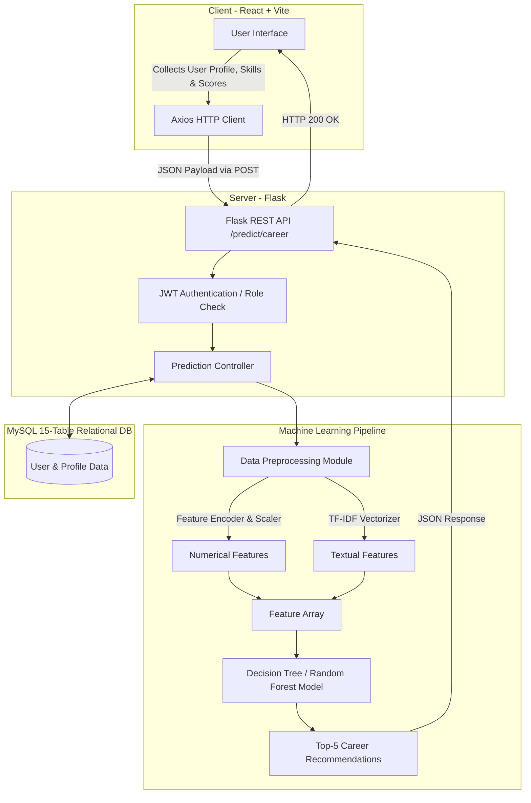

# AI Career Recommendation System

An intelligent, full-stack application that leverages machine learning to recommend suitable career paths based on a student's academic performance, skills, interests, and various other metrics.

---

## 🌟 Key Features

- **High-Accuracy ML Model**: Utilizes a high-capacity Decision Tree / Random Forest model combined with TF-IDF on textual data (skills, interests, certifications). Evaluated on 270+ career classes with 95%+ accuracy.
- **Robust Backend API**: Built with Flask and MySQL, providing a fully normalized relational database (15 tables) storage for users, education profiles, and student profiles.
- **Modern Frontend**: Interactive and responsive user interface built with React 19 and Vite, using React Router for seamless navigation.
- **User Roles & Authentication**: Supports student and administrative roles with secure JWT-based authentication and password hashing (Werkzeug).
- **Comprehensive API**: Exposes REST endpoints for AI prediction, user management, profile updates, and more.

---

## 🛠 Tech Stack

### Frontend
- **React 19**
- **Vite** (Build tool and dev server)
- **React Router DOM** (Routing)
- **Axios** (HTTP client for API requests)

### Backend
- **Python 3**
- **Flask** & **Flask-CORS** (RESTful API)
- **MySQL** & `mysql-connector-python` (Relational Database)
- **Scikit-Learn, Pandas, Numpy, Joblib** (Machine Learning Pipeline)
- **PyJWT & Werkzeug** (Authentication & Security)

---

## 🏗 Project Pipeline Architecture



---

## 📂 Project Structure

```text
Career_Recommendation_System/
├── backend/
│   ├── app.py                 # Main Flask application and API routes
│   ├── train_model.py         # ML pipeline script (TF-IDF + Feature Engineering)
│   ├── import_data.py         # Script to seed database / import datasets
│   ├── models/                # Directory storing trained ML models (.joblib, .pkl)
│   ├── requirements.txt       # Python dependencies
│   └── .env                   # Environment variables (Database credentials)
├── frontend/
│   ├── src/                   # React components, pages (Home, Register, Profile)
│   ├── package.json           # Node.js dependencies and scripts
│   └── vite.config.js         # Vite configuration
└── test_api.py                # Example script to test the prediction API payload
```

---

## 🚀 Getting Started

### Prerequisites

- Node.js (v18+)
- Python (v3.8+)
- MySQL Server

### 1. Database Setup

1. Start your local MySQL server.
2. Create a database named `career_recommendation_db` (or as specified in your environment variables).
3. The database tables (like `users`, `student_profiles`, `education_profiles`, etc.) will automatically initialize upon starting the Flask application.

### 2. Backend Setup

1. Navigate to the `backend` directory:
   ```bash
   cd backend
   ```
2. Create a virtual environment and activate it:
   ```bash
   python -m venv venv
   # On Windows:
   .\venv\Scripts\activate
   # On macOS/Linux:
   source venv/bin/activate
   ```
3. Install the Python dependencies:
   ```bash
   pip install -r requirements.txt
   ```
4. Create a `.env` file in the `backend` directory with the following content (adjust values to your local MySQL setup):
   ```env
   DB_HOST=localhost
   DB_USER=root
   DB_PASSWORD=abc123
   DB_NAME=career_recommendation_db
   JWT_SECRET=career_super_secret_key_2026
   ```
5. Train the Machine Learning model (this will generate the necessary `.pkl` and `.joblib` files in `backend/models/`):
   ```bash
   python train_model.py
   ```
6. Start the Flask server:
   ```bash
   python app.py
   ```
   The backend will run on `http://127.0.0.1:5000`.

### 3. Frontend Setup

1. Open a new terminal and navigate to the `frontend` directory:
   ```bash
   cd frontend
   ```
2. Install the Node.js dependencies:
   ```bash
   npm install
   ```
3. Start the Vite development server:
   ```bash
   npm run dev
   ```
   The frontend will be accessible at `http://localhost:5173`.

---

## 🧠 Machine Learning Details

The recommendation engine (`backend/train_model.py`) is engineered to capture complex patterns across user profiles.

- **Categorical Features**: `Gender`, `Education_Level`, `Stream`, `Specialization`, `Olympiad_Participation`, `Research_Experience`, `Volunteer_Activities`, `Club_Activities`.
- **Textual Features**: Combines `Skills`, `Interests`, and `Certifications` using a **TF-IDF Vectorizer**.
- **Model**: High-capacity Decision Tree Classifier (acting as a tree-based estimator).
- **Metrics**: Calculates Top-1 and Top-5 accuracy across a broad spectrum of career recommendations.

---

## 📡 API Usage Example

To test the career prediction endpoint directly, you can run the provided `test_api.py` script:

```bash
python test_api.py
```

This sends a JSON payload containing academic scores, RIASEC scores, and skills to the `/api/predict/career` endpoint. 

**Example Payload:**
```json
{
  "Age": 17,
  "Gender": "Female",
  "Location_Type": "Urban",
  "Education_Level": "Class 11-12",
  "Current_Class_Or_Year": "Class 12",
  "Board": "CBSE",
  "Stream": "Science - PCM",
  "Specialization": "Not Applicable",
  "Specialization_Group": "STEM",
  "Math_Score": 85.5,
  "Science_Score": 88.0,
  "Social_Science_Score": 75.0,
  "English_Score": 82.0,
  "Overall_Academic_Percentage": 84.5,
  "Total_RIASEC_Score": 330.0
}
```

---

## 📄 License

This project is licensed under the MIT License.
