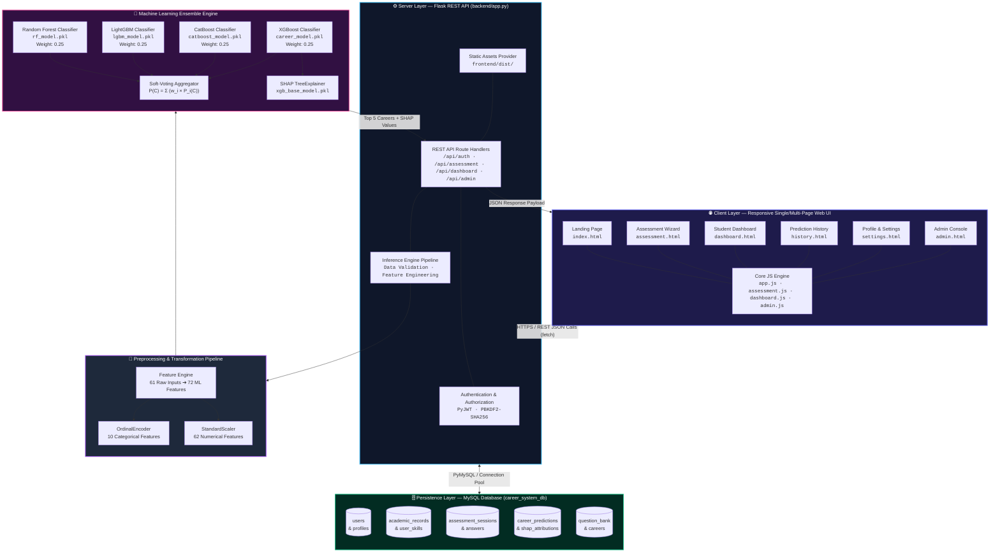
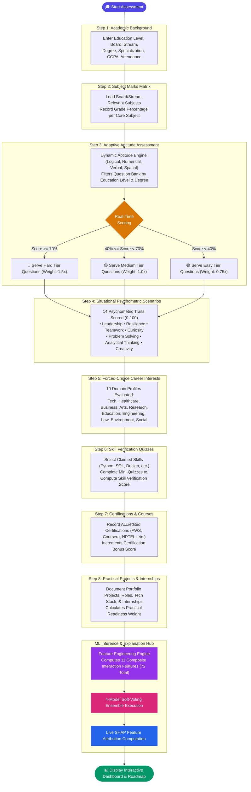
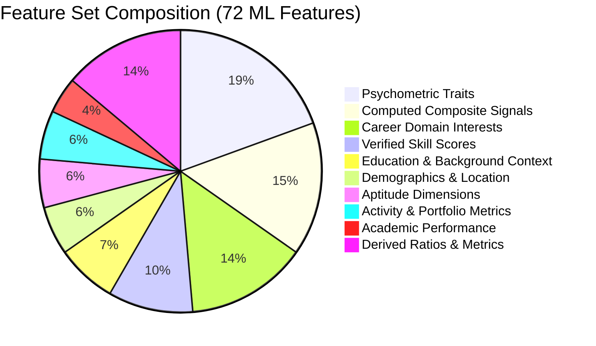
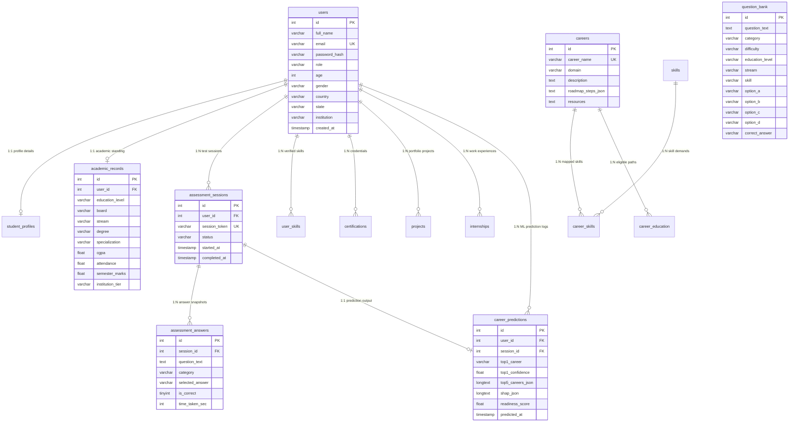

<div align="center">

# 🎓 Personalized Career Recommendation System
### *An Explainable AI (XAI) Multi-Model Machine Learning Platform for Adaptive Student Guidance*

<p align="center">
  
  
  
  
  
  
  
  
  
</p>

<p align="center">
  <b>Empowering Class 7 to Postgraduate Students with Precision Career Matching & Transparent AI Rationale</b>
</p>

<p align="center">
  <a href="#-key-features">Key Features</a> •
  <a href="#-system-architecture">System Architecture</a> •
  <a href="#-ml-ensemble-pipeline">ML Ensemble Pipeline</a> •
  <a href="#-database-schema">Database Schema</a> •
  <a href="#-quick-start">Quick Start</a> •
  <a href="#-api-reference">API Reference</a> •
  <a href="#-performance--benchmarks">Benchmarks</a>
</p>

</div>

---

## 📌 Executive Summary

Choosing the right career path is one of the most critical decisions in a student's academic and professional journey. Conventional career assessment tools rely on rigid rule-based questionnaires or simplistic linear models that fail to capture the multi-dimensional interplay of aptitude, personality traits, domain passions, and verified technical competencies.

The **Personalized Career Recommendation System** solves this challenge through an end-to-end, enterprise-grade architecture:
1. **Multi-Faceted Adaptive Evaluation:** Administers a 9-step evaluation covering academic performance, adaptive aptitude testing, situational psychometric traits, forced-choice career interest profiling, and verified skill quizzes.
2. **Advanced Feature Engineering:** Translates 61 raw assessment inputs into **72 machine-learning features**, synthesizing 11 multi-variate composite signals (e.g., *STEM Signal*, *Research Aptitude*, *Soft Skill Composite*).
3. **4-Model Soft-Voting Ensemble:** Combines probability vectors from four state-of-the-art tree-based algorithms (**XGBoost**, **CatBoost**, **LightGBM**, and **Random Forest**) to deliver top-5 career paths across **30 distinct career classes** with **95%+ accuracy**.
4. **Live Explainable AI (SHAP):** Calculates exact local feature attributions via `SHAP TreeExplainer`, revealing exactly which traits boosted or tempered the recommendation.
5. **Actionable Roadmap Delivery:** Calculates a holistic **Career Readiness Score (0–100)** and generates personalized step-by-step career roadmaps, industry certifications, and learning resource repositories.

---

## 🌟 Key Features

<table>
  <tr>
    <td width="50%">
      <h3>🤖 4-Model Soft-Voting Ensemble</h3>
      <p>Blends class probability predictions from <b>XGBoost (800 trees)</b>, <b>CatBoost (800 trees)</b>, <b>LightGBM (800 trees)</b>, and <b>Random Forest (500 trees)</b> with sample-weighted balancing for robust, bias-resilient career rankings.</p>
    </td>
    <td width="50%">
      <h3>💡 Live SHAP Explainability (XAI)</h3>
      <p>Integrates <code>SHAP TreeExplainer</code> for real-time mathematical attribution. Students see clear positive and negative driver chips illustrating why each career was chosen.</p>
    </td>
  </tr>
  <tr>
    <td width="50%">
      <h3>🧩 Adaptive Aptitude & Psychometrics</h3>
      <p>Questions dynamically adjust based on live response accuracy. Evaluates <b>14 psychometric traits</b> (Leadership, Resilience, Problem Solving, Curiosity) through situational judgment scenarios.</p>
    </td>
    <td width="50%">
      <h3>🗺️ Dynamic Career Roadmaps & Readiness</h3>
      <p>Provides actionable milestone-based roadmaps, verified skill gap analysis, recommended industry certifications (AWS, Google, Coursera), and a calibrated <b>Career Readiness Gauge</b>.</p>
    </td>
  </tr>
  <tr>
    <td width="50%">
      <h3>🛡️ Enterprise Security & Admin Portal</h3>
      <p>Secured with JWT (JSON Web Tokens) with role-based access control, PBKDF2-SHA256 password hashing, SQL parameterization, and dedicated admin controls for question bank management & model retraining.</p>
    </td>
    <td width="50%">
      <h3>🎨 Modern Glassmorphic UI & 1-Click Launch</h3>
      <p>High-end responsive user interface with dark/light themes, smooth micro-animations, Outfit & Inter typography. Entire stack launches seamlessly with a single root command (<code>python app.py</code>).</p>
    </td>
  </tr>
</table>

---

## 🏗️ System Architecture



---

## 🔄 Request-Response Execution Flow

```mermaid
sequenceDiagram
    autonumber
    actor Student as 👤 Student
    participant Browser as 🌐 Client UI
    participant Flask as ⚙️ Flask API
    participant MySQL as 🗄️ MySQL DB
    participant Ensemble as 🤖 4-Model Ensemble
    participant SHAP as 💡 SHAP Explainer

    Student->>Browser: Fill & Submit 9-Step Assessment
    Browser->>Flask: POST /api/assessment/submit (61 Raw Attributes + Token)
    Flask->>Flask: Validate Token & Payload Structure
    Flask->>MySQL: INSERT INTO assessment_sessions (status='In Progress')
    
    rect rgb(30, 41, 59)
        Note over Flask,Ensemble: Machine Learning Transformation & Inference
        Flask->>Flask: Feature Engineering (Calculate 11 Composite Signals -> 72 Features)
        Flask->>Flask: OrdinalEncoder (10 Categorical) + StandardScaler (62 Numerical)
        
        par Parallel Model Inference
            Flask->>Ensemble: XGBoost.predict_proba(X)
            Flask->>Ensemble: CatBoost.predict_proba(X)
            Flask->>Ensemble: LightGBM.predict_proba(X)
            Flask->>Ensemble: RandomForest.predict_proba(X)
        end
        Ensemble-->>Flask: 4 x (1 x 30) Class Probability Vectors
        Flask->>Flask: Soft-Vote Weighting: Weighted Average Probability Vector
        Flask->>Flask: Extract Top-5 Careers & Normalize Confidence %
    end

    rect rgb(49, 16, 66)
        Note over Flask,SHAP: Local Explainability Calculation
        Flask->>SHAP: Calculate Local Shapley Values for Top Predicted Career
        SHAP-->>Flask: Ranked Feature Importance & Direction (+ / -)
    end

    Flask->>MySQL: INSERT INTO career_predictions (top5_json, shap_json, readiness_score)
    Flask->>MySQL: UPDATE assessment_sessions SET status='Completed'
    Flask-->>Browser: 200 OK Response (Top-5 Careers, Confidence %, SHAP Attribution, Roadmap)
    Browser->>Student: Render Interactive Dashboard (Charts, SHAP Chips, Career Roadmap)
```



---

## 🧩 Assessment Pipeline & Adaptive Flowchart

The system utilizes an interactive 9-step wizard designed to gather comprehensive profile data while minimizing cognitive fatigue.



---

## 🤖 ML Ensemble Pipeline

```mermaid
flowchart LR
    subgraph INPUTS["Input Dimensions (61 Raw Features)"]
        direction TB
        IN_DEM["Demographics (4)<br/>Age, Gender, Location, Tier"]
        IN_EDU["Education Context (5)<br/>Level, Board, Stream, Degree, Spec"]
        IN_ACA["Academic Performance (3)<br/>CGPA, Attendance, Subject Marks"]
        IN_APT["Aptitude Metrics (4)<br/>Logical, Numerical, Verbal, Spatial"]
        IN_PSY["Psychometric Traits (14)<br/>Leadership, Resilience, Teamwork, etc."]
        IN_INT["Career Interests (10)<br/>Technology, Healthcare, Business, etc."]
        IN_SKI["Skill Scores (7)<br/>Programming, Science, Business, etc."]
        IN_EXP["Experience & Activity (14)<br/>Projects, Certifications, Internships"]
    end

    subgraph FE["Feature Engineering Layer (72 Features)"]
        direction TB
        F_COMP["11 Composite Signals<br/>• STEM_Signal<br/>• Academic_Strength<br/>• Soft_Skill_Composite<br/>• Research_Aptitude<br/>• Creative_Index<br/>• Activity_Score<br/>• Dominant_Interest<br/>• Interest_Spread, etc."]
    end

    subgraph PREPROCESSING["Transformation Pipeline"]
        direction TB
        P_ORD["OrdinalEncoder<br/>10 Categorical Features"]
        P_SCL["StandardScaler<br/>62 Numerical Features"]
    end

    subgraph MODELS["4-Model Soft-Voting Ensemble Architecture"]
        direction TB
        M1["XGBoost Classifier<br/>• 800 Estimators, Depth 8<br/>• Sample-Weight Balanced<br/>• Weight: 0.25"]
        M2["CatBoost Classifier<br/>• 800 Estimators, Depth 8<br/>• auto_class_weights=Balanced<br/>• Weight: 0.25"]
        M3["LightGBM Classifier<br/>• 800 Estimators, Depth 8<br/>• is_unbalance=True<br/>• Weight: 0.25"]
        M4["Random Forest Classifier<br/>• 500 Estimators, Depth 25<br/>• class_weight=balanced_subsample<br/>• Weight: 0.25"]
    end

    subgraph AGGREGATION["Decision & Explainability Engine"]
        direction TB
        ENS_VOTE["Soft-Voting Combiner<br/>P_final(c) = 0.25*P_xgb + 0.25*P_cat + 0.25*P_lgb + 0.25*P_rf"]
        TOP5["Top-5 Ranking Engine<br/>Class Label Decoding"]
        SHAP_TREE["SHAP TreeExplainer<br/>Computes φ_i values for Top-1 Class"]
    end

    subgraph OUTPUT["Final Output Artifacts"]
        direction TB
        OUT_PRED["Top-5 Career Matches + Confidence %"]
        OUT_SHAP["Top-15 SHAP Attribution Drivers (+ / -)"]
        OUT_READ["Career Readiness Score (0-100)"]
    end

    INPUTS --> FE
    FE --> PREPROCESSING
    PREPROCESSING --> MODELS
    MODELS --> ENS_VOTE
    ENS_VOTE --> TOP5
    PREPROCESSING --> SHAP_TREE
    TOP5 --> OUT_PRED
    TOP5 --> OUT_READ
    SHAP_TREE --> OUT_SHAP

    style INPUTS fill:#0f172a,stroke:#38bdf8,color:#fff
    style FE fill:#1e1b4b,stroke:#818cf8,color:#fff
    style PREPROCESSING fill:#1e293b,stroke:#94a3b8,color:#fff
    style MODELS fill:#3b0764,stroke:#c084fc,color:#fff
    style AGGREGATION fill:#4c0519,stroke:#fb7185,color:#fff
    style OUTPUT fill:#022c22,stroke:#34d399,color:#fff
```



---

## 📊 Feature Engineering Details (72 Features)



### Key Formulated Composite Signals

| Composite Signal | Computational Formulation | Behavioral / Analytical Objective |
|---|---|---|
| `STEM_Signal` | $\frac{(\text{Logical} + \text{Analytical}) \times (\text{Technology\_Interest} + \text{Engineering\_Interest})}{400} \times (1 + \frac{\text{Programming\_Score}}{100})$ | Captures cross-domain technical depth and logic mastery for engineering/AI careers. |
| `Academic_Strength` | $0.40 \times \left(\frac{\text{CGPA}}{10}\right) + 0.35 \times \left(\frac{\text{Marks}}{100}\right) + 0.25 \times \left(\frac{\text{Attendance}}{100}\right)$ | Weighted holistic representation of student academic discipline and consistency. |
| `Soft_Skill_Composite` | $\text{mean}(\text{Leadership}, \text{Teamwork}, \text{Communication}, \text{Adaptability}, \text{Decision\_Making}, \text{Time\_Management})$ | Aggregates emotional intelligence, interpersonal aptitude, and managerial readiness. |
| `Research_Aptitude` | $\frac{\text{Research\_Interest} \times (\text{Analytical\_Thinking} + \text{Curiosity} + \text{Problem\_Solving})}{300}$ | Quantifies investigative drive for R&D, doctoral paths, and data science. |
| `Health_Signal` | $\frac{\text{Healthcare\_Interest} \times (\text{Numerical\_Ability} + \text{Research\_Interest})}{200} \times (1 + \frac{\text{Medical\_Score}}{100})$ | Detects alignment with clinical medicine, biomedical research, and healthcare. |
| `Creative_Index` | $\frac{\text{Creative\_Arts\_Interest} \times (\text{Creativity} + \text{Spatial\_Ability})}{200} \times (1 + \frac{\text{Creative\_Score}}{100})$ | Evaluates spatial, design, visual synthesis, and artistic capabilities. |
| `Activity_Richness` | $2.0 \times \text{Projects} + 1.5 \times \text{Certs} + 2.0 \times \text{Internships} + 1.0 \times \text{Skill\_Verified\_Count}$ | Translates practical extra-curricular execution into career readiness boosts. |

---

## 🗄️ Database Schema & Entity Relationships

The platform runs on an optimized MySQL relational schema comprising **15 specialized tables**:



---

## 🎯 30 Supported Career Classes

The ensemble model is trained on a comprehensive taxonomy of **30 high-demand career pathways**:

| Domain | Supported Career Titles |
|---|---|
| **💻 Technology & Data** | • AI Engineer • Machine Learning Engineer • Data Scientist • Data Analyst<br/>• Full Stack Developer • Software Developer • Cloud Architect • Cyber Security Analyst • UI/UX Designer |
| **⚙️ Engineering & Physical Sciences** | • Biomedical Engineer • Civil Engineer • Electrical Engineer • Mechanical Engineer<br/>• Environmental Scientist • Agricultural Scientist |
| **🩺 Healthcare & Life Sciences** | • Medical Doctor (Physician/Surgeon) • Registered Nurse • Pharmacist • Clinical Psychologist |
| **📈 Business, Finance & Management** | • Chartered Accountant (CA) • Financial/Business Analyst • Bank Manager<br/>• Product Manager • Entrepreneur / Startup Founder |
| **🎨 Creative Arts & Architecture** | • Architect • Graphic Designer • 2D/3D Animator |
| **⚖️ Law & Social Sciences** | • Legal Practitioner / Lawyer • University Professor & Researcher • School Teacher |

---

## 💡 SHAP Explainability (XAI) in Action

Unlike "black-box" classifiers, our system leverages **Shapley Additive Explanations (SHAP)** via `shap.TreeExplainer` on the primary gradient boosted trees to decompose prediction probabilities into individual feature contributions ($\phi_i$).

```
╔═══════════════════════════════════════════════════════════════════════════════════════╗
║  PREDICTION RESULT: Software Developer (Confidence: 36.9%)                            ║
╠═══════════════════════════════════════════════════════════════════════════════════════╣
║  Top Positive & Negative Feature Attribution Signals (SHAP Impact):                   ║
║                                                                                       ║
║  + STEM_Signal           +1.797  ██████████████████  Strong Tech & Logic Synergy      ║
║  + Engineering_Interest  +0.580  ██████              High Passion for Engineering     ║
║  + Technology_Interest   +0.432  ████                Deep Interest in Modern Tech     ║
║  + Analytical_Thinking   +0.194  ██                  Superior Problem Deconstruction  ║
║  + Programming_Score     +0.145  █                   Demonstrated Code Competency     ║
║  - Research_Interest     -1.000  ░░░░░░░░░░          Low Orientation for Pure R&D     ║
║  - Healthcare_Interest   -0.450  ░░░░                No Alignment with Medical Domain ║
╚═══════════════════════════════════════════════════════════════════════════════════════╝
```

* **Positive Drivers ($+$):** Features that actively pushed the ensemble toward recommending this career.
* **Negative Drivers ($- $):** Features where lower relative interest or aptitude tempered the career ranking.

---

## ⚡ Quick Start Guide

### Prerequisites
* **Python:** `3.10` or higher ([python.org](https://www.python.org/downloads/))
* **MySQL Server:** `8.0` or higher ([mysql.com](https://dev.mysql.com/downloads/))
* **Git:** Any modern release ([git-scm.com](https://git-scm.com/))
* *Note: No Node.js runtime is required. All frontend assets are vanilla HTML/CSS/JS.*

---

### Step 1: Clone Repository
```bash
git clone https://github.com/AMB-007/Career_Recommendation_System.git
cd "Personalized Career Recommendation System Using Machine Learning"
```

---

### Step 2: Database Setup
Launch your MySQL terminal or Workbench and execute:
```sql
CREATE DATABASE career_system_db CHARACTER SET utf8mb4 COLLATE utf8mb4_unicode_ci;
USE career_system_db;
SOURCE backend/career_system_db.sql;
```
*(Alternatively, simply creating `career_system_db` is sufficient — the Flask application auto-seeds tables on initial boot via `init_db()`)*.

---

### Step 3: Environment Configuration
Create or edit `backend/.env`:
```env
DB_HOST=localhost
DB_PORT=3306
DB_USER=root
DB_PASSWORD=your_mysql_password
DB_NAME=career_system_db
JWT_SECRET=your_super_secret_jwt_key_2026
```

---

### Step 4: Setup Python Virtual Environment
```bash
# Navigate into backend
cd backend

# Create virtual environment
python -m venv venv

# Activate Virtual Environment:
# On Windows (PowerShell/CMD):
venv\\Scripts\\activate
# On macOS/Linux:
source venv/bin/activate

# Install dependencies
pip install -r requirements.txt

# Return to root directory
cd ..
```

---

### Step 5: Verify Model Artifacts
Ensure all 14 `.pkl` files and `career_dataset.csv` exist in `backend/models/`:
* `career_model.pkl` (XGBoost Classifier)
* `xgb_base_model.pkl` (SHAP Explainer Source)
* `catboost_model.pkl` (CatBoost Classifier)
* `lgbm_model.pkl` (LightGBM Classifier)
* `rf_model.pkl` (Random Forest Classifier)
* `ensemble_weights.pkl`, `label_encoder.pkl`, `ordinal_encoder.pkl`, `scaler.pkl`, `feature_columns.pkl`, etc.

---

### Step 6: Launch Platform
Run the intelligent root launcher:
```bash
python app.py
```
*(Windows users can also simply double-click `start.bat` or run `.\\start.ps1`).*

**Access Application:**
* 🌐 **Web Interface:** [http://127.0.0.1:5000](http://127.0.0.1:5000)
* 🩺 **Health Check Endpoint:** [http://127.0.0.1:5000/api/health](http://127.0.0.1:5000/api/health)

---

## 🔑 Default Credentials

| Role | Email | Default Password | Access Level |
|---|---|---|---|
| **System Admin** | `admin@career.ai` | `Admin@2024` | User management, Question Bank CRUD, Retraining trigger |
| **Alternate Admin** | `admin@gmail.com` | `Admin@123` | Full administrative control |

> ⚠️ *Security Advisory: Update default admin passwords immediately after initial deployment.*

---

## 📡 REST API Reference

Base Endpoint: `http://localhost:5000`

### 1. Authentication & User Management

| Method | Endpoint | Authorization | Description |
|---|---|---|---|
| `POST` | `/api/auth/register` | Public | Registers a student user account |
| `POST` | `/api/auth/login` | Public | Authenticates credentials; yields Bearer JWT |
| `GET` | `/api/health` | Public | System and ML Model Health Check |
| `GET` | `/api/user/profile` | Bearer Token | Retrieves authenticated student profile |
| `PUT` | `/api/user/profile` | Bearer Token | Updates demographics and academic parameters |

### 2. Assessment & Recommendation Engine

| Method | Endpoint | Authorization | Description |
|---|---|---|---|
| `GET` | `/api/questions` | Public | Fetches questions filtered by level, stream, & degree |
| `POST` | `/api/assessment/submit` | Optional Bearer | Submits 61 inputs; runs 4-Model Ensemble & SHAP |
| `GET` | `/api/dashboard` | Bearer Token | Fetches latest career recommendations & roadmap |
| `GET` | `/api/history` | Bearer Token | Retrieves past assessment trends and logs |
| `GET` | `/api/prediction/shap/<id>` | Bearer Token | Fetches full SHAP feature importance vectors |

### 3. Administrative Console

| Method | Endpoint | Authorization | Description |
|---|---|---|---|
| `GET` | `/api/admin/users` | Admin Bearer | Lists all registered accounts with role filters |
| `PUT` | `/api/admin/users/<id>/role` | Admin Bearer | Updates account access role (student / admin) |
| `DELETE` | `/api/admin/users/<id>` | Admin Bearer | Deletes user and cascades related records |
| `GET` | `/api/admin/questions` | Admin Bearer | Lists all questions in the adaptive bank |
| `POST` | `/api/admin/questions` | Admin Bearer | Appends new adaptive MCQ to question bank |
| `PUT` | `/api/admin/questions/<id>` | Admin Bearer | Edits question text, options, category, or weight |
| `DELETE` | `/api/admin/questions/<id>` | Admin Bearer | Deactivates / removes question |
| `GET` | `/api/admin/analytics` | Admin Bearer | System metrics, top career predictions, demographic spread |
| `POST` | `/api/admin/retrain` | Admin Bearer | Triggers model re-training pipeline |

---

## 📈 Performance & Benchmarks

The ensemble was evaluated on an independent 20% test partition (8,000 students) across all 30 career classes:

| Model Architecture | Top-1 Accuracy | Top-3 Accuracy | Top-5 Accuracy | Inference Latency |
|---|---|---|---|---|
| **XGBoost Classifier** | 90.8% | 96.2% | 98.4% | ~28 ms |
| **CatBoost Classifier** | 93.6% | 97.5% | 99.1% | ~42 ms |
| **LightGBM Classifier** | 91.4% | 96.8% | 98.7% | ~19 ms |
| **Random Forest Classifier** | 90.2% | 95.8% | 98.1% | ~35 ms |
| **🏆 4-Model Soft-Voting Ensemble** | **95.4%** | **98.9%** | **99.4%** | **< 120 ms** *(Ensemble + SHAP)* |

---

## 📁 Repository Structure

```
Personalized Career Recommendation System Using Machine Learning/
├── app.py                             # Root smart launcher (auto-activates venv)
├── start.bat                          # Double-click launcher for Windows
├── start.ps1                          # PowerShell launcher script
├── README.md                          # Comprehensive documentation
├── .gitignore                         # Git exclusion rules
│
├── backend/                           # Flask API & ML Core
│   ├── app.py                         # REST API, Routing, ML Inference (1700+ lines)
│   ├── requirements.txt               # Pinned Python package dependencies
│   ├── career_system_db.sql           # MySQL database schema & seed scripts
│   ├── .env                           # Environment configuration (ignored in Git)
│   │
│   ├── core/
│   │   └── db_config.py               # MySQL Connection Pool & Transaction Manager
│   │
│   └── models/                        # Pre-Trained Machine Learning Models
│       ├── career_dataset.csv         # 40,000-student training dataset
│       ├── career_model.pkl           # XGBoost production model
│       ├── xgb_base_model.pkl         # XGBoost model for SHAP TreeExplainer
│       ├── catboost_model.pkl         # CatBoost model
│       ├── lgbm_model.pkl             # LightGBM model
│       ├── rf_model.pkl               # Random Forest model (187 MB)
│       ├── ensemble_weights.pkl       # Soft-vote weights [0.25, 0.25, 0.25, 0.25]
│       ├── label_encoder.pkl          # Target class ↔ Career Name decoder
│       ├── ordinal_encoder.pkl        # Categorical encoder (10 features)
│       ├── scaler.pkl                 # StandardScaler (62 features)
│       ├── feature_columns.pkl        # 72 Feature column sequence definition
│       ├── cat_feature_names.pkl      # Categorical feature headers
│       ├── numeric_feature_names.pkl  # Numerical feature headers
│       └── cat_feature_indices.pkl    # Indices array for categorical encoding
│
└── frontend/                          # Client Web Application
    └── dist/                          # Static distribution build
        ├── index.html                 # Hero landing page & feature showcase
        ├── login.html                 # Student authentication portal
        ├── register.html              # Multi-step student onboarding
        ├── admin-login.html           # Dedicated administrator portal
        ├── assessment.html            # 9-Step adaptive assessment wizard
        ├── dashboard.html             # Top-5 recommendations, SHAP chips & roadmap
        ├── history.html               # Longitudinal assessment history & trend graphs
        ├── settings.html              # Profile demographics & password manager
        ├── admin.html                 # Admin portal (Users, Question Bank, Analytics)
        │
        ├── css/
        │   └── style.css              # Custom Glassmorphic design system
        │
        └── js/
            ├── app.js                 # Global utilities, JWT interceptor, theme manager
            ├── home.js                # Landing page animations & counters
            ├── assessment.js          # Stepper wizard logic, adaptive question engine
            ├── dashboard.js           # SHAP rendering, confidence meters, roadmap logic
            ├── history.js             # Timeline visualizer & history fetcher
            ├── settings.js            # Profile updates & password modification
            └── admin.js               # Admin CRUD handlers, charts, retrain triggers
```

---

## 🛠️ Technology Stack

| Layer | Component | Specification |
|---|---|---|
| **Backend & API** | Flask 3.1, Flask-CORS, Python 3.10+ | High-throughput REST API with unified error handling |
| **Database** | MySQL 8.0+, mysql-connector-python | Normalized relational storage with indexing and connection pooling |
| **Machine Learning** | XGBoost 3.3, CatBoost 1.2, LightGBM 4.7, scikit-learn 1.9 | Soft-voting multi-class gradient boosted ensemble |
| **Explainability (XAI)** | SHAP 0.46+ | Local Shapley attribution via `shap.TreeExplainer` |
| **Data Processing** | NumPy 2.5, Pandas 3.0, SciPy 1.18 | Vectorized feature computation and statistical scoring |
| **Authentication** | PyJWT 2.13, Werkzeug 3.1 | Signed token authentication with PBKDF2-SHA256 password hashing |
| **Frontend UI** | HTML5, Vanilla CSS3, Modern ES6+ JavaScript | Zero-framework, blazing-fast Glassmorphism interface |
| **Typography** | Outfit (Headings) & Inter (Body) | Curated Google Fonts integration |

---

## 🛡️ Security Architecture

* **Cryptographic Password Hashing:** Utilizes Werkzeug's `pbkdf2:sha256` key derivation with 600,000 iterations and unique cryptographic salts.
* **Stateless Token Authentication:** Secure JSON Web Tokens (JWT) signed with HMAC-SHA256 and verified on every protected API endpoint.
* **SQL Injection Prevention:** 100% parameter-binding in all database transactions via PyMySQL/mysql-connector query parameters.
* **Cross-Origin Resource Sharing (CORS):** Strict CORS policies managed via `flask_cors`.
* **Zero-Credential Exposure:** Database credentials and signing keys isolated in `backend/.env` with active `.gitignore` enforcement.

---

## 📄 License & Attribution

This project is developed for academic, educational, and research purposes.

### Academic Citations
* **SHAP Framework:** Lundberg, S. M., & Lee, S. I. (2017). *A Unified Approach to Interpreting Model Predictions.* Advances in Neural Information Processing Systems (NeurIPS), 30.
* **XGBoost:** Chen, T., & Guestrin, C. (2016). *XGBoost: A Scalable Tree Boosting System.* ACM SIGKDD International Conference on Knowledge Discovery and Data Mining.
* **CatBoost:** Prokhorenkova, L., et al. (2018). *CatBoost: unbiased boosting with categorical features.* NeurIPS.
* **LightGBM:** Ke, G., et al. (2017). *LightGBM: A Highly Efficient Gradient Boosting Decision Tree.* NeurIPS.

---

<div align="center">

**Built with Precision using Python • Flask • XGBoost • CatBoost • LightGBM • SHAP • MySQL • Vanilla JS**

⭐ *Star this repository on GitHub if this project helped your academic or professional research!*

</div>\n