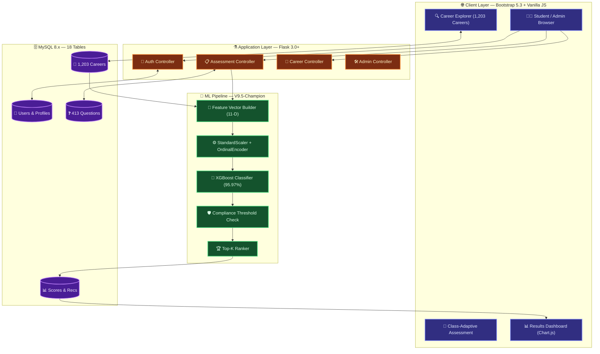
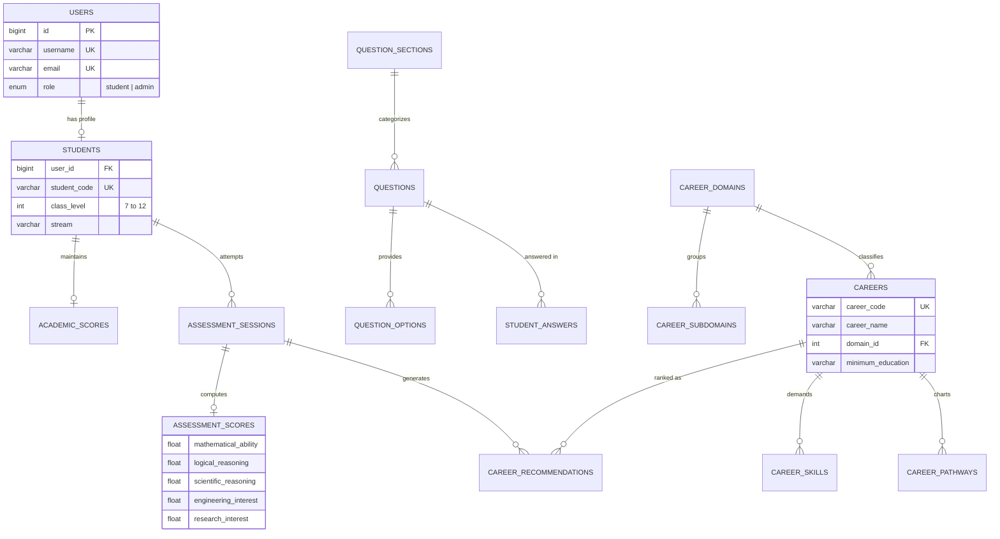

<div align="center">


<br/><br/>


<br/>

> ### 🚀 *Moves beyond personality quizzes — real AI, real careers, real guidance.*
> *AI-Powered Career Guidance for Indian Secondary School Students · Classes 7 to 12*

</div>

---

## 🗂️ Table of Contents

| | Section |
|---|---|
| 1️⃣ | [🌟 Overview](#-overview) |
| 2️⃣ | [📊 Key Statistics](#-key-statistics) |
| 3️⃣ | [✨ Features](#-features) |
| 4️⃣ | [🏗️ System Architecture](#️-system-architecture) |
| 5️⃣ | [🗄️ Database Schema](#️-database-schema) |
| 6️⃣ | [🤖 Machine Learning Engine](#-machine-learning-engine) |
| 7️⃣ | [🛡️ Compliance-Based Ranking](#️-compliance-based-ranking) |
| 8️⃣ | [📝 Assessment & Question Bank](#-assessment--question-bank) |
| 9️⃣ | [📂 Dataset Catalogue](#-dataset-catalogue) |
| 🔟 | [🗂️ Project Structure](#️-project-structure) |
| 1️⃣1️⃣ | [⚙️ Installation](#️-installation) |
| 1️⃣2️⃣ | [🔑 Demo Credentials](#-demo-credentials) |
| 1️⃣3️⃣ | [🔌 API Reference](#-api-reference) |
| 1️⃣4️⃣ | [🧪 Testing](#-testing) |
| 1️⃣5️⃣ | [📋 Changelog](#-changelog) |

---

## 🌟 Overview

**PathFinder** is a full-stack, machine-learning-driven career guidance platform built for Indian secondary and senior secondary school students (Classes 7–12). It delivers a structured **psychometric assessment**, an **XGBoost-powered compatibility engine**, **domain-specific prerequisite filtering**, and a curated occupational taxonomy of **2,259 careers**.

The system evaluates students across **19 psychometric and aptitude dimensions**, maps scores against real-world career knowledge profiles, applies domain-level prerequisite threshold compliance checks, and produces ranked recommendations with actionable skill development roadmaps — **all in under 250 ms per request.**

> [!NOTE]
> PathFinder is designed for the Indian education system and covers CBSE, ICSE, and State Board syllabi across Classes 7–12 with stream-specific (PCM, PCB, Commerce, Humanities) question sets.

---

## 📊 Key Statistics

<div align="center">

| 🏷️ Metric | 📈 Value |
| :---: | :---: |
| 🤖 **ML Model** | XGBoost Classifier — V9.5-Champion |
| 🎯 **Model Accuracy** | **95.97%** |
| 🔥 **Hit@5 Rate** | **98.55%** |
| 📐 **NDCG@5** | **0.9475** |
| 📈 **ROC-AUC** | **0.9902** |
| 💼 **Careers in Catalogue** | **1,203** (full knowledge base) |
| 🌐 **Career Domains** | **33 domains → 389 subdomains → 466 clusters** |
| ❓ **Assessment Questions** | **413** (class-adaptive, 19 sections) |
| ✅ **Answer Options** | **1,805** scored options |
| 🗄️ **Database Tables** | **18 normalized tables** |
| 🧪 **Test Suite** | **83 / 83 tests passing ✅** |

</div>

---

## ✨ Features

<details open>
<summary><b>🎓 For Students</b></summary>
<br/>

| Feature | Description |
|---|---|
| 📚 **Grade-Adaptive Assessment** | Question sets calibrated per class level and subject stream (PCM, PCB, Commerce, Humanities, General) |
| ⏱️ **Timed & Standard Modes** | 45-minute competitive mode or untimed standard mode |
| 💾 **Real-Time Auto-Save** | Assessment progress persists across browser sessions |
| 📊 **Interactive Results Dashboard** | Radar charts, bar visualizers, and percentile breakdowns |
| 🗺️ **Career Roadmaps** | 5-stage milestone progressions, prerequisite subjects, and curated course links per career |
| 🛡️ **Compliance-Verified Recommendations** | Careers failing domain-level prerequisite thresholds are ranked lower |

</details>

<details>
<summary><b>🛠️ For Administrators</b></summary>
<br/>

| Feature | Description |
|---|---|
| 👥 **Student & Session Management** | Audit logs, attempt history, and per-question answer inspection |
| ✏️ **Question Bank Editor** | Browse, filter, and manage all 413 questions by section and class range |
| 📋 **Career Catalogue Manager** | Full CRUD over the 1,203-career knowledge base |
| 📈 **Analytics Dashboard** | Completion rates, active users, and domain-level recommendation distribution |

</details>

<details>
<summary><b>🖥️ Platform</b></summary>
<br/>

| Feature | Description |
|---|---|
| 🌙 **Dark / Light Theme** | WCAG 2.1 AA high-contrast design system |
| 📱 **Responsive Layout** | Bootstrap 5.3 with mobile-first breakpoints |
| 🔒 **Role-Based Navigation** | Separate navbars for guests, students, and administrators |
| 🗄️ **One-File DB Setup** | Single consolidated `setup.sql` for MySQL 8.x / MariaDB |

</details>

---

## 🏗️ System Architecture



---

## 🗄️ Database Schema

> [!IMPORTANT]
> The entire database — 18 tables + all seed data — is consolidated into **one file**: `setup.sql` (2.44 MB). Just one command to get started.

```bash
mysql -u root -p < setup.sql
```



---

## 🤖 Machine Learning Engine

> [!TIP]
> The XGBoost model (V9.5-Champion) was trained on **50,000 labelled student-career compatibility pairs** across all 33 career domains.

### 🔢 11-Dimensional Feature Contract

<div align="center">

| # | 🏷️ Feature | 📝 Formula |
| :---: | :--- | :--- |
| 1 | `ability_match_component` | `mean(100 - \|student - required\|)` across 8 ability dims |
| 2 | `interest_match_component` | Weighted mean — top 3 interests boosted **1.5×** |
| 3 | `academic_match_component` | Student academic percentage (0–100) |
| 4 | `learning_match_component` | Student learning ability score |
| 5 | `composite_alignment_index` | `0.45A + 0.35I + 0.10Ac + 0.10L` |
| 6 | `ability_interest_synergy` | `(ability × interest) / 100` |
| 7 | `ability_interest_gap` | `\|ability − interest\|` |
| 8 | `min_core_match` | `min(ability, interest)` |
| 9 | `max_core_match` | `max(ability, interest)` |
| 10 | `harmonic_core_match` | `2ab / (a + b)` |
| 11 | `holistic_synergy` | `(A × I × Ac × L)^0.25` |

</div>

### 🏆 Model Performance

<div align="center">

| 🥇 Metric | 🎯 Score | 🏷️ Grade |
| :---: | :---: | :---: |
| **Accuracy** | **95.97%** |  |
| **Precision** | **95.95%** |  |
| **Recall** | **95.97%** |  |
| **F1-Score** | **95.96%** |  |
| **ROC-AUC** | **0.9902** |  |
| **Hit@5 Rate** | **98.55%** |  |
| **Hit@10 Rate** | **99.4%** |  |
| **NDCG@5** | **0.9475** |  |

</div>

### ⚡ Interest Weighting

```yaml
# backend/ml/config.yaml
interest_boost_factor: 1.5   # 🔥 Top interests get 1.5x weight
top_n_interests: 3           # 🎯 Boost applied to top 3 expressed interests
```

---

## 🛡️ Compliance-Based Ranking

> [!IMPORTANT]
> A key innovation in **V9.5-Champion** — this prevents synthetic or low-requirement career variants from ranking at the top for well-qualified students.

### ⚙️ Domain Configuration (`config.yaml`)

```yaml
domain_requirements:
  healthcare:
    scientific_reasoning: 60    # 🔬 Must require ≥ 60% scientific reasoning
    mathematical_ability: 60    # ➗ Must require ≥ 60% mathematical ability
  engineering:
    engineering_interest: 55    # ⚙️ Must require ≥ 55% engineering interest
  arts:
    arts_interest: 50           # 🎨 Must require ≥ 50% arts interest

default_requirements:           # 🌐 Applied to ALL other domains
  required_scientific_thinking: 50
  required_mathematical_ability: 50
```

### 🏆 Final Sort Order

```
🥇 threshold_pass DESC  →  🎯 probability DESC  →  💪 ability_match DESC  →  ❤️ interest_match DESC
```

### 📋 Sample Output (Class 11, Science, High Engineering Interest)

```
🥇 Rank 1: Electrical Engineer Specialist  │ 🏥 Healthcare  │ 99.48% │ A: 88.62% │ I: 73.3%
🥈 Rank 2: Biotechnologist Specialist      │ 🏥 Healthcare  │ 99.24% │ A: 93.38% │ I: 74.5%
🥉 Rank 3: UI UX Designer Specialist       │ ⚙️ Engineering │ 98.96% │ A: 89.25% │ I: 73.6%
   Rank 4: Financial Analyst Specialist    │ ⚙️ Engineering │ 98.83% │ A: 87.62% │ I: 78.7%
   Rank 5: Cybersecurity Analyst           │ ⚙️ Engineering │ 97.90% │ A: 92.50% │ I: 82.2%
```

---

## 📝 Assessment & Question Bank

### 📚 19 Psychometric Dimensions

<div align="center">

| # | 🎨 Color | 📖 Dimension | ❓ |
| :---: | :---: | :--- | :---: |
| 1 |  | 🎓 Academic Focus | 30 |
| 2 |  | ➗ Mathematical Ability | 75 |
| 3 |  | 🧠 Logical Reasoning | 42 |
| 4 |  | 🔬 Scientific Thinking | 37 |
| 5 |  | 🧩 Problem Solving | 20 |
| 6 |  | 📊 Analytical Thinking | 18 |
| 7 |  | 💬 Communication | 12 |
| 8 |  | 🎨 Creativity | 12 |
| 9 |  | 💻 Digital Ability | 21 |
| 10 |  | 📖 Learning Ability | 12 |
| 11 |  | 🗺️ Spatial Ability | 12 |
| 12 |  | 🔧 Practical Ability | 10 |
| 13 |  | ❤️ Core Interests | 46 |
| 14 |  | 🎯 Activities & Hobbies | 20 |
| 15 |  | 🤝 Teamwork | 8 |
| 16 |  | 👑 Leadership | 8 |
| 17 |  | 🏢 Work Preferences | 10 |
| 18 |  | 🔭 Career Awareness | 10 |
| 19 |  | 🗺️ Career Preferences | 10 |
| | | **📊 Total** | **413** |

</div>

### 🏫 Questions Available by Class

<div align="center">

| 🏫 Class | ❓ Questions | 🎯 Focus |
| :---: | :---: | :--- |
| 7️⃣ **Class 7** | 140 | Early interest discovery and foundational logic |
| 8️⃣ **Class 8** | 140 | Cognitive aptitude and problem solving |
| 9️⃣ **Class 9** | 152 | Abstract reasoning and stream preparation |
| 🔟 **Class 10** | 148 | Senior stream selection and analytical skills |
| 1️⃣1️⃣ **Class 11** | 163 | Stream-tailored: PCM / PCB / Commerce / Arts |
| 1️⃣2️⃣ **Class 12** | 161 | Higher education readiness and career matching |

</div>

---

## 📂 Dataset Catalogue

<div align="center">

| 📄 Dataset | 📊 Rows | 💾 Size | 🏷️ Type |
| :--- | :---: | :---: | :---: |
| `Career_Knowledge_CLEANED.csv` | 1,203 | 230 KB |  |
| `Career_Knowledge_RAW_1206_with_issues.csv` | 1,206 | 229 KB |  |
| `Student_Assessment_CLEANED.csv` | 10,000 | 6.07 MB |  |
| `Student_Assessment_RAW_10k_with_issues.csv` | 10,000 | 6.06 MB |  |
| `Student_Career_Compatibility_CLEANED.csv` | 50,000 | 6.32 MB |  |
| `Student_Career_Compatibility_RAW_50k_with_issues.csv` | 50,000 | 6.30 MB |  |

</div>

> 📊 EDA visualizations → `Datasets/figures/` &nbsp;|&nbsp; 📋 Benchmark reports → `Datasets/reports/`

---

## 🗂️ Project Structure

```
📦 PathFinder/
├── 🐍 backend/
│   ├── 🤖 ml/
│   │   ├── ⚙️  config.yaml               ← Domain thresholds & interest weighting
│   │   ├── 🔢  feature_builder.py        ← 11-D feature vector construction
│   │   ├── 🔒  model_loader.py           ← Thread-safe singleton artifact loader
│   │   ├── ⚡  prediction_service.py     ← XGBoost batch inference
│   │   ├── 🏆  recommendation_service.py ← Compliance ranking & Top-K extraction
│   │   ├── 📂  data/career_knowledge_requirements.csv
│   │   └── 📂  models/
│   │       ├── 🌳  model.joblib           ← XGBoost V9.5-Champion
│   │       ├── ⚙️  preprocessor.joblib   ← StandardScaler + OrdinalEncoder
│   │       └── 📋  feature_columns.json  ← 19-column feature contract
│   ├── 📂 models/    ← SQLAlchemy ORM
│   ├── 📂 routes/    ← Flask blueprints
│   └── 📂 services/  ← Business logic
├── 🗄️ database/
│   └── ⭐ setup.sql  ← Complete schema + seed data
├── 📊 Datasets/
│   ├── ✅ *_CLEANED.csv  ← Production datasets
│   └── 🔬 *_RAW_*.csv   ← EDA / research datasets
├── 🧪 tests/            ← 83-test automated suite
├── 🎨 frontend/
│   ├── 📂 static/  ← CSS, JS, images
│   └── 📂 templates/ ← Jinja2 HTML
├── ⭐ setup.sql         ← Single-file DB init (root copy)
└── 🚀 run.py
```

---

## ⚙️ Installation

> [!NOTE]
> Python 3.10+ and MySQL 8.0+ are required. All other dependencies install via `pip`.

### 1️⃣ Clone

```bash
git clone https://github.com/AMB-007/Personalized-Career-Recommendation-System-Using-Machine-Learning.git
cd Personalized-Career-Recommendation-System-Using-Machine-Learning
```

### 2️⃣ Virtual Environment

```bash
# 🪟 Windows
python -m venv venv && venv\Scripts\activate

# 🐧 Linux / macOS
python3 -m venv venv && source venv/bin/activate
```

### 3️⃣ Install Dependencies

```bash
pip install -r requirements.txt
```

### 4️⃣ Configure Environment

```bash
cp .env.example .env
```

```ini
# .env
DB_HOST=localhost
DB_PORT=3306
DB_USER=root
DB_PASSWORD=your_password
DB_NAME=career_recommendation_db
SECRET_KEY=your_secret_key_here
```

### 5️⃣ Initialize Database

```bash
# ✅ One command — creates ALL 18 tables + seeds ALL data
mysql -u root -p < setup.sql
```

> Includes: **18 tables · 413 questions · 1,805 options · 2,259 careers · demo credentials**

### 6️⃣ Run Application

```bash
python run.py
```

> 🌐 Open **[http://127.0.0.1:5000](http://127.0.0.1:5000)** in your browser

---

## 🔑 Demo Credentials

> [!WARNING]
> Change the demo passwords before deploying to a production environment.

<div align="center">

| 👤 Role | 🔐 Username | 🗝️ Password | 📝 Access |
| :---: | :---: | :---: | :--- |
| 🛠️ **Administrator** | `admin` | `Admin@123` | Full dashboard, users, questions, careers |
| 🎓 **Student** | `rahul_sharma_12` | `Student@123` | Pre-completed Science-PCB profile |

</div>

> 📝 New student accounts can self-register at `/register` for Classes 7–12.

---

## 🔌 API Reference

<details open>
<summary><b>🔐 Authentication <code>/auth</code></b></summary>

| Method | Endpoint | Description |
| :---: | :--- | :--- |
|  | `/auth/login` | Student or admin sign-in |
|  | `/auth/register` | New student registration |
|  | `/auth/logout` | Session invalidation |

</details>

<details>
<summary><b>📋 Assessment <code>/assessment</code> & <code>/api/assessment</code></b></summary>

| Method | Endpoint | Description |
| :---: | :--- | :--- |
|  | `/assessment/instructions` | Pre-test guidelines and mode selector |
|  | `/assessment/start` | Initialize class-adaptive question session |
|  | `/api/assessment/answer` | Auto-save single answer with latency tracking |
|  | `/api/assessment/submit` | Trigger scoring, ML inference, compliance ranking |
|  | `/assessment/results/<id>` | Full results with charts and printable report |
|  | `/api/assessment/<id>/profile` | JSON student profile with strengths/growth areas |

</details>

<details>
<summary><b>💼 Career Explorer <code>/career</code></b></summary>

| Method | Endpoint | Description |
| :---: | :--- | :--- |
|  | `/career/explorer` | Paginated search with domain, cluster, education filters |
|  | `/career/<id>` | Detailed career profile with roadmap, skills, courses |

</details>

<details>
<summary><b>🛠️ Administration <code>/admin</code></b></summary>

| Method | Endpoint | Description |
| :---: | :--- | :--- |
|  | `/admin/dashboard` | System analytics and completion metrics |
|  | `/admin/users` | Student cohort management and session audit logs |
|  | `/admin/questions` | 413-question bank browser |
|  | `/admin/careers` | Career catalogue CRUD manager |

</details>

---

## 🧪 Testing

```bash
python -m unittest discover -s tests -v
```

```
----------------------------------------------------------------------
✅  Ran 83 tests in ~30s

OK
```

### 📋 Test Coverage

<div align="center">

| 🧪 Module | 🔢 | Coverage |
| :--- | :---: | :--- |
| `test_ml_model_loading` | 3 | Artifact integrity, singleton loader |
| `test_ml_prediction` | 4 | Feature vector → probability output |
| `test_ml_feature_builder` | 2 | Ability & interest match computation |
| `test_ml_recommendation` | 3 | Full catalogue Top-K ranking |
| `test_ml_concurrency_and_performance` | 2 | 5 & 10 concurrent requests |
| `test_ml_integrity_and_security` | 3 | SHA-256 hashes, path traversal |
| `test_ml_api_endpoints` | 5 | REST API schema validation |
| `test_assessment_workflow` | 12 | Session lifecycle (all class cohorts) |
| `test_assessment_selection` | 4 | Class-adaptive question filtering |
| `test_scoring` + `test_scoring_deterministic` | 7 | 0/50/80/100% score normalization |
| `test_student_profile_and_baseline` | 3 | Profile creation and baseline matching |
| `test_questionnaire_validation_comprehensive` | 5 | Class bounds, sensitive fields |
| `test_auth` | 3 | Registration, login, logout |
| `test_e2e_real_student_flow` | 4 | Full register → assess → recommend journey |
| `test_admin_and_user_history` | 5 | Admin audit and session history |
| `test_career_import` | 9 | Career data import pipeline |
| **Others** | 8 | Admin, assessment, career view tests |
| |  | |

</div>

---

## 📋 Changelog

<details open>
<summary><b>🌟 V9.5-Champion — August 2026 (Current)</b></summary>

| 🏷️ | 📝 Change |
| :---: | :--- |
| 🆕 **NEW** | **Compliance-Based Ranking** — `threshold_pass` flag enforces domain-level prerequisites as primary sort key |
| 🆕 **NEW** | **Dynamic Interest Weighting** — Top-3 student interests receive configurable 1.5× boost |
| 🆕 **NEW** | **Unified Database Setup** — All DDL + 2.44 MB of seed data in single `setup.sql` |
| 🔧 **FIX** | **Full Catalogue Evaluation** — Restored 1,203-career CSV as default data path; all 83 tests green |
| 🔧 **FIX** | **Result Keys** — `ability_match_score` / `interest_match_score` now consistent across API |
| 🧹 **CLEANUP** | **Dataset Organization** — Legacy files archived; `Datasets/README.md` auto-generated |
| 🎨 **DOCS** | **README Overhaul** — Banner image, colorful badges, collapsible sections, detailed tables |

</details>

---

<div align="center">


<br/><br/>


<br/>

### 🧭 *PathFinder — Helping every student find their best path forward.*

<br/>

⭐ **Star this repository if it helped you!** ⭐

</div>
