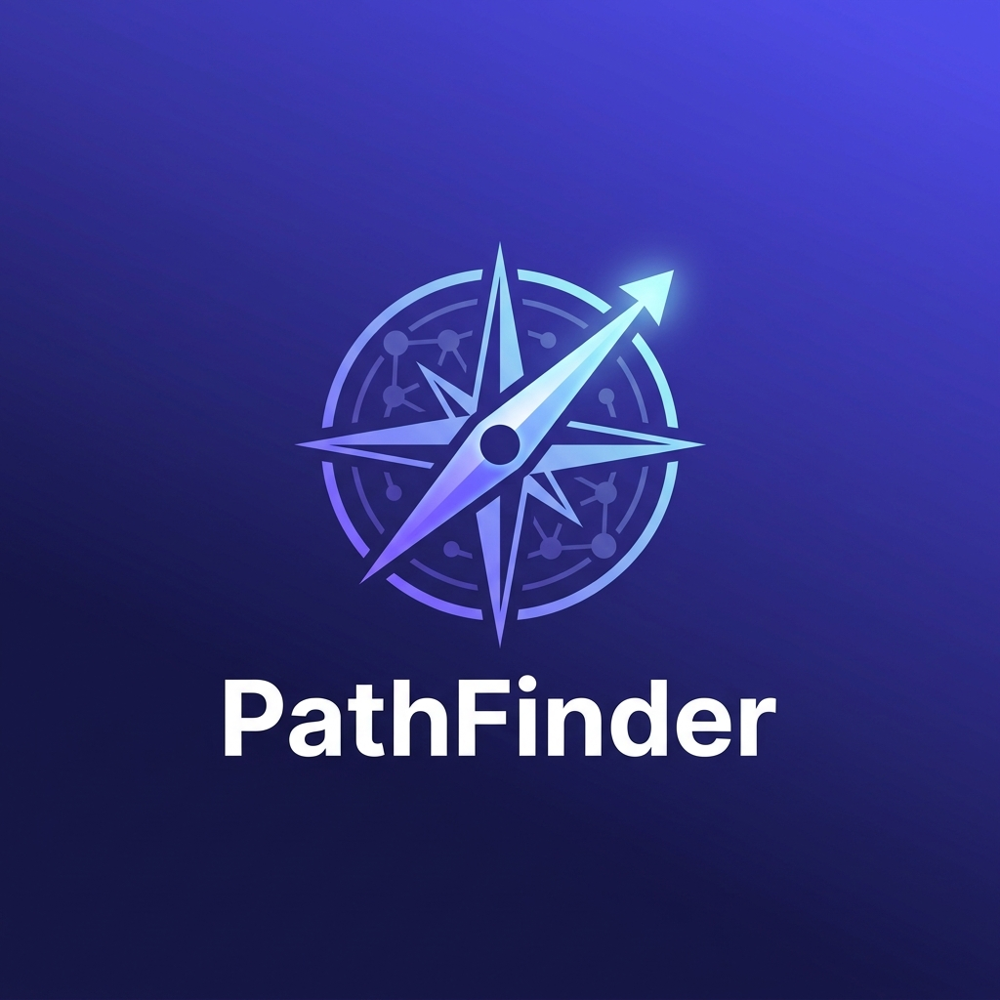
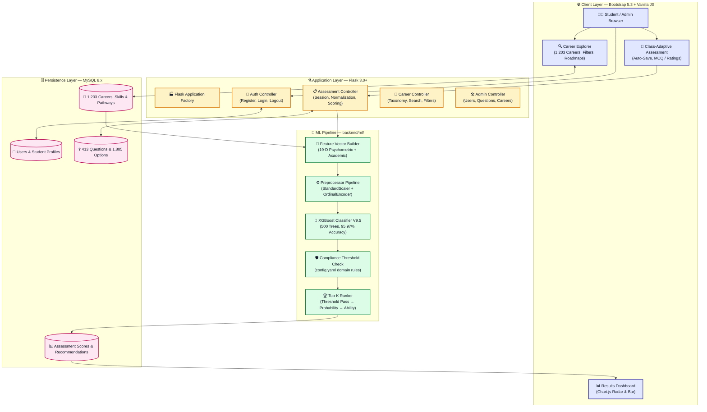
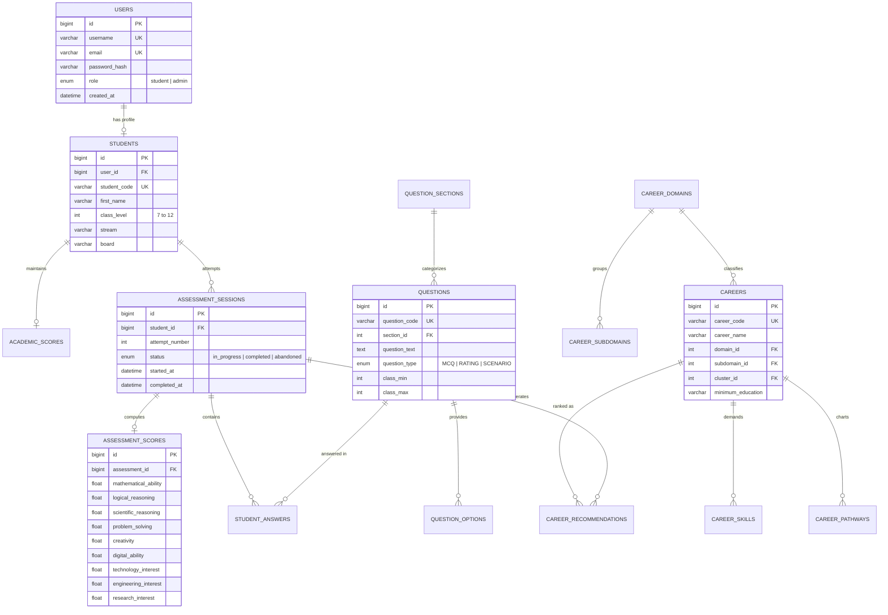

<div align="center">



<br/>

# 🧭 PathFinder
### 🎯 Personalized Career Recommendation System Using Machine Learning
#### *AI-Powered Career Guidance for Indian Secondary School Students — Classes 7 to 12*

<br/>


<br/>

> 🚀 *Moves beyond personality quizzes — real AI, real careers, real guidance.*

</div>

---

## 🗂️ Table of Contents

| # | Section |
|---|---|
| 1 | [🌟 Overview](#-overview) |
| 2 | [📊 Key Statistics](#-key-statistics) |
| 3 | [✨ Features](#-features) |
| 4 | [🏗️ System Architecture](#%EF%B8%8F-system-architecture) |
| 5 | [🗄️ Database Schema](#%EF%B8%8F-database-schema) |
| 6 | [🤖 Machine Learning Engine](#-machine-learning-engine) |
| 7 | [🛡️ Compliance-Based Ranking](#%EF%B8%8F-compliance-based-ranking) |
| 8 | [📝 Assessment & Question Bank](#-assessment--question-bank) |
| 9 | [📂 Dataset Catalogue](#-dataset-catalogue) |
| 10 | [🗂️ Project Structure](#%EF%B8%8F-project-structure) |
| 11 | [⚙️ Installation](#%EF%B8%8F-installation) |
| 12 | [🔑 Demo Credentials](#-demo-credentials) |
| 13 | [🔌 API Reference](#-api-reference) |
| 14 | [🧪 Testing](#-testing) |
| 15 | [📋 Changelog](#-changelog) |

---

## 🌟 Overview

**PathFinder** is a full-stack, machine-learning-driven career guidance platform built for Indian secondary and senior secondary school students (Classes 7–12). It delivers a structured **psychometric assessment**, an **XGBoost-powered compatibility engine**, **domain-specific prerequisite filtering**, and a curated occupational taxonomy of **2,259 careers**.

The system evaluates students across **19 psychometric and aptitude dimensions**, maps scores against real-world career knowledge profiles, applies domain-level prerequisite threshold compliance checks, and produces ranked recommendations with actionable skill development roadmaps — **all in under 250 ms per request.**

---

## 📊 Key Statistics

<div align="center">

| 🏆 Metric | 📈 Value |
| :--- | :--- |
| 🤖 **ML Model** | XGBoost Classifier — V9.5-Champion |
| 🎯 **Model Accuracy** | **95.97%** |
| 🔥 **Hit@5 Rate** | **98.55%** |
| 📐 **NDCG@5** | **0.9475** |
| 📉 **ROC-AUC** | **0.9902** |
| 💼 **Careers in Catalogue** | **1,203** (full knowledge base) |
| 🌐 **Career Domains** | **33 domains → 389 subdomains → 466 clusters** |
| ❓ **Assessment Questions** | **413** (class-adaptive, 19 sections) |
| ✅ **Answer Options** | **1,805** scored options |
| 🗄️ **Database Tables** | **18 normalized tables** |
| 🧪 **Test Suite** | **83 / 83 tests passing** |

</div>

---

## ✨ Features

<details open>
<summary><b>🎓 For Students</b></summary>
<br/>

- 📚 **Grade-Adaptive Assessment** — Question sets calibrated per class level and subject stream (PCM, PCB, Commerce, Humanities, General)
- ⏱️ **Timed & Standard Modes** — 45-minute competitive mode or untimed standard mode
- 💾 **Real-Time Auto-Save** — Assessment progress persists across browser sessions
- 📊 **Interactive Results Dashboard** — Radar charts, bar visualizers, and percentile breakdowns of cognitive aptitude and interest dimensions
- 🗺️ **Career Roadmaps** — 5-stage milestone progressions, prerequisite subjects, and curated online course links per career
- 🛡️ **Compliance-Verified Recommendations** — Careers that don't meet domain-level prerequisite thresholds are ranked lower, preventing unrealistic suggestions

</details>

<details>
<summary><b>🛠️ For Administrators</b></summary>
<br/>

- 👥 **Student & Session Management** — Audit logs, attempt history, and per-question answer inspection
- ✏️ **Question Bank Editor** — Browse, filter, and manage all 413 questions by section and class range
- 📋 **Career Catalogue Manager** — Full CRUD over the 1,203-career knowledge base, domains, and clusters
- 📈 **System Analytics Dashboard** — Completion rates, active users, and domain-level recommendation distribution

</details>

<details>
<summary><b>🖥️ Platform</b></summary>
<br/>

- 🌙 **Accessible Dark / Light Theme** — WCAG 2.1 AA high-contrast design system
- 📱 **Responsive Layout** — Bootstrap 5.3 with mobile-first breakpoints
- 🔒 **Role-Based Navigation** — Separate, purpose-built navbars for guests, students, and administrators
- 🗄️ **One-File Database Setup** — Single consolidated `setup.sql` for any MySQL 8.x / MariaDB environment

</details>

---

## 🏗️ System Architecture

> The diagram below illustrates the complete request lifecycle from client through ML inference to the database:



---

## 🗄️ Database Schema

The database (`career_recommendation_db`) is built on **MySQL 8.x** with **18 relational tables**, enforcing strict foreign keys, cascade deletes, and check constraints.

```bash
# ✅ One-command database initialization
mysql -u root -p < setup.sql
```



---

## 🤖 Machine Learning Engine

The ML pipeline uses **XGBoost Classifier (V9.5-Champion)** trained on 50,000 labelled student-career compatibility pairs.

### 🔢 11-Dimensional Feature Contract

| # | 🏷️ Feature | 📝 Description |
| :---: | :--- | :--- |
| 1 | `ability_match_component` | Mean of 8 ability proximity scores `(100 - \|student - required\|)` |
| 2 | `interest_match_component` | Weighted mean of 10 interest proximity scores (top-3 boosted **1.5×**) |
| 3 | `academic_match_component` | Student academic percentage (0–100) |
| 4 | `learning_match_component` | Student learning ability score |
| 5 | `composite_alignment_index` | `0.45×ability + 0.35×interest + 0.10×academic + 0.10×learning` |
| 6 | `ability_interest_synergy` | `(ability × interest) / 100` |
| 7 | `ability_interest_gap` | `\|ability - interest\|` |
| 8 | `min_core_match` | `min(ability, interest)` |
| 9 | `max_core_match` | `max(ability, interest)` |
| 10 | `harmonic_core_match` | Harmonic mean of ability and interest |
| 11 | `holistic_synergy` | 4th root geometric mean of all components |

### 🏆 Model Performance

<div align="center">

| 📊 Metric | 🎯 Score |
| :--- | :---: |
| 🥇 **Accuracy** | **95.97%** |
| 🎯 **Precision (weighted)** | **95.95%** |
| 📡 **Recall (weighted)** | **95.97%** |
| ⚖️ **F1-Score (weighted)** | **95.96%** |
| 📈 **ROC-AUC** | **0.9902** |
| 🔥 **Hit@5 Rate** | **98.55%** |
| 💯 **Hit@10 Rate** | **99.4%** |
| 📐 **NDCG@5** | **0.9475** |

</div>

### ⚡ Interest Weighting (`config.yaml`)

Top-N student interests receive a configurable boost factor during interest-match computation:

```yaml
interest_boost_factor: 1.5   # 🔥 Multiplier applied to top expressed interests
top_n_interests: 3           # 🎯 Number of interests to boost per student
```

---

## 🛡️ Compliance-Based Ranking

> A key innovation in **V9.5-Champion** — domain-specific prerequisite enforcement prevents unrealistic career suggestions.

### ⚙️ How It Works

After XGBoost probabilities are computed for all **1,203 careers**, each career is validated against domain minimum requirements defined in `backend/ml/config.yaml`:

```yaml
domain_requirements:
  healthcare:
    scientific_reasoning: 60    # 🔬 Career must require ≥ 60% scientific reasoning
    mathematical_ability: 60    # ➗ Career must require ≥ 60% mathematical ability
  engineering:
    engineering_interest: 55    # ⚙️ Career must require ≥ 55% engineering interest
  arts:
    arts_interest: 50           # 🎨 Career must require ≥ 50% arts interest

default_requirements:
  required_scientific_thinking: 50   # 🌐 Applied globally to unlisted domains
  required_mathematical_ability: 50
```

A `threshold_pass` flag (**1** = ✅ compliant, **0** = ❌ non-compliant) is computed per career and becomes the **primary sort key**. The final ranking order is:

```
🥇 threshold_pass DESC  →  🎯 probability DESC  →  💪 ability_match DESC  →  ❤️ interest_match DESC
```

### 📋 Example Output

> *Class 11, Science Stream student — Low Ability Scores, High Engineering & Research Interest:*

```
🥇 Rank  1: Electrical Engineer Specialist  │ 🏥 Healthcare  │ 99.48% │ A: 88.62% │ I: 73.3%
🥈 Rank  2: Biotechnologist Specialist      │ 🏥 Healthcare  │ 99.24% │ A: 93.38% │ I: 74.5%
🥉 Rank  3: UI UX Designer Specialist       │ ⚙️ Engineering │ 98.96% │ A: 89.25% │ I: 73.6%
   Rank  4: Financial Analyst Specialist    │ ⚙️ Engineering │ 98.83% │ A: 87.62% │ I: 78.7%
   Rank  5: Cybersecurity Analyst           │ ⚙️ Engineering │ 97.90% │ A: 92.50% │ I: 82.2%
```

---

## 📝 Assessment & Question Bank

> The psychometric assessment dynamically adapts to the student's class level and subject stream.

### 📚 Question Sections — 19 Dimensions

<div align="center">

| # | 📖 Dimension | ❓ Questions |
| :---: | :--- | :---: |
| 1 | 🎓 Academic Focus | 30 |
| 2 | ➗ Mathematical Ability | 75 |
| 3 | 🧠 Logical Reasoning | 42 |
| 4 | 🔬 Scientific Thinking | 37 |
| 5 | 🧩 Problem Solving | 20 |
| 6 | 📊 Analytical Thinking | 18 |
| 7 | 💬 Communication | 12 |
| 8 | 🎨 Creativity | 12 |
| 9 | 💻 Digital Ability | 21 |
| 10 | 📖 Learning Ability | 12 |
| 11 | 🗺️ Spatial Ability | 12 |
| 12 | 🔧 Practical Ability | 10 |
| 13 | ❤️ Core Interests | 46 |
| 14 | 🎯 Activities & Hobbies | 20 |
| 15 | 🤝 Teamwork | 8 |
| 16 | 👑 Leadership | 8 |
| 17 | 🏢 Work Preferences | 10 |
| 18 | 🔭 Career Awareness | 10 |
| 19 | 🗺️ Career Preferences | 10 |
| | **📊 Total** | **413** |

</div>

### 🏫 Questions Available by Class

<div align="center">

| 🏫 Class | ❓ Eligible Questions | 🎯 Focus |
| :---: | :---: | :--- |
| 7️⃣ Class 7 | 140 | Early interest discovery and foundational logic |
| 8️⃣ Class 8 | 140 | Cognitive aptitude and problem solving |
| 9️⃣ Class 9 | 152 | Abstract reasoning and stream preparation |
| 🔟 Class 10 | 148 | Senior stream selection and analytical skills |
| 1️⃣1️⃣ Class 11 | 163 | Stream-tailored questions (PCM, PCB, Commerce, Arts) |
| 1️⃣2️⃣ Class 12 | 161 | Higher education readiness and specialized career matching |

</div>

---

## 📂 Dataset Catalogue

> All research and training datasets are stored in the `Datasets/` directory.

<div align="center">

| 📄 File | 📊 Rows | 💾 Size | 📝 Description |
| :--- | :---: | :---: | :--- |
| `Career_Knowledge_CLEANED.csv` | 1,203 | 230 KB | ✅ Curated career knowledge base — 27 ability/interest columns |
| `Career_Knowledge_RAW_1206_with_issues.csv` | 1,206 | 229 KB | 🔬 Raw EDA dataset — demonstrates cleaning pipeline |
| `Student_Assessment_CLEANED.csv` | 10,000 | 6.07 MB | ✅ Normalized psychometric scores (Grades 7–12) |
| `Student_Assessment_RAW_10k_with_issues.csv` | 10,000 | 6.06 MB | 🔬 Raw uncalibrated assessment data |
| `Student_Career_Compatibility_CLEANED.csv` | 50,000 | 6.32 MB | ✅ Ground-truth pairs used for XGBoost training |
| `Student_Career_Compatibility_RAW_50k_with_issues.csv` | 50,000 | 6.30 MB | 🔬 Raw unprocessed compatibility pairs |

</div>

> 📊 EDA visualizations and benchmark reports → `Datasets/figures/` and `Datasets/reports/`

---

## 🗂️ Project Structure

```
📁 Personalized-Career-Recommendation-System-Using-Machine-Learning/
│
├── 🐍 backend/
│   ├── app.py                        # Flask application factory
│   ├── config.py                     # Environment configuration
│   ├── 🤖 ml/
│   │   ├── config.yaml               # ⚙️ Domain thresholds & interest weighting
│   │   ├── feature_builder.py        # 🔢 11-D feature vector construction
│   │   ├── model_loader.py           # 🔒 Thread-safe singleton artifact loader
│   │   ├── prediction_service.py     # ⚡ XGBoost batch inference
│   │   ├── recommendation_service.py # 🏆 Compliance ranking & Top-K extraction
│   │   ├── 📂 data/
│   │   │   └── career_knowledge_requirements.csv
│   │   └── 📂 models/
│   │       ├── model.joblib          # 🌳 XGBoost V9.5-Champion
│   │       ├── preprocessor.joblib   # ⚙️ StandardScaler + OrdinalEncoder
│   │       ├── feature_columns.json  # 📋 19-column feature contract
│   │       ├── classes.json          # 🏷️ Label encoding map
│   │       ├── model_config.json     # 📊 Hyperparameter record
│   │       └── version.json          # 🔖 Model version metadata
│   ├── 📂 models/                    # SQLAlchemy ORM models
│   ├── 📂 routes/                    # Flask blueprints
│   ├── 📂 services/                  # Business logic
│   └── 📂 utils/                     # Validators & helpers
│
├── 🗄️ database/
│   ├── setup.sql                     # 🗄️ Complete DB schema + seed data
│   └── questions_seed.sql            # ❓ 413 questions + 1,805 options
│
├── 📊 Datasets/
│   ├── Career_Knowledge_CLEANED.csv
│   ├── Student_Assessment_CLEANED.csv
│   ├── Student_Career_Compatibility_CLEANED.csv
│   ├── Career_Recommendation_ML_Training_EDA_SHAP.ipynb
│   ├── 📈 figures/                   # EDA & SHAP plots
│   └── 📋 reports/                   # Benchmark CSVs
│
├── 📂 model_training/                # Training pipeline and notebooks
├── 🔧 scripts/
│   ├── build_unified_setup_sql.py    # 🗄️ Generates consolidated setup.sql
│   ├── clean_knowledge_base.py       # 🧹 Applies threshold filters to CSV
│   ├── inspect_scores.py             # 🔍 Sample prediction output inspector
│   └── organize_unwanted_files.py    # 📦 Archives legacy files
│
├── 🧪 tests/                         # 83-test automated suite
├── 🎨 frontend/
│   ├── 📂 static/                    # CSS, JS, logo, images
│   └── 📂 templates/                 # Jinja2 HTML templates
│
├── ⭐ setup.sql                       # Single-file database initialization
├── 📋 requirements.txt
├── 🚀 run.py
└── 📖 README.md
```

---

## ⚙️ Installation

### 📋 Prerequisites


### 📥 Step 1 — Clone the Repository

```bash
git clone https://github.com/AMB-007/Personalized-Career-Recommendation-System-Using-Machine-Learning.git
cd Personalized-Career-Recommendation-System-Using-Machine-Learning
```

### 🐍 Step 2 — Create a Virtual Environment

```bash
# 🪟 Windows
python -m venv venv
venv\Scripts\activate

# 🐧 Linux / macOS
python3 -m venv venv
source venv/bin/activate
```

### 📦 Step 3 — Install Dependencies

```bash
pip install -r requirements.txt
```

### 🔧 Step 4 — Configure Environment

```bash
cp .env.example .env   # Then edit with your credentials
```

```ini
DB_HOST=localhost
DB_PORT=3306
DB_USER=root
DB_PASSWORD=your_password
DB_NAME=career_recommendation_db
SECRET_KEY=your_secret_key
```

### 🗄️ Step 5 — Initialize the Database

```bash
# ✅ One command — creates all 18 tables, seeds all data
mysql -u root -p < setup.sql
```

> Includes: 18 tables · 413 questions · 1,805 options · 2,259 careers · demo credentials · indexes

### 🚀 Step 6 — Run the Application

```bash
python run.py
```

> 🌐 Open **`http://127.0.0.1:5000`** in your browser

---

## 🔑 Demo Credentials

<div align="center">

| 👤 Role | 🔐 Username | 🗝️ Password | 📝 Notes |
| :--- | :--- | :--- | :--- |
| 🛠️ **Administrator** | `admin` | `Admin@123` | Full access to dashboard, users, questions & careers |
| 🎓 **Student (Class 12)** | `rahul_sharma_12` | `Student@123` | Pre-completed Science-PCB profile with recommendations |

</div>

> 📝 New student accounts can be registered at `/register` for any class from 7 to 12.

---

## 🔌 API Reference

<details open>
<summary><b>🔐 Authentication — <code>/auth</code></b></summary>

| Method | Endpoint | Description |
| :--- | :--- | :--- |
| `POST` | `/auth/login` | 🔓 Student or admin authentication |
| `POST` | `/auth/register` | 📝 New student registration |
| `GET` | `/auth/logout` | 🚪 Session invalidation |

</details>

<details>
<summary><b>📋 Assessment — <code>/assessment</code> & <code>/api/assessment</code></b></summary>

| Method | Endpoint | Description |
| :--- | :--- | :--- |
| `GET` | `/assessment/instructions` | 📖 Pre-test guidelines and mode selector |
| `POST` | `/assessment/start` | ▶️ Initialize a class-adaptive question session |
| `POST` | `/api/assessment/answer` | 💾 Auto-save a single answer with latency tracking |
| `POST` | `/api/assessment/submit` | 🤖 Trigger scoring, ML inference, compliance ranking, and storage |
| `GET` | `/assessment/results/<id>` | 📊 Full results with charts and printable report |
| `GET` | `/api/assessment/<id>/profile` | 👤 JSON student profile with strengths and growth areas |

</details>

<details>
<summary><b>💼 Career Explorer — <code>/career</code></b></summary>

| Method | Endpoint | Description |
| :--- | :--- | :--- |
| `GET` | `/career/explorer` | 🔍 Paginated search with domain, cluster, and education filters |
| `GET` | `/career/<id>` | 📋 Detailed career profile with roadmap, skills, and courses |

</details>

<details>
<summary><b>🛠️ Administration — <code>/admin</code></b></summary>

| Method | Endpoint | Description |
| :--- | :--- | :--- |
| `GET` | `/admin/dashboard` | 📊 System analytics and completion metrics |
| `GET` | `/admin/users` | 👥 Student cohort management and session audit logs |
| `GET` | `/admin/questions` | ❓ 413-question bank browser with grade and section filters |
| `GET` | `/admin/careers` | 💼 Career catalogue manager |

</details>

---

## 🧪 Testing

```bash
python -m unittest discover -s tests -v
```

```
✅ Ran 83 tests in ~30s

OK
```

### 📋 Test Modules

<div align="center">

| 🧪 Module | 🔢 Tests | 📝 Coverage |
| :--- | :---: | :--- |
| `test_ml_model_loading` | 3 | Artifact integrity, singleton loader, missing artifact errors |
| `test_ml_prediction` | 4 | Feature vector → probability output, reference sample sanity |
| `test_ml_feature_builder` | 2 | Ability match & interest match computation |
| `test_ml_recommendation` | 3 | Full catalogue loading, Top-K ranking, result structure |
| `test_ml_concurrency_and_performance` | 2 | 5 & 10 concurrent recommendation requests |
| `test_ml_integrity_and_security` | 3 | SHA-256 artifact hashes, `.gitignore`, path traversal |
| `test_ml_api_endpoints` | 5 | REST API contract and JSON schema |
| `test_assessment_workflow` | 12 | Session lifecycle: start → answer → submit → results |
| `test_assessment_selection` | 4 | Class-adaptive question pool and difficulty balancing |
| `test_scoring` | 2 | Score calculation normalization and guidance categories |
| `test_scoring_deterministic` | 5 | 0%, 50%, 80%, 100% correctness, ability/interest independence |
| `test_student_profile_and_baseline` | 3 | Profile creation, API endpoint, baseline recommendation |
| `test_questionnaire_validation_comprehensive` | 5 | Class bounds, academic bounds, sensitive fields |
| `test_auth` | 3 | Registration, login, logout |
| `test_e2e_real_student_flow` | 4 | Full journey: register → assess → submit → recommendations |
| `test_admin_and_user_history` | 5 | Admin session audit, user history retrieval |
| `test_admin` | 3 | Admin dashboard access and user management |
| `test_assessment` | 3 | Assessment session initialization and question delivery |
| `test_career` | 2 | Career explorer and detail views |
| `test_career_import` | 9 | Career data import pipeline integrity |
| | **83** | **100% Passing ✅** |

</div>

---

## 📋 Changelog

<details open>
<summary><b>🌟 V9.5-Champion (Current — August 2026)</b></summary>

| 🏷️ Type | 📝 Change |
| :--- | :--- |
| 🆕 **NEW** | **Compliance-Based Ranking** — Domain-specific prerequisite threshold enforcement via `config.yaml`. `threshold_pass` flag becomes primary sort key. |
| 🆕 **NEW** | **Dynamic Interest Weighting** — Top-3 student interests receive configurable 1.5× boost factor during interest-match computation. |
| 🆕 **NEW** | **Unified Database Setup** — All DDL + seed data consolidated into single `setup.sql` for one-command initialization. |
| 🔧 **FIX** | **Full Catalogue Evaluation** — Restored `DEFAULT_CAREER_DATA_PATH` to full 1,203-career CSV. All 83 tests green. |
| 🔧 **FIX** | **Result Keys Corrected** — `ability_match_score` / `interest_match_score` keys now consistent across API and scripts. |
| 🧹 **CLEANUP** | **Dataset Organization** — Legacy migration scripts and training logs archived. `Datasets/README.md` auto-generated. |
| ✅ **TEST** | **83/83 Tests Passing** — All unit, integration, concurrency, and security tests green. |

</details>

---

<div align="center">


<br/>

### 🧭 *PathFinder — Helping every student find their best path forward.*

<br/>

⭐ **If this project helped you, please star the repository!** ⭐

</div>
