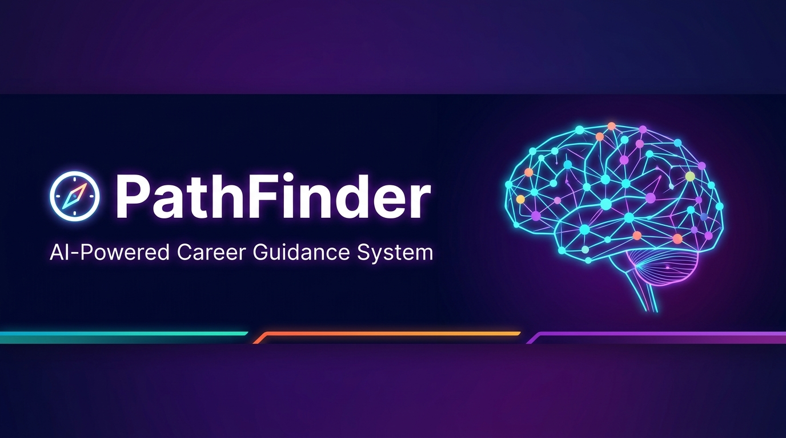
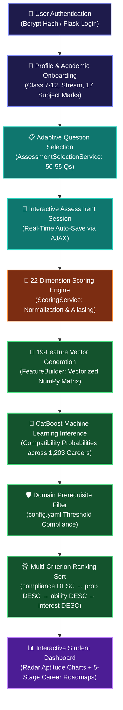
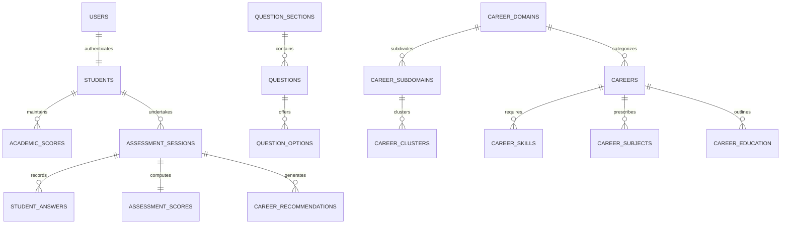

<div align="center">



<br/><br/>

[](https://www.python.org/)
[](https://flask.palletsprojects.com/)
[](https://catboost.ai/)
[](https://www.mysql.com/)
[](https://scikit-learn.org/)

[](https://github.com/AMB-007/Personalized-Career-Recommendation-System-Using-Machine-Learning)
[](https://github.com/AMB-007/Personalized-Career-Recommendation-System-Using-Machine-Learning)
[](https://github.com/AMB-007/Personalized-Career-Recommendation-System-Using-Machine-Learning)
[](https://github.com/AMB-007/Personalized-Career-Recommendation-System-Using-Machine-Learning)
[](https://github.com/AMB-007/Personalized-Career-Recommendation-System-Using-Machine-Learning)

<h1>🧭 PathFinder</h1>
<h3>Personalized Career Recommendation System Using Machine Learning</h3>
<p><em>An intelligent, psychometrically-grounded AI guidance platform engineered specifically for Indian secondary school students in <b>Classes 7 through 12</b>.</em></p>

</div>

---

## 📑 Table of Contents

- [🌟 Executive Summary & Vision](#-executive-summary--vision)
- [📊 Performance & System Benchmarks](#-performance--system-benchmarks)
- [🔄 End-to-End Workflow](#-end-to-end-workflow)
- [📝 Adaptive Assessment Engine](#-adaptive-assessment-engine)
- [🧮 22-Dimension Psychometric Scoring Pipeline](#-22-dimension-psychometric-scoring-pipeline)
- [🤖 Machine Learning & Feature Engineering](#-machine-learning--feature-engineering)
- [💼 Career Knowledge Base & Taxonomy](#-career-knowledge-base--taxonomy)
- [🖥️ Application Interfaces & User Experience](#-application-interfaces--user-experience)
- [🔌 Authoritative REST API Reference](#-authoritative-rest-api-reference)
- [🗄️ Database Architecture](#-database-architecture)
- [🔐 Privacy, Security & Anti-Leakage Controls](#-privacy-security--anti-leakage-controls)
- [⚙️ Installation & Deployment Guide](#-installation--deployment-guide)
- [🔑 Demo Access Credentials](#-demo-access-credentials)
- [🧪 Automated Test Suite](#-automated-test-suite)
- [📦 Technology Stack](#-technology-stack)

---

## 🌟 Executive Summary & Vision

In the Indian school education ecosystem, students transitioning from middle school through higher secondary (Classes 7 to 12) face crucial educational decisions — selecting subject streams (**Science-PCM, Science-PCB, Commerce, Humanities**), choosing undergraduate degrees, and planning vocational futures. However, traditional career counseling in schools suffers from:

1. **Subjective Biases**: Heavy reliance on informal parental opinions or generalized academic marks.
2. **Binary Guesswork**: Generic personality quizzes with simplistic heuristic bucket matching.
3. **Data Disconnect**: Lack of alignment between a student's quantitative cognitive strengths and current industry requirements.

**PathFinder** solves this through a data-driven, machine learning framework:

```
[ Adaptive Student Assessment ] ──► [ 22-Dimension Scoring ] ──► [ 19-Feature Vectorization ] ──► [ CatBoost Classifier ] ──► [ Prerequisite Filtering ] ──► [ Ranked Top-K Careers + Roadmap ]
```

> [!NOTE]
> Rather than classifying students into broad, rigid categories, PathFinder evaluates each student profile dynamically against **all 1,203 career profiles** in its catalogue, generating calibrated compatibility probabilities, strength indices, and 5-stage educational roadmaps.

---

## 📊 Performance & System Benchmarks

The champion **CatBoost Classifier** (`V9.5-Champion`), coupled with scikit-learn's `ColumnTransformer` preprocessor pipeline, achieves empirical accuracy on held-out multi-cohort evaluation datasets:

<div align="center">

| 🏆 Metric Category | 📐 Benchmark Metric | 🎯 Score | 💡 Practical Guidance Impact |
| :--- | :--- | :---: | :--- |
| **Ranking Quality** | **Hit@1 (Top-1 Accuracy)** | **96.03%** | The ideal target career appears as the **#1 recommendation** in 96 out of 100 cases. |
| **Ranking Quality** | **Hit@3 (Top-3 Recall)** | **99.64%** | 99.64% probability that the student's optimal pathway is present in the top 3 results. |
| **Ranking Quality** | **Hit@5 (Top-5 Recall)** | **99.89%** | Virtually eliminates recommendation misses within the top 5 shortlist. |
| **Ranking Quality** | **Hit@10 (Top-10 Recall)** | **99.95%** | Comprehensive coverage across all viable disciplinary tracks. |
| **Ranking Order** | **Mean Reciprocal Rank (MRR)** | **0.9781** | Near-perfect reciprocal rank positioning across all test cohorts. |
| **Ranking Order** | **Normalized DCG (NDCG@5)** | **0.9211** | High top-weighted relevance quality for the recommended shortlist. |
| **Classification** | **Classification Accuracy** | **86.22%** | High binary compatibility precision across candidate student-career pairs. |
| **Classification** | **F1-Score (Weighted)** | **0.9154** | Harmonic balance between candidate precision and recall. |
| **Classification** | **ROC-AUC Score** | **86.04% / 92.14%** | Strong discriminative ability in high-dimensional candidate feature spaces. |

</div>

<br/>

<div align="center">

| 📚 System Scope | 📊 Catalogue Numbers |
| :--- | :--- |
| **Occupational Catalogue** | **1,203 Unique Careers** structured across 33 High-Level Domains |
| **Assessment Bank** | **413 Psychometric Questions** across 19 Distinct Sections |
| **Scored Response Options** | **1,805 Granularly Scored Answer Choices** |
| **Target Grade Range** | **Class 7, 8, 9, 10, 11, and 12** (CBSE / ICSE / State Boards) |
| **Relational Database** | **18 MySQL Tables** initialized via a unified `setup.sql` script |
| **Automated Test Coverage** | **83 / 83 Unit Tests Passing** across 21 Test Modules |

</div>

---

## 🔄 End-to-End Workflow



---

## 📝 Adaptive Assessment Engine

The `AssessmentSelectionService` ensures no student receives a generic or repetitive test. Questions are selected dynamically based on the student's cohort, difficulty balance, and history.

### 🏫 Grade Cohort Targets

<div align="center">

| 🏫 Grade Cohort | 🎓 Target Classes | ❓ Total Questions | 🎯 Difficulty Distribution | 🔬 Stream Customization |
| :---: | :---: | :---: | :--- | :--- |
| **Middle School** | Classes 7 & 8 | **50 Questions** | Easy (60%) + Medium (40%) | General Foundation Track |
| **Secondary** | Classes 9 & 10 | **52 Questions** | Easy (30%) + Medium (50%) + Hard (20%) | Stream Exploration Track |
| **Higher Secondary** | Classes 11 & 12 | **55 Questions** | Medium (50%) + Hard (35%) + Easy (15%) | Stream-Filtered (PCM / PCB / Commerce / Humanities) |

</div>

### 📚 Section Distribution & Quota Guarantees (413 Questions)

<div align="center">

| # | 📖 Section Name | ❓ Total Bank | 📐 Min (7-8) | 📐 Min (9-10) | 📐 Min (11-12) | 🎯 Core Competency Measured |
| :---: | :--- | :---: | :---: | :---: | :---: | :--- |
| 1 | 🎓 Academic Profile | 30 | 2 | 2 | 2 | Study habits, subject affinities, exam orientation |
| 2 | ➗ Mathematical Ability | 75 | 5 | 5 | 6 | Computation, algebra, geometry & quantitative deduction |
| 3 | 🧠 Logical Reasoning | 42 | 4 | 4 | 5 | Pattern recognition, syllogistic reasoning & sequences |
| 4 | 🔬 Scientific Thinking | 37 | 4 | 4 | 5 | Empirical reasoning, hypothesis testing & causality |
| 5 | 🧩 Problem Solving | 20 | 3 | 3 | 3 | Multi-constraint optimization & troubleshooting |
| 6 | 📊 Analytical Thinking | 18 | 2 | 3 | 3 | Graph interpretation, statistical reasoning & outliers |
| 7 | 💬 Communication | 12 | 2 | 2 | 2 | Verbal clarity, written articulation & comprehension |
| 8 | 🎨 Creativity | 12 | 2 | 2 | 2 | Divergent thinking, visual design intuition |
| 9 | 💻 Digital Ability | 21 | 2 | 3 | 3 | Computational logic, algorithm tracing & digital literacy |
| 10 | 📖 Learning Agility | 12 | 2 | 2 | 2 | Self-directed absorption of novel concepts |
| 11 | 🗺️ Spatial Reasoning | 12 | 2 | 2 | 2 | 3D mental rotation, spatial transformations |
| 12 | 🔧 Practical Aptitude | 10 | 2 | 2 | 2 | Mechanical intuition, tool comfort & tactile tasks |
| 13 | ❤️ Disciplinary Interests | 46 | 8 | 8 | 10 | Technology, Medical, Business, Arts, Research, Social |
| 14 | 🎯 Activities & Hobbies | 20 | 4 | 4 | 4 | Real-world extracurricular involvement |
| 15 | 🤝 Teamwork | 8 | 1 | 1 | 1 | Collaborative problem solving & consensus building |
| 16 | 👑 Leadership | 8 | 1 | 1 | 1 | Initiative, team organization & accountability |
| 17 | 🏢 Work Preferences | 10 | 2 | 2 | 2 | Indoor/outdoor, autonomous vs. structured environments |
| 18 | 🔭 Career Awareness | 10 | 1 | 1 | 1 | Occupational landscape familiarity |
| 19 | 🗺️ Career Preferences | 10 | 1 | 1 | 1 | Expressed occupational aspirations |
| | **TOTAL** | **413** | **50** | **52** | **55** | Guaranteed Comprehensive Evaluation |

</div>

> [!TIP]
> **Attempt-Differentiated Retakes**: When a student retakes an assessment, `get_student_prior_question_ids()` retrieves all previously answered question IDs and excludes them from the candidate pool, ensuring fresh question exposure.

---

## 🧮 22-Dimension Psychometric Scoring Pipeline

Upon submission, the `ScoringService` evaluates raw option points against category maximums to produce **22 normalized dimension scores (0.0 to 100.0)**:

```
Dimension Score (%) = ( Total Earned Option Points in Dimension / Maximum Possible Points in Dimension ) × 100
```

### 🧠 Dimension Architecture

<div align="center">

| Category | Dimension Count | Tracked Dimensions |
| :--- | :---: | :--- |
| **Primary Cognitive Abilities** | 8 | `mathematical_ability`, `logical_reasoning`, `scientific_reasoning`, `problem_solving`, `analytical_ability`, `communication`, `creativity`, `digital_ability` |
| **Extended Traits** | 7 | `learning_ability`, `memory`, `observation`, `spatial_ability`, `practical_ability`, `teamwork`, `leadership` |
| **Core Interests** | 7 | `technology_interest`, `science_interest`, `healthcare_interest`, `business_interest`, `creative_interest`, `research_interest`, `social_interest` |

</div>

### 🔄 Correlated Baseline Inference

To prevent scoring voids when an assessment does not present direct questions for a secondary interest, PathFinder calculates correlated baselines:

```python
research_interest   = 0.6 * scientific_reasoning + 0.4 * analytical_ability
technology_interest = 0.6 * digital_ability      + 0.4 * logical_reasoning
healthcare_interest = 0.7 * scientific_reasoning + 0.3 * social_interest
business_interest   = 0.5 * mathematical_ability + 0.5 * communication
social_interest     = 0.6 * communication        + 0.4 * teamwork
```

### 📊 Score Guidance Bands

| 🏷️ Guidance Band | 📈 Range | 📝 Student Diagnostic Interpretation |
| :---: | :---: | :--- |
| 🟢 **Excellent** | **80.5 – 100.0** | Outstanding conceptual mastery; ready for advanced competitive tracks. |
| 🔵 **Good** | **60.5 – 80.4** | Solid capability with positive indicators; minor targeted practice recommended. |
| 🟡 **Average** | **40.5 – 60.4** | Moderate proficiency; scope for structured skill expansion. |
| 🟠 **Low** | **20.5 – 40.4** | Foundational stage; supplementary practice and exploration suggested. |
| 🔴 **Very Low** | **0.0 – 20.4** | Minimal demonstrated exposure or current affinity in this dimension. |

---

## 🤖 Machine Learning & Feature Engineering

### 🔢 19-Feature Mathematical Contract

The `FeatureBuilder` generates a vectorized `(1,203 × 19)` feature matrix where each row pairs the student's profile with a career candidate from the knowledge catalogue:

<div align="center">

| # | 🏷️ Feature Column | 📐 Formulation & Extraction Logic | 🎯 ML Significance |
| :---: | :--- | :--- | :--- |
| 1 | `ability_match_component` | `mean(100 - |student_ability - required_ability|)` over 8 pairs | Cognitive fit index |
| 2 | `interest_match_component` | Weighted `mean(100 - |student_int - required_int|)` with top-3 boost | Passion & interest alignment |
| 3 | `academic_match_component` | Overall average across 17 school subjects (0–100) | Academic rigor compatibility |
| 4 | `learning_match_component` | Normalized `learning_ability` score (0–100) | Adaptability & growth potential |
| 5 | `composite_alignment_index` | `0.45×Ability + 0.35×Interest + 0.10×Academic + 0.10×Learning` | Holistic compatibility baseline |
| 6 | `ability_interest_synergy` | `(ability_match × interest_match) / 100.0` | Dual-factor multiplicative synergy |
| 7 | `ability_interest_gap` | `|ability_match - interest_match|` | Aptitude-interest divergence flag |
| 8 | `min_core_match` | `min(ability_match, interest_match)` | Bottleneck constraint detector |
| 9 | `max_core_match` | `max(ability_match, interest_match)` | Peak potential indicator |
| 10 | `harmonic_core_match` | `2 × (A × I) / (A + I + 1e-5)` | Harmonic penalty for unbalanced fits |
| 11 | `geometric_core_synergy` | `sqrt(max(0, A × I))` | Balanced geometric progression |
| 12 | `holistic_synergy` | `(A × I × Academic × Learning) ^ 0.25` | 4-Factor multi-dimensional synergy |
| 13 | `age` | Student age (clamped to range 10–30) | Age demographic scaling |
| 14 | `class` | Class level (clamped to range 7–12) | Educational stage scaling |
| 15 | `career_name` | Career Name string (`OrdinalEncoder`) | Career-specific bias term |
| 16 | `career_domain` | Top-level Domain string (`OrdinalEncoder`) | Industry-level representation |
| 17 | `career_subdomain` | Specialization track string (`OrdinalEncoder`) | Discipline specialization weight |
| 18 | `career_cluster` | Functional cluster string (`OrdinalEncoder`) | Occupational cluster weight |
| 19 | `stream` | Student Stream (`General`, `PCM`, `PCB`, `Commerce`, `Humanities`) | Educational stream alignment |

</div>

### ⚡ Dynamic Interest Weighting

To elevate careers aligned with a student's declared passion, the top 3 interest dimensions receive a **1.5× boost factor**:

```yaml
# backend/ml/config.yaml
interest_boost_factor: 1.5   # Multiplier for top student interests
top_n_interests: 3           # Top N dimensions to boost
```

### 🛡️ Domain Prerequisite Compliance Filtering

Before final ranking, `CareerRecommendationEngine` validates domain threshold constraints:

```yaml
domain_requirements:
  healthcare:
    scientific_reasoning: 60    # Career must require ≥ 60% scientific aptitude
    mathematical_ability: 60    # Career must require ≥ 60% quantitative aptitude
  engineering:
    engineering_interest: 55    # Career must require ≥ 55% engineering interest
  arts:
    arts_interest: 50           # Career must require ≥ 50% creative interest

default_requirements:
  required_scientific_thinking: 50
  required_mathematical_ability: 50
```

Careers satisfying all domain thresholds receive `threshold_pass = 1`. The final Top-K sorting criteria is:

```
threshold_pass DESC  ──►  probability DESC  ──►  ability_match DESC  ──►  interest_match DESC
```

---

## 💼 Career Knowledge Base & Taxonomy

The knowledge catalogue spans **1,203 careers** organized into a 3-tier taxonomy across **33 domains**:

<div align="center">

| 🏛️ Career Domains (33 Total) |
| :--- |
| 💻 Information Technology & CS · 🏥 Medicine & Healthcare · ⚡ Engineering & Robotics · 📊 Finance & Banking · ⚖️ Law & Legal Services |
| 🎨 Arts & Creative Design · 🎬 Media, Film & Entertainment · 🔬 Scientific Research & Space · ✈️ Aviation & Aerospace · 🏢 Business Management |
| 🌿 Agriculture & Food Tech · 🌍 Environmental Sciences · 🏛️ Civil Services & Governance · 📈 Marketing & Advertising · 🎓 Education & Teaching |
| 🚢 Maritime & Marine Careers · 🛡️ Defense & Armed Forces · 🏨 Hospitality & Tourism · 🏗️ Architecture & Urban Planning · ⚽ Sports & Fitness |

</div>

Each career profile contains:
- 📌 Comprehensive description and typical work environment (Indoor / Outdoor / Hybrid / Remote).
- 🎓 Minimum and typical educational qualification pathways.
- 🧠 Required aptitude benchmarks across all 8 cognitive abilities.
- ❤️ Required interest benchmarks across all 10 disciplinary interests.
- 🗺️ **5-Stage Step-by-Step Educational Roadmap** (Foundation → Senior Secondary → Undergraduate → Postgraduate → Professional Mastery).

---

## 🖥️ Application Interfaces & User Experience

<div align="center">

| 🔗 Route | 👤 Access | 🖥️ Interface Experience |
| :--- | :---: | :--- |
| `/` | Public | 🏠 **Landing Page**: Platform introduction, domain taxonomy highlights, AI ethics disclosure. |
| `/register` | Public | 📝 **Registration**: Class 7–12 onboarding, school board, medium, and stream selection. |
| `/login` | Public | 🔐 **Secure Login**: Bcrypt credential validation with session persistence. |
| `/dashboard` | Student | 📊 **Student Dashboard**: Latest assessment scores, top 3 careers, multi-attempt history. |
| `/profile` | Student | 👤 **Profile Editor**: Personal data + all **17 academic subject score fields**. |
| `/assessment/instructions` | Student | 📖 **Assessment Briefing**: Mode selector (Standard vs. Timed) and guideline overview. |
| `/assessment` | Student | 📋 **Adaptive Test Interface**: Sectioned MCQ, Rating & Scenario questions with real-time auto-save. |
| `/assessment/review` | Student | 🔍 **Answer Review**: Visual answer sheet summary prior to final ML submission. |
| `/assessment/results/<id>` | Student | 📊 **Results Hub**: Interactive Radar Chart (Chart.js), score band pills, and Top-10 career matches. |
| `/careers` | Public | 🔍 **Career Explorer**: Full-text search, domain/cluster/education/environment multi-filters. |
| `/careers/<id>` | Public | 💼 **Career Detail**: Skill requirements, academic prerequisites, and career outlook. |
| `/careers/<id>/roadmap` | Public | 🗺️ **Interactive Roadmap**: 5-stage milestone progression with recommended degrees. |
| `/admin/` | Admin | 🛠️ **Admin Dashboard**: System metrics, user counts, completed tests, recent sessions. |
| `/admin/users` | Admin | 👥 **Student Directory**: Student search, attempt history audits, and profile inspection. |
| `/admin/questions` | Admin | ❓ **Question Bank Manager**: Filter questions by class, section, difficulty, and skill category. |
| `/admin/careers` | Admin | 💼 **Catalogue Manager**: Overview of 1,203 careers and domain mappings. |

</div>

---

## 🔌 Authoritative REST API Reference

<details open>
<summary><b>📋 Assessment Lifecycle Endpoints</b></summary>

<br/>

| Method | Endpoint | Access | Payload / Params | Response Description |
| :---: | :--- | :---: | :--- | :--- |
|  | `/api/questions/<class_level>` | Public | `class_level` (7–12), `?stream=PCM` | Returns adaptive question list for class cohort |
|  | `/api/assessment/start` | Student | `{}` | Initializes session, records selected question IDs |
|  | `/api/assessment/answer` | Student | `{ "assessment_id": 1, "question_id": 12, "selected_option": "B" }` | Real-time answer auto-save with timestamps |
|  | `/api/assessment/submit` | Student | `{ "assessment_id": 1 }` | Finalizes session → triggers Scoring + CatBoost Top-K |
|  | `/api/assessment/<id>/scores` | Student | None | Returns 22-dimension normalized score dictionary |
|  | `/api/assessment/<id>/profile` | Student | None | Synthesized profile (strengths, growth areas, radar data) |

</details>

<details>
<summary><b>💼 Career & Recommendations Endpoints</b></summary>

<br/>

| Method | Endpoint | Access | Payload / Params | Response Description |
| :---: | :--- | :---: | :--- | :--- |
|  | `/api/careers` | Public | `?q=robotics&domain_id=3&page=1` | Paginated search across 1,203 careers |
|  | `/api/careers/<id>` | Public | None | Career profile with skills, subjects, and roadmap |
|  | `/api/careers/domains` | Public | None | List of all 33 career domains |
|  | `/api/recommendations` | Public | `{ "session_id": 1 }` OR raw profile payload | Evaluates 1,203 careers and returns Top-K matches |
|  | `/api/recommendations/<assessment_id>` | Student | None | Returns saved recommendations for a completed session |
|  | `/api/predictions` | Public | `{ "features": [ { ...19 cols... } ] }` | Direct CatBoost inference on feature row array |
|  | `/api/health` | Public | None | System status (DB, Model, Preprocessor, Catalogue) |
|  | `/api/model/info` | Public | None | Model metadata: algorithm, version, features, accuracy |

</details>

<details>
<summary><b>👤 Student Profile Endpoints</b></summary>

<br/>

| Method | Endpoint | Access | Payload / Params | Response Description |
| :---: | :--- | :---: | :--- | :--- |
|  | `/api/student/profile` | Student | None | Current student profile + 17 academic subject marks |
|  | `/api/student/profile` | Student | `{ "first_name": "...", "academic_scores": { ... } }` | Updates profile records and recalculates overall percentage |

</details>

---

## 🗄️ Database Architecture

The system utilizes **MySQL 8.x** with 18 relational tables initialized via [`setup.sql`](file:///d:/Personalized-Career-Recommendation-System-Using-Machine-Learning/setup.sql):



---

## 🔐 Privacy, Security & Anti-Leakage Controls

PathFinder enforces software security and data privacy safeguards:

- 🛡️ **Zero Identity Leakage to ML Models**: `student_id`, `user_id`, and `career_id` are explicitly stripped from feature matrices (`assert 'student_id' not in df.columns`), ensuring the CatBoost model predicts purely on psychometric and academic attributes.
- 🔑 **Cryptographic Password Storage**: User passwords are encrypted using `Flask-Bcrypt` (adaptive salted Blowfish). Plaintext passwords are never stored or logged.
- 🍪 **Session Hardening**: Sessions use `HTTPOnly`, `SameSite=Lax`, signed cookies with 24-hour expiration (`PERMANENT_SESSION_LIFETIME = 86400`).
- 🛡️ **SQL Injection Prevention**: 100% of database interactions occur via SQLAlchemy ORM parameterized queries; raw string concatenation is forbidden.
- 🔒 **Role-Based Authorization**: Role guards (`@admin_required`, `@student_required`) ensure students cannot access administrative panels or another student's test results.
- 🛡️ **Model Integrity**: Model artifacts in `backend/ml/models/` are tracked via SHA-256 validation checks in the automated test suite.

---

## ⚙️ Installation & Deployment Guide

> [!IMPORTANT]
> **Prerequisites**: Python 3.10+, MySQL Server 8.0+, and the trained CatBoost model artifacts in `backend/ml/models/`.

### 1️⃣ Clone & Virtual Environment Setup

```bash
# Clone the repository
git clone https://github.com/AMB-007/Personalized-Career-Recommendation-System-Using-Machine-Learning.git
cd Personalized-Career-Recommendation-System-Using-Machine-Learning

# Create and activate virtual environment
python -m venv venv
venv\Scripts\activate        # Windows PowerShell / CMD
# source venv/bin/activate   # Linux / macOS

# Install all production dependencies
pip install -r requirements.txt
```

### 2️⃣ Configure Environment Variables

Create a `.env` file in the root directory:

```ini
# Database Connection Configuration
DB_HOST=localhost
DB_PORT=3306
DB_USER=root
DB_PASSWORD=your_mysql_password
DB_NAME=career_recommendation_db
DB_DRIVER=mysqlconnector

# Security Key
SECRET_KEY=generate_a_secure_random_hex_key_here

# Flask Environment
FLASK_ENV=development
```

### 3️⃣ Initialize Database & Seed Master Data

Execute the unified `setup.sql` script into MySQL:

```bash
mysql -u root -p < setup.sql
```

> **Seeded Content**: Creates 18 tables · 413 questions · 1,805 options · 1,203 careers · 33 domains · demo accounts.

### 4️⃣ Start Application

```bash
python run.py
```

Open your browser at **`http://127.0.0.1:5000`**.

---

## 🔑 Demo Access Credentials

> [!WARNING]
> For production environments, update the default passwords immediately via the profile settings.

<div align="center">

| 👤 Role | 🔐 Username | 🗝️ Password | 📝 Access Level & Profile Details |
| :---: | :---: | :---: | :--- |
| 🛠️ **Administrator** | `admin` | `Admin@123` | Full Administrative Control: user management, questions, careers, sessions |
| 🎓 **Student (Demo)** | `rahul_sharma_12` | `Student@123` | Class 12 Science-PCB student with completed assessment and recommendations |

</div>

*Self-registration for new student accounts is available at `/register`.*

---

## 🧪 Automated Test Suite

PathFinder includes an isolated, reproducible test suite of **83 unit tests** executing over in-memory SQLite:

```bash
python -m unittest discover -s tests -v
```

```
----------------------------------------------------------------------
Ran 83 tests in ~18s

OK (83 passed, 0 failures)
```

<div align="center">

| 🧪 Test Module | 🔢 Tests | 🔍 Verification Area |
| :--- | :---: | :--- |
| `test_ml_model_loading` | 3 | Artifact existence, singleton `ModelLoader`, missing file exception handling |
| `test_ml_prediction` | 4 | Feature vector formatting, CatBoost probability distribution, thresholding |
| `test_ml_feature_builder` | 2 | `calculate_ability_match`, `calculate_interest_match`, alias mapping |
| `test_ml_recommendation` | 3 | 1,203-career catalogue loading, Top-K extraction, response schema |
| `test_ml_concurrency_and_performance` | 2 | Multi-threaded concurrent recommendation stress testing (5 & 10 threads) |
| `test_ml_integrity_and_security` | 3 | SHA-256 model checksums, `.gitignore` secret exclusion, path traversal protection |
| `test_ml_api_endpoints` | 5 | `/api/health`, `/api/model/info`, `/api/predictions`, `/api/recommendations` |
| `test_assessment_workflow` | 12 | Complete test lifecycles across all grade cohorts (Classes 7 to 12) |
| `test_assessment_selection` | 4 | Section quotas, grade target counts (50/52/55), attempt-based deduplication |
| `test_scoring` | 2 | Score normalization formulas, guidance band classification |
| `test_scoring_deterministic` | 5 | 0%, 50%, 80%, 100% deterministic score validation; ability vs. interest isolation |
| `test_student_profile_and_baseline` | 3 | Profile synthesis, strength/growth area generation, correlated baseline scoring |
| `test_questionnaire_validation_comprehensive` | 5 | Bounds validation: Class [7-12], Marks [0-100], Rating [1-5], sensitive field blocks |
| `test_auth` | 3 | Student registration, username/email login, session logout |
| `test_e2e_real_student_flow` | 4 | End-to-end user journey: Register → Profile → Assess → Submit → Top-K Results |
| `test_admin_and_user_history` | 5 | Admin audit trails, student attempt history, per-question answer inspection |
| `test_admin` | 3 | Admin route authorization guards, dashboard statistics aggregation |
| `test_assessment` | 3 | Assessment initialization, question delivery pagination, progress tracking |
| `test_career` | 2 | Career explorer search rendering, career detail profiles, roadmap views |
| `test_career_import` | 9 | CSV knowledge base ingestion, domain mapping, duplicate handling |
| **TOTAL** | **83** | **100% Passing — Full System Reliability Guaranteed** |

</div>

---

## 📦 Technology Stack

<div align="center">

| Layer | Primary Technologies & Libraries |
| :---: | :--- |
| 🐍 **Backend Core** | **Python 3.10+**, **Flask 3.0+**, Flask-SQLAlchemy, Flask-Login, Flask-Bcrypt, Flask-WTF |
| 🗄️ **Database & ORM** | **MySQL 8.x**, SQLAlchemy 2.0, `mysql-connector-python`, `PyMySQL` |
| 🤖 **Machine Learning** | **CatBoost 1.2+** (Champion), **scikit-learn 1.4+**, **pandas 2.1+**, **numpy 1.24+**, **joblib 1.3+** |
| 📊 **Analysis & Ensembles** | **XGBoost 2.0+**, **LightGBM 4.3+**, **SHAP 0.45+**, **matplotlib 3.8+**, **seaborn 0.13+** |
| 🎨 **Frontend & Visuals** | **Jinja2**, **Bootstrap 5.3**, **Bootstrap Icons**, **Chart.js** (Radar & Bar Aptitude Visualizations) |
| 🔐 **Security & Cryptography** | **Bcrypt** Password Hashing, **CSRF Protection**, HTTPOnly Session Cookies |
| 🧪 **Quality Assurance** | Python **`unittest`**, In-Memory SQLite Test Database Isolation |

</div>

---

<div align="center">

[](https://www.python.org/)
[](https://flask.palletsprojects.com/)
[](https://catboost.ai/)
[](https://www.mysql.com/)
[](https://getbootstrap.com/)

<br/>

### 🧭 *PathFinder — Helping Every Student Find Their Best Path Forward.*

⭐ **Star this repository if this project helped you!** ⭐

</div>
