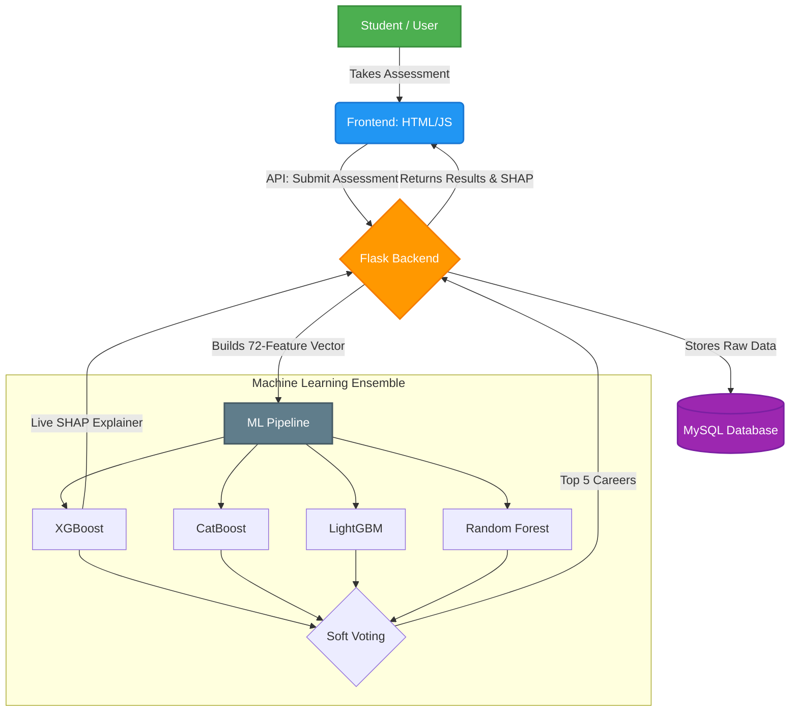
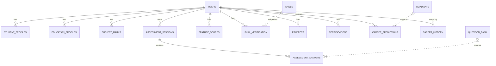

<div align="center">
  <h1>🎓 Personalized Career Recommendation System</h1>
  <p><b>An intelligent, full-stack AI career guidance platform that delivers personalized career recommendations through adaptive assessments, a 4-model ML ensemble, and explainable AI.</b></p>

  <p>
    
    
    
    
    
    
    
  </p>
</div>

---

## 📌 Table of Contents

- [Overview](#-overview)
- [Key Features](#-key-features)
- [System Architecture](#-system-architecture)
- [ML Architecture](#-ml-architecture)
- [Assessment Flow](#-assessment-flow)
- [Education Level Adaptations](#-education-level-adaptations)
- [Database Schema](#-database-schema)
- [API Endpoints](#-api-endpoints)
- [Setup & Installation](#-setup--installation)
- [Supported Careers (30)](#-supported-careers-30)

---

## 🔍 Overview

This system collects a rich multi-dimensional profile from each student — academic marks, aptitude, psychometrics, interests, and verified skills — then feeds it through a **72-feature vector** into a soft-voting ensemble of **XGBoost + CatBoost + LightGBM + RandomForest** to predict the top 5 best-fit career paths with confidence scores.

The frontend is a fully adaptive **8-step assessment** that automatically adjusts questions, subjects, and visible steps based on the student's education level and board (CBSE / Kerala State Board / ICSE).

---

## ✨ Key Features

### 🧠 AI & ML
- **4-Model Ensemble**: XGBoost + CatBoost + LightGBM + RandomForest with soft-vote weighting.
- **72-feature vector**: Academic, aptitude, psychometric, interest, skill, and activity signals.
- **Live SHAP explainability**: Per-feature attribution shown on the results dashboard.
- **30 career classes** predicted with confidence percentages.
- **Readiness score**: Composite score indicating how prepared the student is.

### 📋 Adaptive Assessment (8 Steps)
- **Step 1**: Education profile (level, board, stream, degree)
- **Step 2**: Subject-wise marks (subjects auto-loaded by board: 10 for Kerala, 5 for CBSE)
- **Step 3**: Aptitude quiz (difficulty adapts to class level)
- **Step 4**: Psychometric scenarios (age-appropriate question banks per level)
- **Step 5**: Career interest profiling (20+ paired-choice questions)
- **Step 6**: Skill verification with quizzes (53 skills, 3-question quiz per skill)
- **Step 7**: Certifications / Achievements *(skipped for Class 7–10)*
- **Step 8**: Projects & Portfolio *(skipped for Class 7–10)*
- **Step 9**: Results with top-5 careers, SHAP charts, roadmaps

### 🏫 Education Level Intelligence
- **Class 7–10**: Steps 7 & 8 auto-skipped; CGPA derived from avg marks; age derived from class
- **Class 11–12**: Steps 7 & 8 adapted to "Achievements" and "School Projects"
- **UG / PG / Professional**: Full 9-step flow with all fields
- **Board-aware subjects**: Kerala State Board (10 subjects), CBSE (5 subjects), ICSE (6 subjects)

### 🎯 Skill Verification
- **53 quiz-verified skills** across Technical, Business, Science, Creative, and Soft Skill domains.
- Each skill has a **3-question quiz** with scored proficiency: Beginner / Intermediate / Advanced.

---

## 🏗 System Architecture

The following diagram illustrates how data flows from the student to the ML ensemble and back, leveraging a robust Flask and MySQL backend.



---

## 🤖 ML Architecture

### 72-Feature Vector

| Category | Features | Count |
|---|---|---|
| **Academic** | CGPA, Avg Marks, Semester Marks, Internal, Practical, Lab, Assignment | 7 |
| **Aptitude** | Logical, Numerical, Verbal, Spatial | 4 |
| **Psychometric** | Leadership, Teamwork, Communication, Creativity, Problem Solving, Critical Thinking, Adaptability, Decision Making, Time Management, Curiosity, Analytical, Stress Management, Self Learning, Persistence, Confidence | 15 |
| **Career Interest**| Technology, Healthcare, Business, Arts/Creative, Research, Education, Engineering, Law, Environment, Social Service | 10 |
| **Skills** | Num_Technical_Skills, Subject_Knowledge_Score | 2 |
| **Activities** | Num_Projects, Num_Certifications, Internships, Hackathons, Research Exp, Competitions, Volunteer | 7 |
| **Engineered** | STEM signal, Health signal, Biz signal, Creative signal, Research signal, Activity richness, Soft composite, Weighted Academic, Interest spread, Dominant Interest, Total Aptitude | 11 |
| **Demographics** | Age, Year of Study | 2 |
| **Derived Scores** | Readiness, Activity score, Soft Skill score, Academic composite | 4 |
| **Other** | Attendance %, Skill verified score, Programming score | 3 |

---

## 🏫 Education Level Adaptations

| Level | Aptitude | Steps 7–8 | CGPA field | Age used |
|---|---|---|---|---|
| **Class 7** | Easy | 🛑 Skipped | Hidden (auto: marks÷10) | 12 |
| **Class 8** | Easy | 🛑 Skipped | Hidden (auto: marks÷10) | 13 |
| **Class 9** | Medium | 🛑 Skipped | Hidden (auto: marks÷10) | 14 |
| **Class 10** | Medium | 🛑 Skipped | Hidden (auto: marks÷10) | 15 |
| **Class 11–12** | Medium-Hard | 🔄 Adapted (School Projects) | Hidden (auto) | 17 |
| **Diploma / ITI**| Medium | ✅ Visible | Visible | 19 |
| **Undergrad** | Hard | ✅ Visible | Visible | 21 |
| **Postgrad** | Hard | ✅ Visible | Visible | 23 |
| **Professional** | Hard | ✅ Visible | Visible | 24 |

---

## 🗃 Database Schema

The project uses a highly normalized relational database with **15 tables**.



### Table Breakdown

| # | Table | Purpose |
|---|---|---|
| 1 | `users` | All users — auth, demographics, role |
| 2 | `student_profiles` | Bio, LinkedIn, GitHub, portfolio links |
| 3 | `education_profiles` | Degree, CGPA, avg_marks, year_of_study, board, stream |
| 4 | `subject_marks` | Subject-wise marks per assessment |
| 5 | `question_bank` | 200+ MCQs filtered by level/board/stream |
| 6 | `assessment_sessions` | Each assessment attempt record |
| 7 | `assessment_answers` | Individual MCQ answers per session |
| 8 | `feature_scores` | Computed ML feature scores per session |
| 9 | `skills` | Master skills list (53 skills) |
| 10 | `skill_verification` | Quiz-verified skill proficiency per user |
| 11 | `projects` | Student project / school activity portfolio |
| 12 | `certifications` | Certifications / achievements |
| 13 | `career_predictions` | ML output — top-5 careers, SHAP JSON, feature JSON |
| 14 | `career_history` | Historical prediction log (for trend charts) |
| 15 | `roadmaps` | 30 career roadmaps (steps, resources, certs) |

---

## 🔌 API Endpoints

| Method | Endpoint | Auth | Description |
|---|---|---|---|
| **POST** | `/api/auth/register` | Public | Register new student |
| **POST** | `/api/auth/login` | Public | Login — returns JWT |
| **GET** | `/api/auth/me` | JWT | Get current user |
| **GET** | `/api/questions` | Public | Fetch adaptive aptitude questions |
| **POST** | `/api/assessment/submit` | JWT | Submit assessment → ML predictions |
| **GET** | `/api/dashboard` | JWT | Career results + SHAP + history |
| **GET** | `/api/history` | JWT | All past assessments |
| **POST** | `/api/skills/verify` | JWT | Save skill quiz result |
| **GET** | `/api/admin/stats` | Admin | Dashboard statistics |
| **POST** | `/api/admin/retrain` | Admin | Trigger model retraining |

---

## ⚙️ Setup & Installation

### Prerequisites

- Python 3.10+
- MySQL 8.x (running locally)
- Git

### 1. Clone the Repository

```bash
git clone https://github.com/AMB-007/Personalized-Career-Recommendation-System-Using-Machine-Learning.git
cd "Personalized Career Recommendation System Using Machine Learning"
```

### 2. Set Up Database

```bash
mysql -u root -p < backend/career_system_db.sql
```

> **Note**: This creates the `career_system_db` database with all 15 tables, seeds the admin user (`admin@gmail.com` / `Admin@123`), and inserts 30 career roadmaps.

### 3. Configure Environment

Edit `backend/.env`:

```env
DB_HOST=localhost
DB_USER=root
DB_PASSWORD=your_mysql_password
DB_NAME=career_system_db
JWT_SECRET=your_secret_key_here
```

### 4. Install Dependencies

```bash
cd backend
python -m venv venv

# Windows
venv\Scripts\activate

# Mac / Linux
source venv/bin/activate

pip install -r requirements.txt
```

### 5. Running the Project

**Option 1: Windows Launcher**
Simply double-click the `start.bat` file in the root folder.

**Option 2: Manual Run**
```bash
cd backend
venv\Scripts\activate
python app.py
```
App runs at **http://localhost:5000**

---

## 🏆 Supported Careers (30)

| Technology | Business | Healthcare | Engineering | Other |
|---|---|---|---|---|
| Software Developer | Business Analyst | Doctor | Mechanical Engineer | School Teacher |
| Data Scientist | Entrepreneur | Nurse | Civil Engineer | Professor / Researcher |
| ML Engineer | Chartered Accountant | Pharmacist | Electrical Engineer | Lawyer |
| AI Engineer | Bank Manager | Biomedical Engineer | Agricultural Scientist | Architect |
| Full Stack Developer | Product Manager | | Environmental Scientist | Animator |
| Data Analyst | | | | Graphic Designer |
| Cyber Security Analyst | | | | UI/UX Designer |
| Cloud Architect | | | | |

---

<div align="center">
  <p><i>Built with ❤️ — AI-powered career guidance for every student, from Class 7 to PhD.</i></p>
</div>
