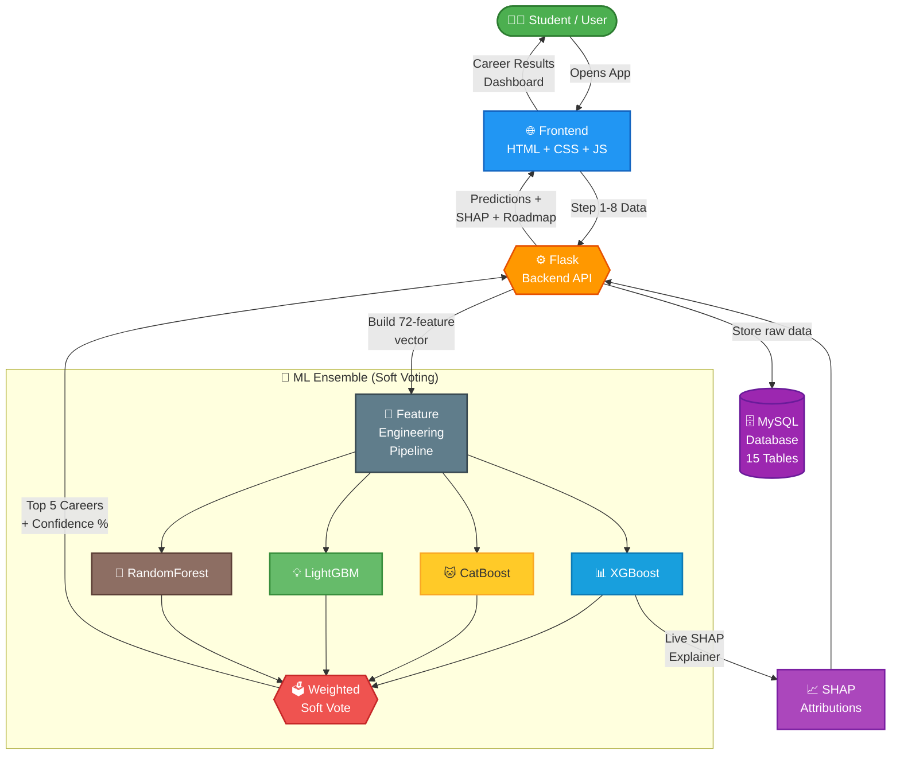
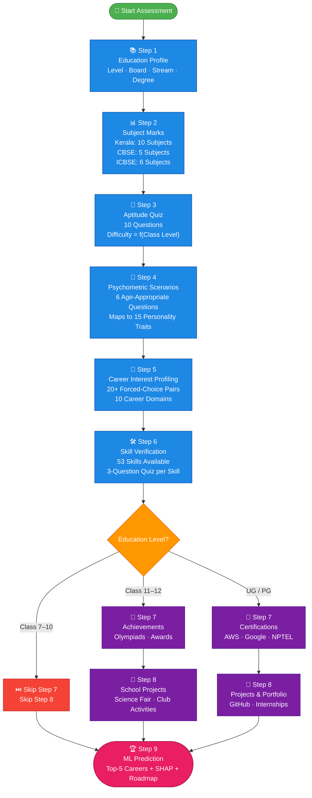
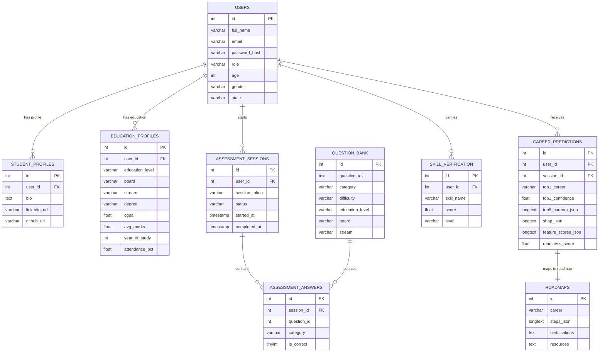

<div align="center">

<h1>🎓 Personalized Career Recommendation System</h1>

<p><b>An intelligent, full-stack AI career guidance platform that delivers personalized career recommendations<br>through adaptive multi-step assessments, a 4-model ML ensemble, and explainable AI (SHAP).</b></p>

<p>
  
  
  
  
  
  
</p>

<p>
  
  
  
  
  
  
</p>

<p>
  
  
  
  
</p>

</div>

---

## 📌 Table of Contents

| # | Section |
|---|---|
| 1 | [Overview](#-overview) |
| 2 | [Key Features](#-key-features) |
| 3 | [System Architecture](#-system-architecture) |
| 4 | [Assessment Flow](#-9-step-assessment-flow) |
| 5 | [ML Architecture & Feature Engineering](#-ml-architecture--feature-engineering) |
| 6 | [Education Level Adaptations](#-education-level-adaptations) |
| 7 | [Database Schema](#-database-schema) |
| 8 | [API Endpoints](#-api-endpoints) |
| 9 | [Supported Careers](#-supported-careers-30) |
| 10 | [Setup & Installation](#-setup--installation) |
| 11 | [High Confidence Tips](#-tips-for-90-prediction-confidence) |

---

## 🔍 Overview

The **Personalized Career Recommendation System** is an end-to-end AI-powered platform designed to help students — from **Class 7 through postgraduate** — discover the most suitable careers for them.

It works in three phases:

> **Phase 1 — Assess**: The student completes an adaptive 8-step assessment covering academic marks, aptitude, psychometrics, career interests, and verified skills.

> **Phase 2 — Predict**: A 72-feature vector is constructed and passed through a soft-voting ensemble of **XGBoost + CatBoost + LightGBM + RandomForest**, producing top-5 career predictions with confidence percentages.

> **Phase 3 — Explain**: **SHAP (SHapley Additive exPlanations)** values are computed live and displayed on the dashboard as a feature attribution bar chart, helping students understand *why* a career was recommended.

The system is fully **board-aware** (CBSE, Kerala State, ICSE), **age-aware** (Class 7 → 12yrs, Class 10 → 15yrs), and **school-level adaptive** (automatically skips irrelevant steps for younger students).

---

## ✨ Key Features

### 🧠 Machine Learning & AI
| Feature | Details |
|---|---|
| **4-Model Ensemble** | XGBoost + CatBoost + LightGBM + RandomForest (soft-vote) |
| **Feature Vector** | 72 features spanning 10 categories |
| **SHAP Explainability** | TreeExplainer on XGBoost — live per-prediction attribution |
| **30 Career Classes** | Confidence % for each of the top 5 |
| **Readiness Score** | Composite 0–100 score indicating career preparedness |
| **Mock Mode** | Graceful interest-based fallback if model files are missing |

### 📋 Adaptive Assessment
| Step | Content | School Adaptation |
|---|---|---|
| Step 1 | Education Profile (level, board, stream, degree) | CGPA hidden; auto-derived |
| Step 2 | Subject-wise Marks (auto-loaded by board) | Kerala=10 subjects, CBSE=5 subjects |
| Step 3 | Aptitude Quiz (10 questions) | Difficulty adapts by class level |
| Step 4 | Psychometric Scenarios (6 questions) | Age-appropriate scenario banks |
| Step 5 | Career Interest Profiling (20+ pairs) | Same across all levels |
| Step 6 | Skill Verification Quizzes (53 skills) | Same across all levels |
| Step 7 | Certifications / Achievements | 🛑 SKIPPED for Class 7–10 |
| Step 8 | Projects & Portfolio | 🛑 SKIPPED for Class 7–10 |
| Step 9 | Results — Top 5 Careers + SHAP + Roadmap | Rendered for all levels |

### 🎯 Skill Verification (53 Skills)
- Each selected skill triggers a **3-question quiz** before being accepted
- Proficiency levels: **Beginner (33pts) / Intermediate (66pts) / Advanced (100pts)**
- Skills not in the quiz bank fall back to a **self-rating modal**
- Score feeds directly into `Subject_Knowledge_Score` feature in the ML vector

---

## 🏗 System Architecture



---

## 📝 9-Step Assessment Flow



---

## 🤖 ML Architecture & Feature Engineering

### Ensemble Weighting
The final prediction is a **weighted soft vote** across all 4 models. Weights are saved in `ensemble_weights.pkl` and loaded at startup.

```
Final Probability = (w_xgb × P_xgb) + (w_cb × P_cb) + (w_lgb × P_lgb) + (w_rf × P_rf)
Confidence %      = max(Final Probability) × 100
```

### 72-Feature Vector Breakdown

| # | Category | Features | Count |
|---|---|---|---|
| 1 | 📚 **Academic** | CGPA, Avg Marks, Semester Marks, Internal Marks, Practical Marks, Lab Score, Assignment Score | 7 |
| 2 | 🧮 **Aptitude** | Logical Reasoning, Numerical Ability, Verbal Ability, Spatial Ability | 4 |
| 3 | 🧠 **Psychometric** | Leadership, Teamwork, Communication, Creativity, Problem Solving, Critical Thinking, Adaptability, Decision Making, Time Management, Curiosity, Analytical, Stress Management, Self Learning, Persistence, Confidence | 15 |
| 4 | 🎯 **Career Interest** | Technology, Healthcare, Business, Arts/Creative, Research, Education, Engineering, Law, Environment, Social Service | 10 |
| 5 | 🛠️ **Skills** | Num_Technical_Skills, Subject_Knowledge_Score | 2 |
| 6 | 🏅 **Activities** | Num_Projects, Num_Certifications, Internships, Hackathons, Research Experience, Competitions, Volunteer Work | 7 |
| 7 | ⚗️ **Engineered** | STEM signal, Health signal, Biz signal, Creative signal, Research signal, Activity richness, Soft composite, Weighted Academic, Interest spread, Dominant Interest, Total Aptitude | 11 |
| 8 | 👤 **Demographics** | Age, Year of Study | 2 |
| 9 | 📈 **Derived Scores** | Readiness Score, Activity Score, Soft Skill Score, Academic Composite | 4 |
| 10 | 📋 **Other** | Attendance %, Skill Verified Score, Programming Score | 3 |
| | | **Total** | **72** |

### School-Level Smart Defaults
When a school student (Class 7–12) submits, the backend automatically:

| Field | School Default | Logic |
|---|---|---|
| `cgpa` | Derived | `avg_marks ÷ 10` |
| `attendance_pct` | 85 | Auto-set |
| `project_score` | 0 | Steps 7–8 skipped |
| `cert_count` | 0 | Steps 7–8 skipped |
| `age` | Class-derived | Class 7→12, Class 10→15, Class 12→17 |
| `year_of_study` | Class-derived | Class 7→1, Class 10→4, Class 12→6 |

---

## 🏫 Education Level Adaptations

| Level | Aptitude | Psychometric Bank | Steps 7–8 | CGPA | Attendance | Age Default |
|---|---|---|---|---|---|---|
| **Class 7** | Easy | School-level | 🛑 Skipped | Hidden (auto) | Hidden (85%) | 12 |
| **Class 8** | Easy | School-level | 🛑 Skipped | Hidden (auto) | Hidden (85%) | 13 |
| **Class 9** | Medium | School-level | 🛑 Skipped | Hidden (auto) | Hidden (85%) | 14 |
| **Class 10** | Medium | School-level | 🛑 Skipped | Hidden (auto) | Hidden (85%) | 15 |
| **Class 11–12** | Medium-Hard | Teen-level | 🔄 Adapted | Hidden (auto) | Hidden (85%) | 17 |
| **Diploma / ITI** | Medium | College-level | ✅ Visible | ✅ Visible | ✅ Visible | 19 |
| **Undergraduate** | Hard | Professional | ✅ Visible | ✅ Visible | ✅ Visible | 21 |
| **Postgraduate** | Hard | Research-level | ✅ Visible | ✅ Visible | ✅ Visible | 23 |
| **Professional** | Hard | Executive | ✅ Visible | ✅ Visible | ✅ Visible | 24 |

---

## 🗃 Database Schema

The project uses a highly normalized relational MySQL database with **15 tables**.

### Entity-Relationship Diagram



### All 15 Tables

| # | Table | Purpose |
|---|---|---|
| 1 | `users` | All users (students + admins) — auth, demographics, role |
| 2 | `student_profiles` | Bio, LinkedIn, GitHub, portfolio links |
| 3 | `education_profiles` | Degree, CGPA, avg_marks, year_of_study, board, stream |
| 4 | `subject_marks` | Individual subject marks per assessment session |
| 5 | `question_bank` | 200+ MCQs — filtered by education level, board, stream |
| 6 | `assessment_sessions` | Each assessment attempt — token, status, timestamps |
| 7 | `assessment_answers` | Individual MCQ answers (correct / incorrect) |
| 8 | `feature_scores` | Computed ML features per session (stored separately) |
| 9 | `skills` | Master skills catalogue (53 skills seeded on startup) |
| 10 | `skill_verification` | Quiz-verified skill proficiency per user |
| 11 | `projects` | Student projects / school activity portfolio |
| 12 | `certifications` | Certifications and achievements |
| 13 | `career_predictions` | ML output — top-5 careers, SHAP JSON, full feature JSON |
| 14 | `career_history` | Historical career prediction log (for dashboard trend chart) |
| 15 | `roadmaps` | 30 career roadmaps — 8-step paths, resources, certifications |

---

## 🔌 API Endpoints

### Auth Endpoints
| Method | Endpoint | Auth | Description |
|---|---|---|---|
| `POST` | `/api/auth/register` | Public | Register a new student account |
| `POST` | `/api/auth/login` | Public | Login and receive a JWT token |
| `GET` | `/api/auth/me` | JWT | Get the currently authenticated user |

### Assessment Endpoints
| Method | Endpoint | Auth | Description |
|---|---|---|---|
| `GET` | `/api/questions` | Public | Fetch adaptive aptitude MCQs (filtered by level/board/stream) |
| `POST` | `/api/assessment/submit` | JWT | Submit full 8-step assessment → triggers ML prediction |
| `GET` | `/api/history` | JWT | Retrieve all past assessment sessions |

### Profile & Skills
| Method | Endpoint | Auth | Description |
|---|---|---|---|
| `GET` | `/api/profile` | JWT | Get full user profile |
| `PUT` | `/api/profile/update` | JWT | Update profile information |
| `POST` | `/api/skills/verify` | JWT | Save a skill quiz result |

### Dashboard & Results
| Method | Endpoint | Auth | Description |
|---|---|---|---|
| `GET` | `/api/dashboard` | JWT | Get latest career predictions + SHAP + feature scores |

### Admin Endpoints
| Method | Endpoint | Auth | Description |
|---|---|---|---|
| `GET` | `/api/admin/stats` | Admin JWT | Total students, assessments, top career distribution |
| `POST` | `/api/admin/retrain` | Admin JWT | Trigger ML model retraining in background |

### System
| Method | Endpoint | Auth | Description |
|---|---|---|---|
| `GET` | `/api/health` | Public | System health — DB connection + ML model status |

---

## 🏆 Supported Careers (30)

<table>
<tr>
<th>💻 Technology</th>
<th>💼 Business</th>
<th>🏥 Healthcare</th>
<th>⚙️ Engineering</th>
<th>🎓 Other</th>
</tr>
<tr>
<td>Software Developer</td>
<td>Business Analyst</td>
<td>Doctor</td>
<td>Mechanical Engineer</td>
<td>School Teacher</td>
</tr>
<tr>
<td>Data Scientist</td>
<td>Entrepreneur</td>
<td>Nurse</td>
<td>Civil Engineer</td>
<td>Professor / Researcher</td>
</tr>
<tr>
<td>ML Engineer</td>
<td>Chartered Accountant</td>
<td>Pharmacist</td>
<td>Electrical Engineer</td>
<td>Lawyer</td>
</tr>
<tr>
<td>AI Engineer</td>
<td>Bank Manager</td>
<td>Biomedical Engineer</td>
<td>Agricultural Scientist</td>
<td>Architect</td>
</tr>
<tr>
<td>Full Stack Developer</td>
<td>Product Manager</td>
<td></td>
<td>Environmental Scientist</td>
<td>Animator</td>
</tr>
<tr>
<td>Data Analyst</td>
<td></td>
<td></td>
<td></td>
<td>Graphic Designer</td>
</tr>
<tr>
<td>Cyber Security Analyst</td>
<td></td>
<td></td>
<td></td>
<td>UI/UX Designer</td>
</tr>
<tr>
<td>Cloud Architect</td>
<td></td>
<td></td>
<td></td>
<td></td>
</tr>
</table>

Each career comes with:
- 📈 **Salary range** (Indian market, e.g. ₹5L–₹18L/yr)
- 🎓 **Required degree** (e.g. BTech CS / BCA)
- 🏢 **Top companies** (e.g. Infosys, Google, TCS)
- 📉 **Industry growth %** (e.g. +22% annually)
- 📜 **Recommended certifications** (e.g. AWS, Full Stack Cert)
- 🗺️ **8-step career roadmap**

---

## ⚙️ Setup & Installation

### Prerequisites
- Python **3.10+**
- MySQL **8.x** (running on localhost)
- Git

### 1. Clone the Repository

```bash
git clone https://github.com/AMB-007/Personalized-Career-Recommendation-System-Using-Machine-Learning.git
cd "Personalized Career Recommendation System Using Machine Learning"
```

### 2. Set Up Database

```bash
mysql -u root -p < backend/career_system_db.sql
```

> Creates `career_system_db` with all 15 tables, seeds admin user, and inserts 30 career roadmaps.
> **Default admin:** `admin@gmail.com` / `Admin@123`

### 3. Configure Environment

Edit `backend/.env`:

```env
DB_HOST=localhost
DB_USER=root
DB_PASSWORD=your_mysql_password
DB_NAME=career_system_db
JWT_SECRET=your_secret_key_here
```

### 4. Install Python Dependencies

```bash
cd backend
python -m venv venv

# Windows
venv\Scripts\activate

# Mac / Linux
source venv/bin/activate

pip install -r requirements.txt
```

### 5. Run the Application

**Windows (one-click):**
```
Double-click start.bat
```

**Manual:**
```bash
cd backend
python app.py
```

App runs at → **http://localhost:5000**

| Page | URL |
|---|---|
| 🏠 Landing | `http://localhost:5000/` |
| 📝 Register | `http://localhost:5000/register.html` |
| 🔑 Login | `http://localhost:5000/login.html` |
| 📋 Assessment | `http://localhost:5000/assessment.html` |
| 📊 Dashboard | `http://localhost:5000/dashboard.html` |
| 🕐 History | `http://localhost:5000/history.html` |
| 🛡️ Admin | `http://localhost:5000/admin.html` |

---

## 🎯 Tips for 90%+ Prediction Confidence

| Priority | Step | What to Do |
|---|---|---|
| ⭐⭐⭐ | **Step 5 — Interests** | Choose 80%+ of pairs toward **one domain** — this is the single biggest factor |
| ⭐⭐⭐ | **Step 3 — Aptitude** | Score 8/10 or higher |
| ⭐⭐ | **Step 6 — Skills** | Select 6–10 skills, pass each quiz at Intermediate or Advanced |
| ⭐⭐ | **Step 2 — Marks** | Enter subject marks ≥ 75 |
| ⭐ | **Step 4 — Psychometric** | Answer all 6 scenarios consistently toward one personality type |

---

## 📊 Project Stats

| Metric | Value |
|---|---|
| ML Features | 72 |
| Career Classes | 30 |
| Skill Quizzes | 53 skills × 3 questions |
| Aptitude Questions | 200+ (multi-level bank) |
| Database Tables | 15 |
| Career Roadmaps | 30 (8-step each) |
| Assessment Steps | 9 (adaptive — 7 for school students) |
| Backend Lines of Code | ~1,984 lines |
| Assessment Engine (JS) | ~143 KB |

---

<div align="center">
  <p>⭐ If this project helped you, please consider giving it a star on GitHub!</p>
  <p><i>Built with ❤️ — AI-powered career guidance for every student, from Class 7 to PhD.</i></p>
</div>
