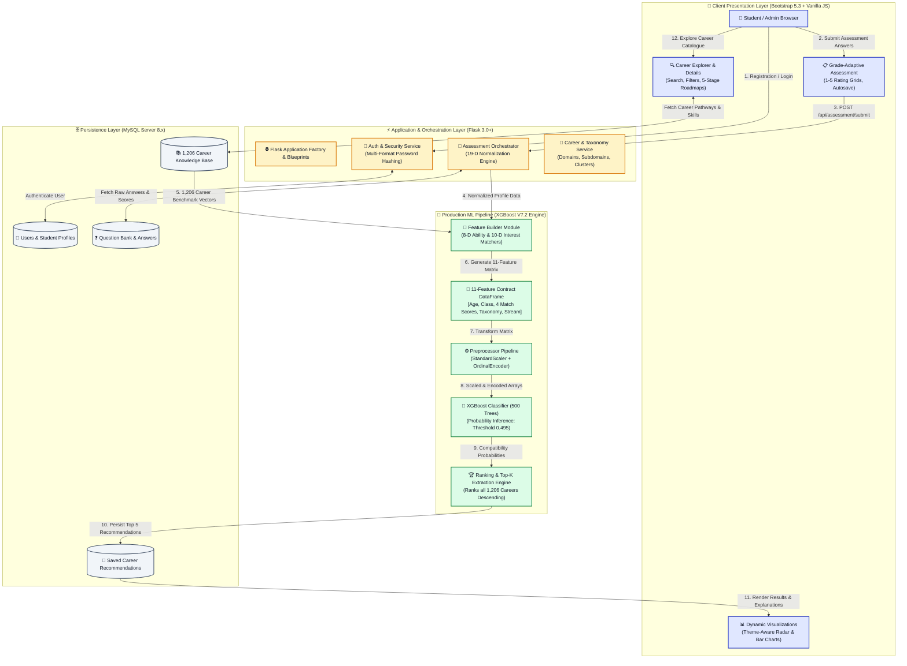
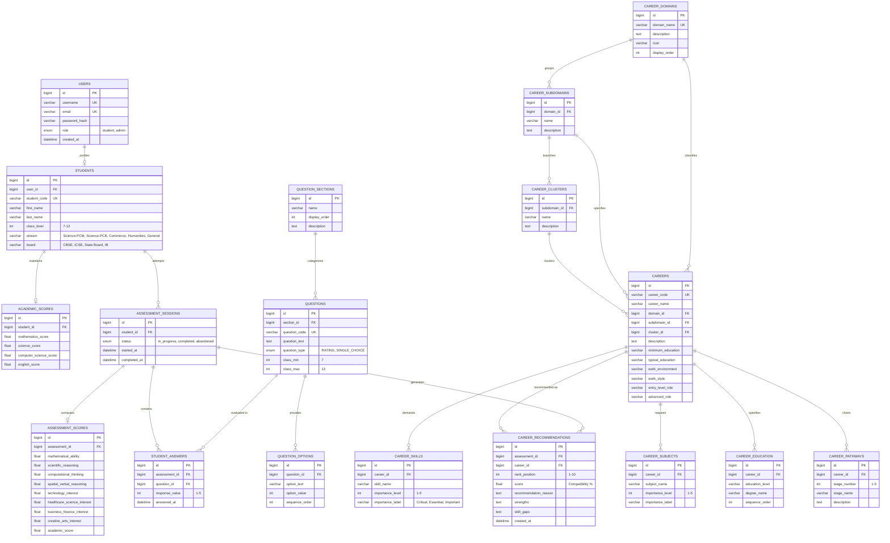

# 🚀 Personalized Career Recommendation System
### *AI-Powered Career Guidance & Compatibility Engine for Classes 7–12*

<p align="left">
  
  
  
  
  
  
  
  
</p>

---

## 📖 Table of Contents
1. [🌟 Executive Overview](#-executive-overview)
2. [🏗️ End-to-End System Architecture](#️-end-to-end-system-architecture)
3. [🗄️ Database Entity-Relationship (ER) Model](#️-database-entity-relationship-er-model)
4. [🧠 Machine Learning Compatibility & Ranking Engine (V7.2)](#-machine-learning-compatibility--ranking-engine-v72)
5. [⚡ First-Time Database Setup & Query Execution](#-first-time-database-setup--query-execution)
6. [🚀 Quick Start & Installation](#-quick-start--installation)
7. [🔑 Demo Credentials](#-demo-credentials)
8. [🌐 REST API Reference](#-rest-api-reference)
9. [🎨 UI/UX Design System & Theme Engine](#-uiux-design-system--theme-engine)
10. [🧪 Automated Verification Suite](#-automated-verification-suite)

---

## 🌟 Executive Overview

The **Personalized Career Recommendation System** is an enterprise-grade career guidance platform tailored specifically for junior and senior secondary school students (**Classes 7–12**), educational counsellors, and parents. 

Unlike generic keyword-matching tools, this platform evaluates students across **19 psychometric dimensions** (8 cognitive abilities, 10 disciplinary affinities, and school curriculum marks) against a database of **1,206 career knowledge profiles**. Compatibility is predicted by a high-performance **XGBoost Classifier (V7.2)** that dynamically ranks all careers and generates personalized educational roadmaps, prerequisite subjects, and skill gap analyses.

---

## 🏗️ End-to-End System Architecture

The following diagram illustrates the complete request lifecycle, machine learning inference pipeline, and relational database synchronization:



---

## 🗄️ Database Entity-Relationship (ER) Model

The application utilizes a relational MySQL schema structured into four functional modules: **Authentication**, **Assessment & Scoring**, **Career Knowledge Taxonomy**, and **Recommendations**.



---

## 🧠 Machine Learning Compatibility & Ranking Engine (V7.2)

### 1. Authoritative 11-Feature Contract Schema
The XGBoost inference engine enforces an exact 11-feature contract. All inputs are strictly validated before scoring:

| # | Feature Name | Data Type | Permitted Range | Description |
| :-: | :--- | :---: | :---: | :--- |
| **1** | `age` | `float` | $10.0 - 25.0$ | Student chronological age |
| **2** | `class` | `int` | $7 - 12$ | Current academic grade level |
| **3** | `ability_match_component` | `float` | $0.0 - 100.0$ | Mean alignment across 8 cognitive ability dimensions |
| **4** | `interest_match_component` | `float` | $0.0 - 100.0$ | Mean alignment across 10 disciplinary interest tracks |
| **5** | `academic_match_component`| `float` | $0.0 - 100.0$ | Composite score of self-reported academic subjects |
| **6** | `learning_match_component`| `float` | $0.0 - 100.0$ | Problem solving and learning adaptability score |
| **7** | `career_name` | `string` | Categorical | Target candidate career name |
| **8** | `career_domain` | `string` | Categorical | Primary professional industry sector |
| **9** | `career_subdomain` | `string` | Categorical | Specialized track within domain |
| **10**| `career_cluster` | `string` | Categorical | Functional occupational cluster |
| **11**| `stream` | `string` | Categorical | Selected stream (`Science-PCM`, `Science-PCB`, `Commerce`, `Humanities`, `General`) |

> [!CAUTION]
> **Data Privacy Guarantee:** `student_id`, names, and contact details are strictly excluded from the ML feature matrix to prevent data leakage and bias.

---

### 2. Verified Performance Metrics (V7.2 Model)

> [!NOTE]
> Classification performance and ranking performance are strictly distinguished in our verified evaluation benchmarks:

#### A. Multi-Candidate Recommendation Ranking (Catalogue of 1,206 Careers)
| Metric | Benchmark Result | Evaluation Description |
| :--- | :---: | :--- |
| **Hit@1 (Top 1 Accuracy)** | **96.18%** | Primary recommended career perfectly matches student profile |
| **Hit@3** | **99.68%** | True optimal career exists within the Top 3 recommendations |
| **Hit@5** | **99.88%** | True optimal career exists within the Top 5 recommendations |
| **Hit@10** | **99.94%** | True optimal career exists within the Top 10 recommendations |
| **Mean Reciprocal Rank (MRR)** | **97.98%** | Average reciprocal rank of the ground-truth optimal career |
| **NDCG@5** | **92.12%** | Normalized Discounted Cumulative Gain across Top 5 ranks |

#### B. Binary Student-Career Compatibility Classification (Test Set)
| Metric | Score | Metric | Score |
| :--- | :---: | :--- | :---: |
| **Overall Accuracy** | **80.99%** | **Balanced Accuracy** | **71.71%** |
| **Precision** | **83.21%** | **Recall** | **92.40%** |
| **F1-Score** | **87.56%** | **ROC-AUC** | **85.25%** |
| **PR-AUC** | **93.48%** | **Optimal Threshold** | **0.495** |

---

## ⚡ First-Time Database Setup & Query Execution

To initialize the MySQL database for the first time, use either **Method A (Automated Python Script)** or **Method B (MySQL Workbench / Command Line)**.

### Method A: Automated One-Command Python Setup (Recommended)
```powershell
python database/seed.py
```
*This automatically creates `career_recommendation_db`, runs all table DDLs, seeds users, imports all 1,206 careers, and generates analytical views.*

---

### Method B: MySQL Workbench All-In-One Script (Single File)

1. Open **MySQL Workbench** and connect to your MySQL Server.
2. Open the all-in-one setup file: **[`database/setup.sql`](file:///c:/Users/arjun/.gemini/antigravity-ide/scratch/career_recommendation_system/database/setup.sql)** (`File -> Open SQL Script`).
3. Click the ⚡ **Execute** button (or press `Ctrl + Shift + Enter`).

*This single file creates `career_recommendation_db`, sets up all 18 tables, seeds demo users, imports all 1,206 career knowledge profiles, populates the adaptive questions, creates analytical views, and runs the verification check automatically.*

```sql
-- Or run from terminal:
mysql -u root -p < database/setup.sql
```

---

## 🚀 Quick Start & Installation

### 1. Prerequisites
- **Python:** 3.10, 3.11, 3.12, or 3.14
- **Database:** MySQL Server 8.0+ (or MySQL Workbench)
- **Git**

### 2. Clone and Install Dependencies
```powershell
git clone https://github.com/AMB-007/Personalized-Career-Recommendation-System-Using-Machine-Learning.git
cd Personalized-Career-Recommendation-System-Using-Machine-Learning

pip install -r requirements.txt
```

### 3. Configure Environment Variables
Copy `.env.example` to `.env` and configure your database credentials:
```powershell
copy .env.example .env
```
Sample `.env` configuration:
```ini
FLASK_APP=run.py
FLASK_ENV=development
SECRET_KEY=your-super-secret-key-change-in-production

# MySQL Database Configuration
DB_HOST=localhost
DB_PORT=3306
DB_USER=root
DB_PASSWORD=your_mysql_password
DB_NAME=career_recommendation_db

# ML Model Paths
MODEL_DIR=backend/ml/models
CAREER_DATA_PATH=backend/ml/data/career_knowledge_requirements.csv
```

### 4. Launch Application
```powershell
python run.py
```
Open your browser and navigate to: **`http://localhost:5000`**

---

## 🔑 Demo Credentials

| Role | Username / Identifier | Password | Access Level | Description |
| :--- | :--- | :--- | :---: | :--- |
| **Administrator** | `admin` | `Admin@123` | **Full Admin** | Question management, career CRUD, student analytics |
| **Student (Junior)** | `rahul_class8` | `Student@123` | **Student** | Class 8 student profile (General curriculum) |
| **Student (Middle)** | `ananya_class10`| `Student@123` | **Student** | Class 10 student profile (Board exam candidate) |
| **Student (Senior)** | `aravind_class12`| `Student@123` | **Student** | Class 12 student profile (Science-PCM stream) |

---

## 🌐 REST API Reference

The platform provides a comprehensive REST API returning JSON responses in standard formats:

| Method | Endpoint | Auth | Purpose & Description |
| :---: | :--- | :---: | :--- |
| `GET` | `/api/health` | Public | System status, database connectivity, and ML engine health check |
| `GET` | `/api/model/info` | Public | Inspect active XGBoost model version (V7.2), feature contract, and metrics |
| `POST` | `/api/predictions` | Student | Directly run XGBoost inference on candidate feature vectors |
| `POST` | `/api/recommendations` | Student | Generate and rank career recommendations across all 1,206 careers |
| `GET` | `/api/recommendations/<int:session_id>` | Student | Fetch stored Top-K recommendations and explanations for a completed session |
| `GET` | `/api/recommendations/student/<student_code>` | Student | Fetch historical recommendations for a student code |
| `GET` | `/api/careers` | Public | Search and filter 1,206 careers by domain, subdomain, cluster, or keyword |
| `GET` | `/api/careers/<int:id>` | Public | Get full career knowledge profile, required skills, and 5-stage roadmap |
| `GET` | `/api/careers/domains` | Public | List all 28 career domains and icons |
| `POST` | `/api/assessment/start` | Student | Initialize a new adaptive assessment session for logged-in student |
| `POST` | `/api/assessment/answer` | Student | Record an individual question response with autosave |
| `POST` | `/api/assessment/submit` | Student | Finalize assessment, trigger ML pipeline, and compute recommendations |

*See [`docs/API_EXAMPLES.md`](file:///c:/Users/arjun/.gemini/antigravity-ide/scratch/career_recommendation_system/docs/API_EXAMPLES.md) for full request/response payloads.*

---

## 🎨 UI/UX Design System & Theme Engine

### 1. Flat Solid Design Philosophy (Zero Gradients)
The user interface follows a strict **zero-gradient, solid-color design system** engineered for maximum readability, focus, and visual clarity across mobile, tablet, and desktop screens.

### 2. Curated Color Palette

| Token Role | Light Mode Hex | Dark Mode Hex | Purpose |
| :--- | :---: | :---: | :--- |
| **Primary Brand** | `#1B2CC1` | `#7692FF` | Main CTAs, Active States, Key Metrics |
| **Secondary Accent** | `#7692FF` | `#98ACFF` | Supporting Highlights, Badges |
| **Page Canvas** | `#F8FAFC` | `#0F172A` | Base Viewport Background |
| **Surface Card** | `#FFFFFF` | `#1E293B` | Content Cards, Tables, Modals |
| **Subtle Card** | `#F1F5F9` | `#334155` | Table Headers, Inner Callouts, Filter Bars |
| **Text Main** | `#111827` | `#F8FAFC` | Headings, Primary Typography |
| **Text Secondary** | `#4B5563` | `#CBD5E1` | Body Text, Field Labels, Descriptions |
| **Border Outline** | `#E5E7EB` | `#334155` | Dividers, Card Outlines, Input Borders |
| **Success Feedback** | `#15803D` | `#22C55E` | Strong Match Badges, Completed Tests |
| **Warning Feedback** | `#B45309` | `#F59E0B` | In-Progress Status, Skipped Notices |

### 3. Dynamic Light / Dark Theme Switcher
- Instant `<head>` initialization queries `localStorage` and `prefers-color-scheme` to prevent any flash of unstyled content.
- Broadcasts a `themechange` JavaScript event so Chart.js Radar and Bar visualizers re-render dynamically with optimized dark/light gridline contrast.

---

## 🧪 Automated Verification Suite

The repository includes a comprehensive, multi-layer automated test suite spanning model integrity, concurrency, API endpoints, scoring logic, and real student lifecycle flows.

```powershell
python -m unittest discover tests
```

### Verified Test Breakdown:
- `tests/test_ml_model_loading.py` — Verifies singleton thread-safety, schema validation, and threshold loading.
- `tests/test_ml_feature_builder.py` — Validates 8-D ability match and 10-D interest match calculations.
- `tests/test_ml_prediction.py` — Validates preprocessor pipeline transformation and probability calculations.
- `tests/test_ml_recommendation.py` — Validates 1,206 career catalogue scoring and monotonic rank sorting.
- `tests/test_ml_integrity_and_security.py` — Validates SHA-256 model checksums and path traversal protections.
- `tests/test_ml_concurrency_and_performance.py` — Tests multi-threaded concurrent recommendation requests.
- `tests/test_e2e_real_student_flow.py` — Tests complete student journey (*Register $\rightarrow$ Login $\rightarrow$ Assessment $\rightarrow$ ML Evaluation $\rightarrow$ Results UI*).
- Full regression tests covering auth, assessment scoring, career search, and admin management.

```
Ran 73 tests in 17.421s

OK (73 passed, 0 failed, 0 errors)
```

---

## 📄 License & Attribution
Developed as part of the **Personalized Career Recommendation System Research Initiative**. Distributed under the MIT License.
