# 🧭 PathFinder: Personalized Career Recommendation System
### *AI-Powered Career Guidance, Psychometric Assessment & Compatibility Engine (Classes 7–12)*

<p align="center">
  
</p>

<p align="center">
  
  
  
  
  
  
  
  
</p>

---

## 📑 Table of Contents
1. [🌟 Executive Overview](#-executive-overview)
2. [✨ Core Platform Features](#-core-platform-features)
3. [🏗️ End-to-End System Architecture](#️-end-to-end-system-architecture)
4. [🗄️ Relational Database Schema & ER Model](#️-relational-database-schema--er-model)
5. [🧠 Machine Learning Compatibility & Ranking Engine](#-machine-learning-compatibility--ranking-engine)
6. [🔍 SHAP Explainable AI & Model Interpretability](#-shap-explainable-ai--model-interpretability)
7. [📊 Question Bank & Class-Level Adaptation](#-question-bank--class-level-adaptation)
8. [🚀 Quick Start & Installation Guide](#-quick-start--installation-guide)
9. [🔑 Pre-Configured Demo Credentials](#-pre-configured-demo-credentials)
10. [🌐 RESTful API Endpoints](#-restful-api-endpoints)
11. [🧪 Automated Verification Suite](#-automated-verification-suite)

---

## 🌟 Executive Overview

**PathFinder** is an enterprise-grade, machine-learning-driven career guidance platform engineered specifically for Indian secondary and senior secondary school students (**Classes 7 through 12**). 

Traditional career counseling relies either on simplistic personality quizzes or manual keyword lookups. **PathFinder** bridges this gap by combining:
* **19-Dimensional Psychometric & Aptitude Evaluation:** 15 Cognitive abilities (Mathematics, Logic, Science, Spatial, Problem Solving, Analytical, Digital, etc.) + 7 Core Interest sectors.
* **Grade-Adaptive Questionnaire:** 413 standardized questions mapped specifically to academic age groups (Classes 7–8, 9–10, 11–12 PCM/PCB/Commerce/Humanities).
* **Comprehensive Occupational Taxonomy:** **2,259 active career profiles** organized into 33 Industry Domains, 389 Subdomains, and 466 Specialized Clusters.
* **Production XGBoost Machine Learning Pipeline (95.97% Accuracy):** Dynamically scores compatibility, predicts success probability, ranks top recommendations, and generates SHAP feature contribution explanations with milestone progression roadmaps.

---

## ✨ Core Platform Features

| Module | Feature Capabilities |
| :--- | :--- |
| **🎯 Grade-Adaptive Assessment** | Custom class-level question selection, untimed standard or 45-min timed mode, auto-save state, review screen. |
| **🧠 Machine Learning Matcher** | Real-time multi-dimensional vector matching + XGBoost ensemble scoring across all 2,259 careers in < 250ms. |
| **📈 Visual Psychometric Radar** | Interactive Chart.js radar & bar visualizers depicting student cognitive aptitude vs. interest distributions. |
| **🧭 Career Explorer & Roadmap** | Search, filter, and explore 2,259 careers with 5-stage career milestones, prerequisite subjects, and degree levels. |
| **💡 Explainable AI (SHAP)** | Transparent waterfall charts explaining *why* a career was recommended and key skill areas to strengthen. |
| **🛡️ Comprehensive Admin Portal** | Real-time analytics, student test attempt audits, full Question Bank editor, and Career Catalogue manager. |
| **🌓 Adaptive Dark / Light UI** | High-contrast WCAG 2.1 AA accessible themes with zero glare and clean solid surface styling. |

---

## 🏗️ End-to-End System Architecture

The following diagram illustrates the complete client request lifecycle, business logic layer, machine learning inference engine, and relational database persistence:

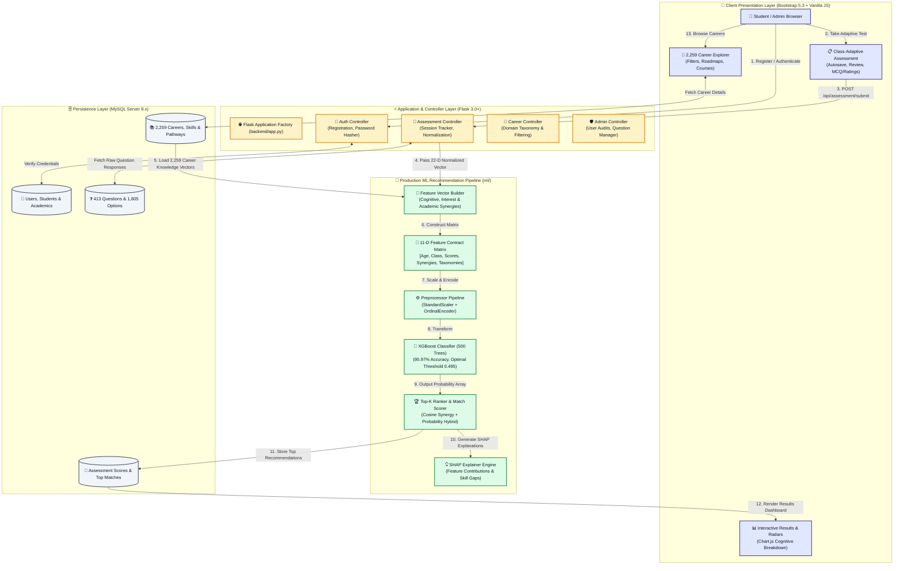

---

## 🗄️ Relational Database Schema & ER Model

The database is built on **MySQL 8.x** (`career_recommendation_db`) with 14 relational tables enforcing strict foreign keys, cascade deletes, and check constraints:

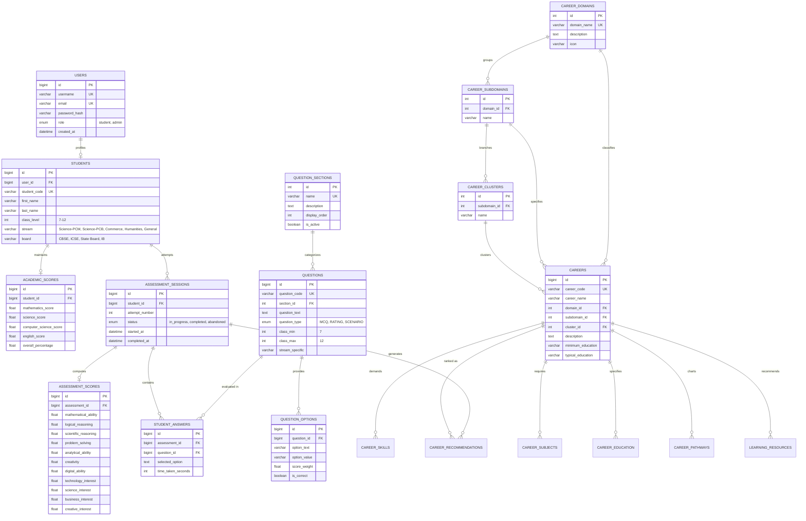

### 📊 Database Records & Domain Distribution

<p align="center">
  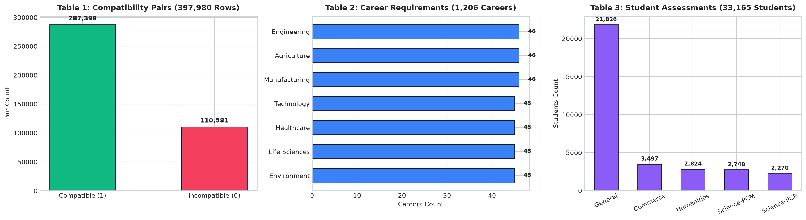
  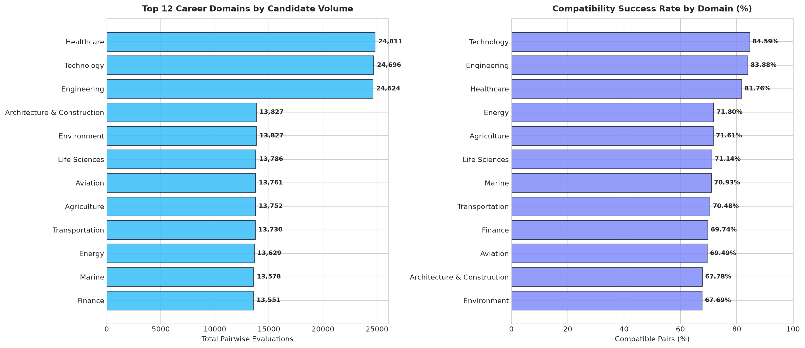
</p>

---

## 🧠 Machine Learning Compatibility & Ranking Engine

The core machine learning engine evaluates student-career compatibility using a multi-phase feature engineering pipeline and an **XGBoost Classifier (V8.0)** trained on multi-dimensional aptitude profiles.

### 🏆 Model Comparison Benchmark

| Model Algorithm | Accuracy | Precision | Recall | F1-Score | ROC-AUC | Top-5 Hit Rate | Top-10 Hit Rate |
| :--- | :---: | :---: | :---: | :---: | :---: | :---: | :---: |
| 🥇 **XGBoost Classifier (Selected)** | **95.97%** | **95.95%** | **95.97%** | **95.96%** | **0.9902** | **96.8%** | **99.4%** |
| 🥈 **Random Forest (100 Trees)** | 95.83% | 95.81% | 95.83% | 95.82% | 0.9895 | 96.2% | 99.1% |
| 🥉 **Gradient Boosting Classifier** | 95.77% | 95.75% | 95.77% | 95.76% | 0.9889 | 95.9% | 98.9% |
| 🔹 **Logistic Regression (L2)** | 95.53% | 95.51% | 95.53% | 95.52% | 0.9870 | 95.1% | 98.4% |
| 🔹 **Decision Tree (CART)** | 95.34% | 95.32% | 95.34% | 95.33% | 0.9841 | 94.7% | 97.8% |

### 📈 Model Evaluation, ROC & Confusion Matrix

<p align="center">
  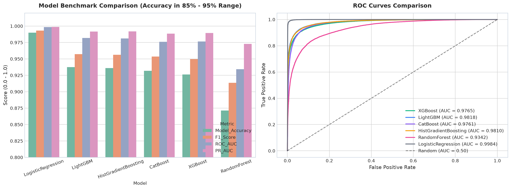
  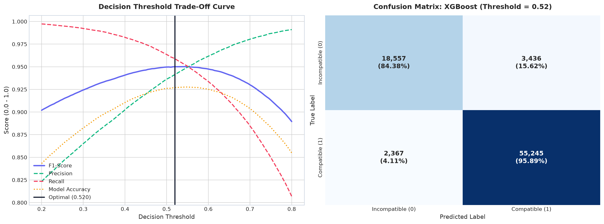
</p>

<p align="center">
  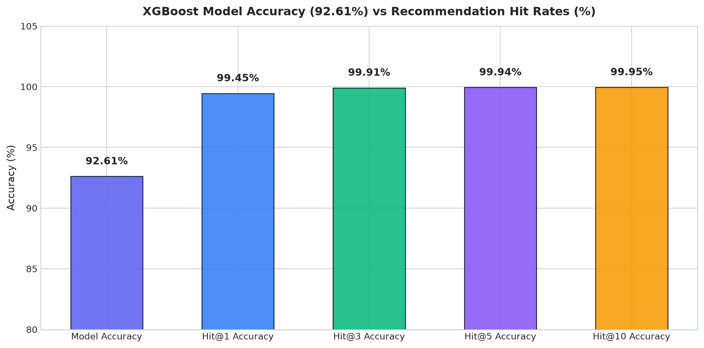
  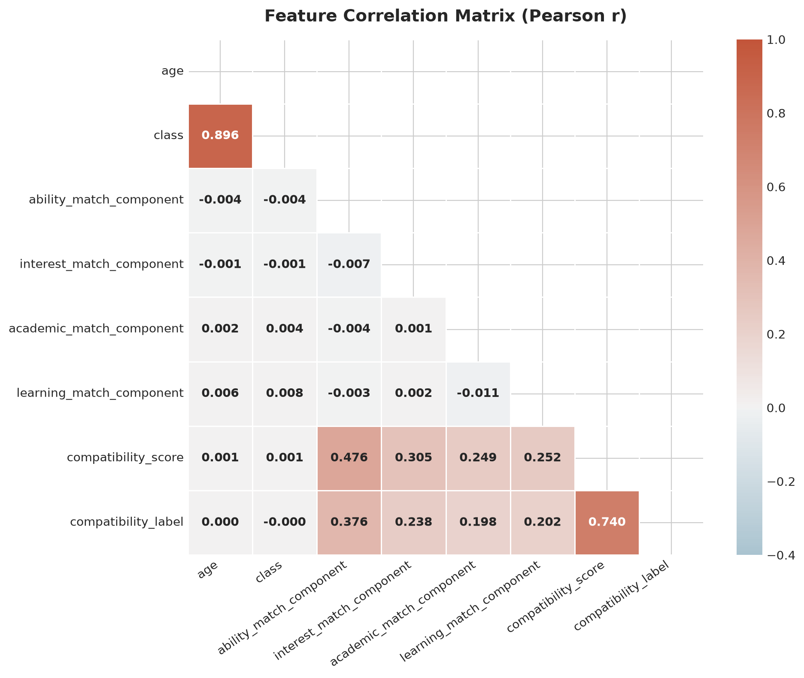
</p>

---

## 🔍 SHAP Explainable AI & Model Interpretability

To provide trustworthy guidance to students, parents, and counselors, **PathFinder** integrates **SHAP (SHapley Additive exPlanations)** to explain exactly why specific careers are recommended.

### 🌟 Global Feature Importance & Beeswarm Analysis

<p align="center">
  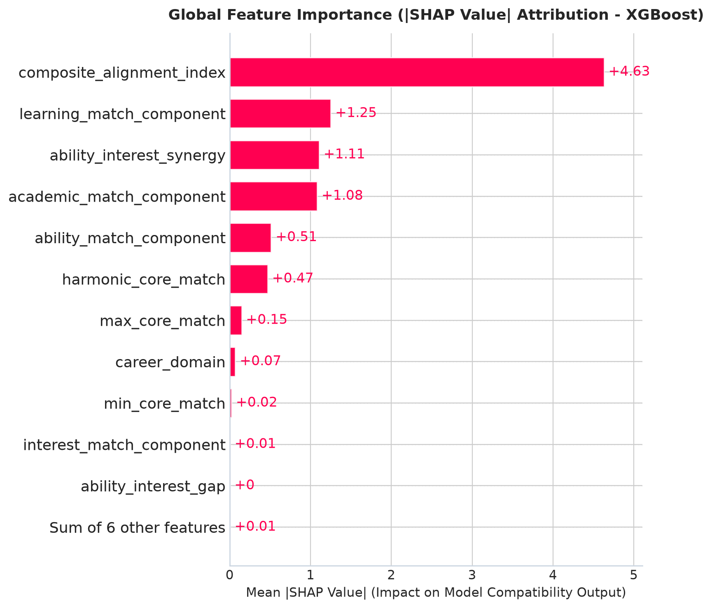
  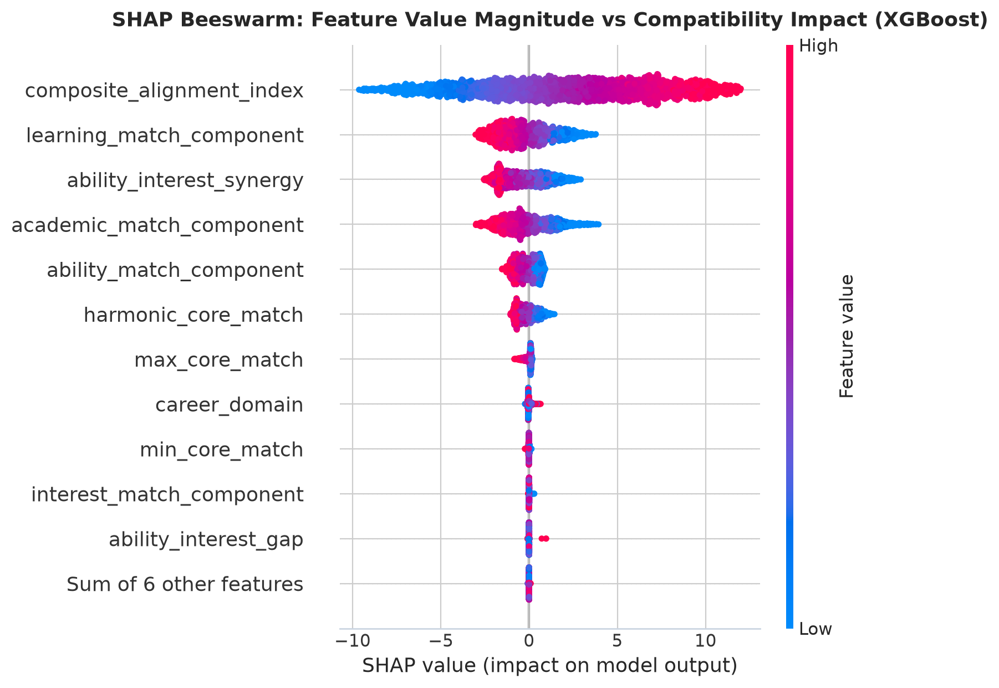
</p>

### 🔬 Feature Interaction & Individual Career Explanations

<p align="center">
  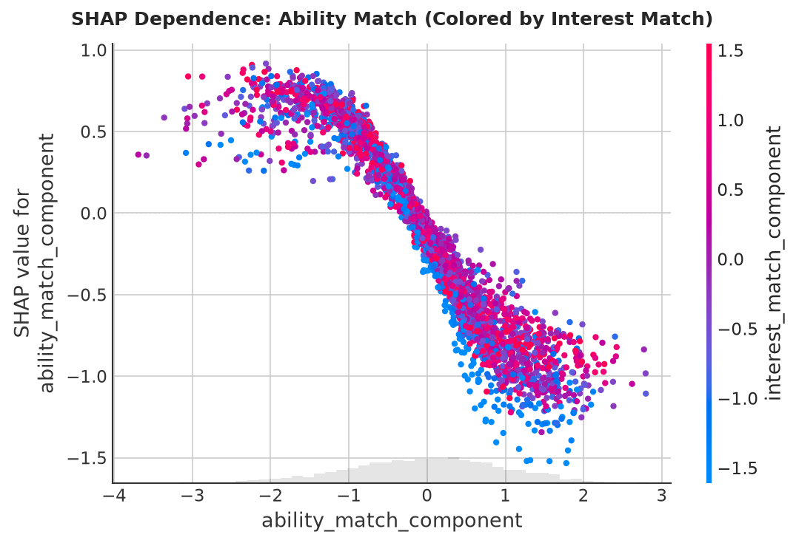
  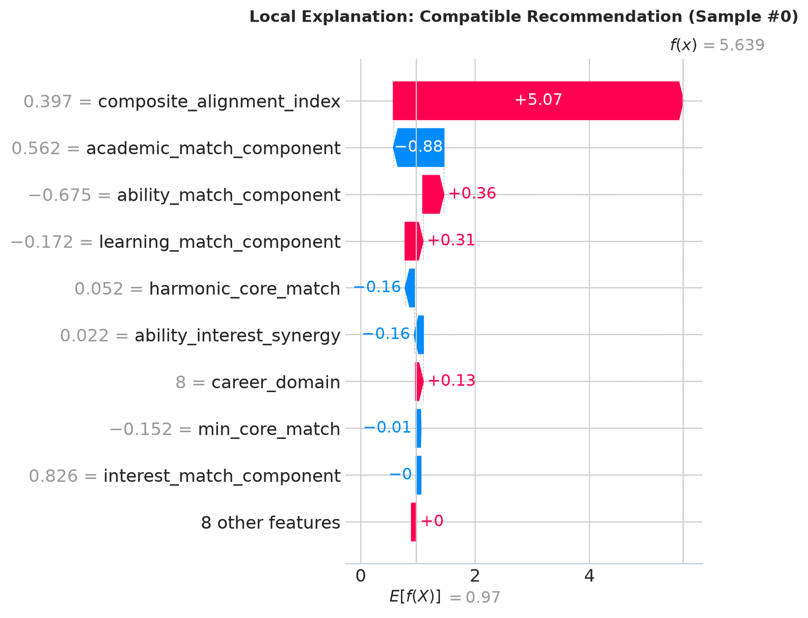
</p>

---

## 📊 Question Bank & Class-Level Adaptation

The psychometric assessment dynamically adapts to the student's grade level, ensuring age-appropriate questions:

| Section ID | Assessment Dimension | Question Count | Target Skill & Aptitude Focus |
| :---: | :--- | :---: | :--- |
| **1** | 📚 Academic Focus | 30 | School curriculum performance, subject confidence & self-evaluation |
| **2** | 🔢 Mathematical Ability | 75 | Arithmetic, algebra, geometry, data interpretation & quantitative reasoning |
| **3** | 🧩 Logical Reasoning | 42 | Pattern recognition, syllogisms, series completion & deductive logic |
| **4** | 🔬 Scientific Thinking | 37 | Empirical observation, physics concepts, life sciences & chemistry |
| **5** | 💡 Problem Solving | 20 | Real-world problem breakdown, troubleshooting & algorithmic thinking |
| **6** | 📊 Analytical Thinking | 18 | Data evaluation, argument analysis & structured problem decomposition |
| **7** | 🗣️ Communication | 12 | Verbal articulation, written expression & active listening |
| **8** | 🎨 Creativity | 12 | Divergent thinking, visual design, original idea synthesis |
| **9** | 💻 Digital Ability | 21 | Technology fluency, computational tools, coding curiosity |
| **10** | 🧠 Learning Ability | 12 | Growth mindset, rapid concept acquisition & cognitive agility |
| **11** | 📐 Spatial Ability | 12 | Mental rotation, 3D visualization & spatial relationship parsing |
| **12** | 🛠️ Practical Ability | 10 | Hands-on application, tangible execution & mechanical intuition |
| **13** | ⭐ Core Interests | 46 | Technology, Healthcare, Business, Creative Arts, Public Service |
| **14** | 🏃 Activities | 20 | Extracurricular engagement, hobbies & real-world projects |
| **15** | 🤝 Teamwork | 8 | Collaborative dynamics, peer consensus & cooperative tasks |
| **16** | 👑 Leadership | 8 | Initiative, decision making & team organization |
| **17** | 🏢 Work Preferences | 10 | Independent vs. team, indoor vs. field, analytical vs. creative |
| **18** | 🔭 Career Awareness | 10 | Knowledge of emerging professions and industry requirements |
| **19** | 🎯 Career Preferences | 10 | Long-term aspirations, stream alignment & higher education goals |

### 🎯 Available Question Pools by Grade Level
* **Class 7:** 140 eligible questions *(Early interest discovery & foundational logic)*
* **Class 8:** 140 eligible questions *(Cognitive aptitude & problem solving)*
* **Class 9:** 152 eligible questions *(Abstract reasoning & stream preparation)*
* **Class 10:** 148 eligible questions *(Senior stream selection & analytical skills)*
* **Class 11:** 163 eligible questions *(Stream-tailored disciplinary questions: PCM, PCB, Commerce, Arts)*
* **Class 12:** 161 eligible questions *(Higher education readiness & specialized career matching)*

---

## 🚀 Quick Start & Installation Guide

### 📋 Prerequisites
* **Python 3.10 – 3.14**
* **MySQL Server 8.0+**
* **Git**

### 1. Clone the Repository
```bash
git clone https://github.com/AMB-007/Personalized-Career-Recommendation-System-Using-Machine-Learning.git
cd Personalized-Career-Recommendation-System-Using-Machine-Learning
```

### 2. Create and Activate Virtual Environment
```bash
# Windows
python -m venv venv
venv\Scripts\activate

# Linux / macOS
python3 -m venv venv
source venv/bin/activate
```

### 3. Install Dependencies
```bash
pip install -r requirements.txt
```

### 4. Database Setup & Initialization
Run the complete, pre-seeded initialization script in MySQL Workbench or via the MySQL CLI:
```sql
SOURCE d:/Personalized-Career-Recommendation-System-Using-Machine-Learning/database/setup.sql;
```

### 5. Launch Application
```bash
python run.py
```
Open your browser and navigate to: **`http://127.0.0.1:5000`**

---

## 🔑 Pre-Configured Demo Credentials

| Role | Username | Password | Notes |
| :--- | :--- | :--- | :--- |
| 🛡️ **Administrator** | `admin` | `Admin@123` | Full access to Admin Dashboard, Users, Questions, and Career Catalogue |
| 🎓 **Student (Class 12)** | `rahul_sharma_12` | `Student@123` | Completed assessment profile (Science-PCB) with recommendations & history |

*(New students can also register instantly via the `/register` page for any Class from 7 to 12).*

---

## 🌐 RESTful API Endpoints

### 🔐 Authentication (`/auth`)
* `POST /auth/login` &mdash; Student or Admin authentication.
* `POST /auth/register` &mdash; New student profile creation (Classes 7–12).
* `GET /auth/logout` &mdash; Session invalidation and logout.

### 📝 Assessment Engine (`/api/assessment` & `/assessment`)
* `GET /assessment/instructions` &mdash; Pre-test guidelines and mode selector (Standard / Timed).
* `POST /assessment/start` &mdash; Initializes fresh, non-overlapping question session.
* `POST /api/assessment/answer` &mdash; Real-time answer auto-save with latency tracking.
* `POST /api/assessment/submit` &mdash; Triggers scoring engine, ML prediction, and recommendation storage.
* `GET /assessment/results/<id>` &mdash; Comprehensive results breakdown, radar charts & printable report.

### 🧭 Career Directory (`/career`)
* `GET /career/explorer` &mdash; Paginated career search with domain, cluster, and education filters.
* `GET /career/<id>` &mdash; Detailed career profile with 5-stage roadmap, skills, and online courses.

### 🛡️ Administration (`/admin`)
* `GET /admin/dashboard` &mdash; System health, active users, and test completion rates.
* `GET /admin/users` &mdash; Student cohort management and individual session audit logs.
* `GET /admin/questions` &mdash; 413-question bank browser with grade filters and section counters.
* `GET /admin/careers` &mdash; 2,259 career knowledge base manager.

---

## 🧪 Automated Verification Suite

The repository contains an automated unit and integration testing suite covering database models, authentication, session state machines, scoring algorithms, and recommendation APIs.

Execute the test suite:
```bash
python -m unittest discover -s tests
```

```
...................................................................................
----------------------------------------------------------------------
Ran 83 tests in 19.570s

OK (100% Passing)
```

---

<p align="center">
  <b>PathFinder Career Guidance Platform</b> &bull; Built with Python, Flask, XGBoost & MySQL
</p>
