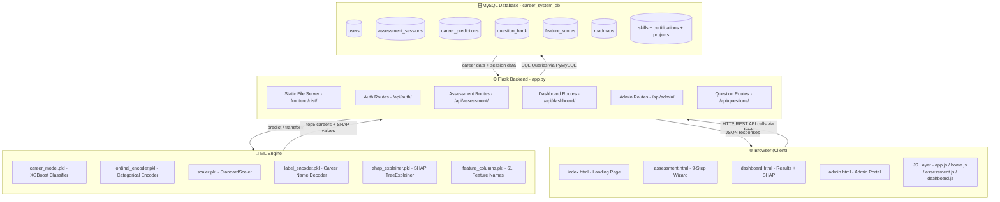
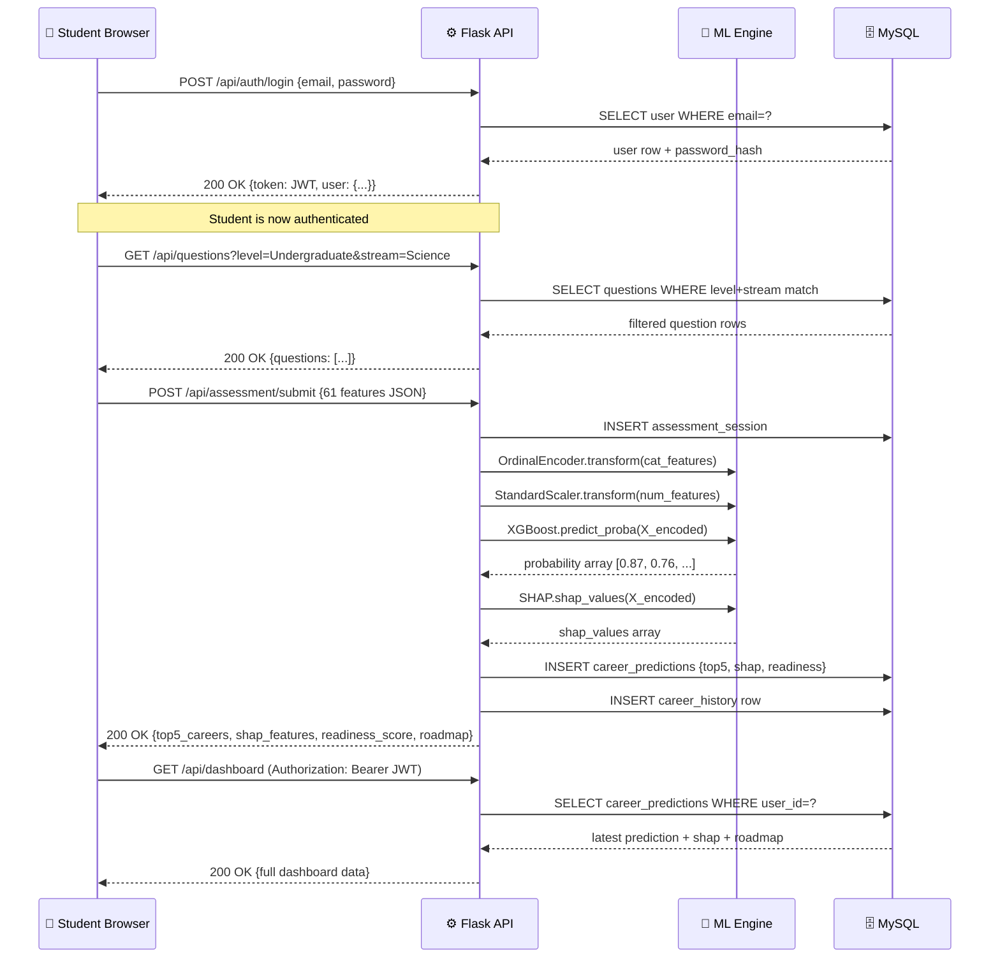
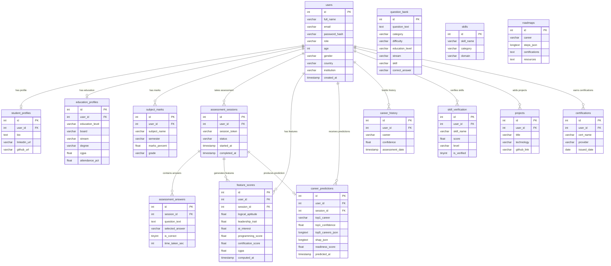
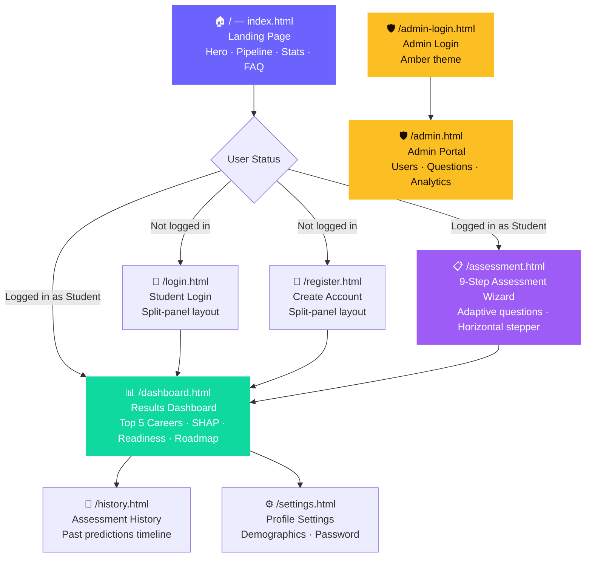
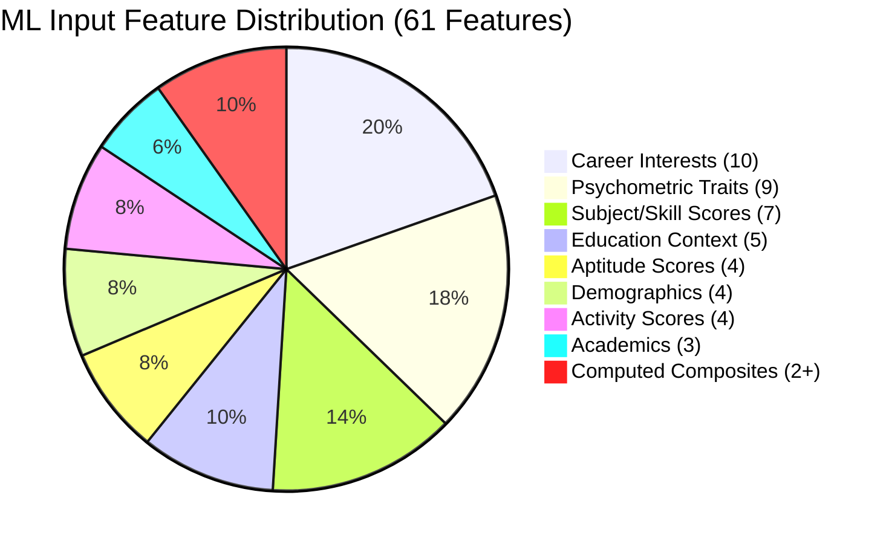

# AI Career Recommendation System

> **AI-powered career guidance for students from Class 7 to Postgraduate.**
> Takes a 9-step adaptive assessment and returns your top-5 personalised career matches with full AI explainability — all running from one command.

<div align="center">


</div>

---

## Table of Contents

1. [What is this?](#what-is-this)
2. [Quick Start (5 Minutes)](#quick-start-5-minutes)
3. [Default Credentials](#default-login-credentials)
4. [System Architecture](#system-architecture)
5. [Request-Response Flow](#request-response-flow)
6. [Assessment Pipeline Flowchart](#assessment-pipeline-flowchart)
7. [ML Prediction Pipeline](#ml-prediction-pipeline)
8. [Database Schema](#database-schema)
9. [Entity Relationship Diagram](#entity-relationship-diagram)
10. [Project Structure](#project-structure)
11. [Frontend Page Map](#frontend-page-map)
12. [API Reference](#api-reference)
13. [ML Model Details](#ml-model-details)
14. [Environment Variables](#environment-variables)
15. [Development Notes](#development-notes)
16. [Contributing](#contributing)
17. [License](#license)

---

## What is this?

Students often struggle to pick the right career. This system solves that with a scientific, AI-driven approach:

1. 🎓 Collects the student's **education profile**, **subject marks**, and **demographics**
2. 🧩 Administers a **9-step adaptive assessment** — questions change based on real-time performance
3. 📊 Computes **61 ML features** across academics, psychometric traits, skills, and career interests
4. 🤖 Runs those features through a trained **XGBoost model** (35,000 training records, 272 career labels)
5. 💡 Explains *why* each career was chosen using **SHAP (Explainable AI)** values
6. 🗺️ Delivers a **step-by-step learning roadmap** for each recommended career

Everything — the web app, the REST API, and the ML engine — starts from **one Python command**.

---

## Quick Start (5 Minutes)

### Prerequisites

| Tool | Version | Download |
|------|---------|----------|
| Python | 3.10 or higher | [python.org](https://www.python.org/downloads/) |
| MySQL | 8.0 or higher | [mysql.com](https://dev.mysql.com/downloads/) |
| Git | Any recent version | [git-scm.com](https://git-scm.com/) |

> **No Node.js needed.** The frontend is plain HTML/CSS/JavaScript served directly by Flask.

---

### Step 1 — Clone the Repository

```bash
git clone https://github.com/AMB-007/Career_Recommendation_System.git
cd Career_Recommendation_System
```

---

### Step 2 — Create the Database

Open your MySQL client and run:

```sql
CREATE DATABASE career_system_db;
```

> The app auto-creates all **15 tables** and seeds default data on first launch. No SQL import required.

---

### Step 3 — Set Up Python Virtual Environment

```bash
# Move into the backend folder
cd backend

# Create virtual environment
python -m venv venv

# Activate it
# Windows:
.\venv\Scripts\activate
# macOS / Linux:
source venv/bin/activate

# Install all dependencies
pip install -r requirements.txt

# Return to project root
cd ..
```

---

### Step 4 — Configure Environment Variables

Create `backend/.env`:

```env
DB_HOST=localhost
DB_USER=root
DB_PASSWORD=your_mysql_password_here
DB_NAME=career_system_db
JWT_SECRET=career_super_secret_key_2026
```

---

### Step 5 — Launch the App

```bash
python app.py
```

Expected output:

```
============================================================
  AI Career Recommendation System
  Starting server...
============================================================
[OK] Database initialised.

  [OK] Frontend + Backend running at: http://127.0.0.1:5000
  [OK] API health check:              http://127.0.0.1:5000/api/health
  Press CTRL+C to stop.
```

Open **http://127.0.0.1:5000** in your browser. Done! ✅

---

### Step 6 — Verify Health

```http
GET http://localhost:5000/api/health
```

```json
{
  "status": "ok",
  "ml_loaded": true,
  "message": "Career Recommendation System API is running"
}
```

---

## Default Login Credentials

| Role | Email | Password |
|------|-------|----------|
| Admin | `admin@gmail.com` | `Admin@123` |

> ⚠️ Change the admin password after your first login via Settings.

---

## System Architecture



---

## Request-Response Flow



---

## Assessment Pipeline Flowchart

```mermaid
flowchart TD
    START([🎓 Student Opens Assessment]) --> S1

    S1["📋 Step 1: Education Profile
    Education Level · Board
    Stream · Degree · CGPA · Attendance"]

    S1 --> VALID1{Fields Complete?}
    VALID1 -- No --> S1
    VALID1 -- Yes --> S2

    S2["📊 Step 2: Subject Marks
    Board-specific subjects auto-loaded
    Enter marks % per subject"]

    S2 --> S3

    S3["🧩 Step 3: Adaptive Aptitude Battery
    Load questions filtered by:
    Education Level + Board + Stream"]

    S3 --> ADAPT{Performance-Based
    Difficulty Adjustment}
    ADAPT -- Score ≥ 70% --> HARD[Hard Questions]
    ADAPT -- Score 40-70% --> MED[Medium Questions]
    ADAPT -- Score < 40% --> EASY[Easy Questions]
    HARD & MED & EASY --> S4

    S4["🧠 Step 4: Situational Psychometrics
    4 scenario-based questions
    Reveal: Leadership · Curiosity ·
    Resilience · Creativity · Teamwork"]

    S4 --> S5

    S5["🎯 Step 5: Career Interest Profiling
    8 forced-choice interest pairs
    Scores: Technology · Healthcare ·
    Business · Creative · Research · Law"]

    S5 --> S6

    S6["🔬 Step 6: Skill Verification
    Student selects claimed skills
    Each skill tested with MCQ questions
    Score: Beginner / Intermediate / Advanced"]

    S6 --> S7

    S7["🏆 Step 7: Certifications
    Add certifications with provider
    Boosts certification_score feature"]

    S7 --> S8

    S8["📁 Step 8: Projects & Portfolio
    Add projects with technologies
    Boosts project_score feature"]

    S8 --> COMPUTE

    COMPUTE["⚙️ Feature Engineering
    Compute 61 ML features from all steps:
    Demographics + Academics + Aptitude +
    Psychometrics + Interests + Skills +
    Certifications + Projects"]

    COMPUTE --> ML_PIPE

    ML_PIPE["🤖 ML Prediction Pipeline
    Ordinal Encode → Standard Scale →
    XGBoost.predict_proba() → Top 5 Careers
    SHAP TreeExplainer → Attribution values"]

    ML_PIPE --> SAVE

    SAVE["💾 Save to MySQL
    career_predictions + career_history
    + feature_scores tables"]

    SAVE --> S9

    S9(["📊 Step 9: Results Dashboard
    Top 5 Careers + Confidence %
    SHAP Explainability Chips
    Career Readiness Score
    Learning Roadmap"])

    style START fill:#6c63ff,color:#fff,stroke:none
    style S9 fill:#10d9a0,color:#fff,stroke:none
    style COMPUTE fill:#9d5cf6,color:#fff,stroke:none
    style ML_PIPE fill:#f472b6,color:#fff,stroke:none
```



---

## ML Prediction Pipeline

```mermaid
flowchart LR
    subgraph INPUT["📥 Raw Input - 61 Features"]
        I1[Demographics\nAge · Gender · Country · State]
        I2[Education\nLevel · Board · Stream · Degree · CGPA]
        I3[Aptitude Scores\nLogical · Numerical · Verbal · Spatial]
        I4[Psychometric Traits\n8 Trait Scores 0-100]
        I5[Interest Scores\n10 Domain Scores 0-100]
        I6[Skill Scores\nProgramming · Science · Business · Creative]
        I7[Activity Scores\nCertifications · Projects · Internship]
    end

    subgraph ENCODE["🔄 Preprocessing"]
        E1[OrdinalEncoder\nCategorical Features\nLevel · Board · Stream · Gender ...]
        E2[StandardScaler\nNumerical Features\nCGPA · Scores · Traits ...]
    end

    subgraph MODEL["🤖 XGBoost Classifier"]
        M1[XGBoost\nGradient Boosted Trees\n35,000 training records]
        M2[predict_proba\nReturns probability\nfor all 272 classes]
        M3[Top-5 Extraction\nnp.argsort descending\nLabel decode via LabelEncoder]
    end

    subgraph EXPLAIN["💡 SHAP Explainability"]
        X1[TreeExplainer\nPre-computed on training data]
        X2[shap_values\nFeature attribution per prediction]
        X3[Top N Features\nBy absolute SHAP value]
    end

    subgraph OUTPUT["📤 API Response"]
        O1[top5_careers\nCareer name + confidence %]
        O2[shap_chips\nFeature + impact pairs]
        O3[readiness_score\nComposite 0-100 score]
        O4[roadmap\nStep-by-step learning path]
    end

    INPUT --> ENCODE
    E1 & E2 --> MODEL
    M1 --> M2 --> M3
    M1 --> EXPLAIN
    MODEL --> OUTPUT
    EXPLAIN --> OUTPUT
```



---

## Database Schema

All **15 tables** are auto-created on first run. Here is the complete schema with key columns:

### Core User Tables

```
┌────────────────────────────────────────────────────────────────────┐
│  TABLE: users                                                      │
│  Central account table for all students and admins                 │
├───────────────────┬────────────────┬──────────────────────────────┤
│  Column           │  Type          │  Description                 │
├───────────────────┼────────────────┼──────────────────────────────┤
│  id               │  INT PK        │  Auto-increment primary key   │
│  full_name        │  VARCHAR(120)  │  Student's full name          │
│  email            │  VARCHAR(120)  │  Unique email (login)         │
│  password_hash    │  VARCHAR(255)  │  Werkzeug pbkdf2 hash         │
│  role             │  VARCHAR(20)   │  'student' or 'admin'         │
│  age              │  INT           │  Age in years                 │
│  gender           │  VARCHAR(20)   │  Male / Female / Other        │
│  country          │  VARCHAR(80)   │  Country of residence         │
│  state            │  VARCHAR(80)   │  State / Province             │
│  district         │  VARCHAR(80)   │  District / City              │
│  institution      │  VARCHAR(150)  │  School or college name       │
│  language         │  VARCHAR(40)   │  Medium of instruction        │
│  created_at       │  TIMESTAMP     │  Registration time            │
└───────────────────┴────────────────┴──────────────────────────────┘

┌────────────────────────────────────────────────────────────────────┐
│  TABLE: student_profiles                         FK → users.id     │
│  Extended profile info — one-to-one with users                     │
├───────────────────┬────────────────┬──────────────────────────────┤
│  user_id          │  INT UNIQUE FK │  Links to users.id (cascade)  │
│  bio              │  TEXT          │  Short personal bio           │
│  linkedin_url     │  VARCHAR(255)  │  LinkedIn profile URL         │
│  github_url       │  VARCHAR(255)  │  GitHub profile URL           │
│  portfolio_url    │  VARCHAR(255)  │  Personal portfolio URL       │
└───────────────────┴────────────────┴──────────────────────────────┘

┌────────────────────────────────────────────────────────────────────┐
│  TABLE: education_profiles                       FK → users.id     │
│  Academic background — one-to-one with users                       │
├───────────────────┬────────────────┬──────────────────────────────┤
│  user_id          │  INT FK        │  Links to users.id            │
│  education_level  │  VARCHAR(60)   │  Class 7–10 / UG / PG / etc.  │
│  board            │  VARCHAR(80)   │  CBSE / ICSE / State Board    │
│  stream           │  VARCHAR(80)   │  Science / Commerce / Arts    │
│  degree           │  VARCHAR(80)   │  BTech / MBBS / LLB / MBA     │
│  specialization   │  VARCHAR(120)  │  Computer Science / Finance   │
│  cgpa             │  FLOAT         │  0.0 – 10.0 scale             │
│  attendance_pct   │  FLOAT         │  0 – 100 %                    │
│  institution_tier │  VARCHAR(20)   │  Tier 1 / Tier 2 / Tier 3     │
└───────────────────┴────────────────┴──────────────────────────────┘
```

### Assessment Tables

```
┌────────────────────────────────────────────────────────────────────┐
│  TABLE: question_bank                                              │
│  All 200+ adaptive MCQ questions for the assessment                │
├───────────────────┬────────────────┬──────────────────────────────┤
│  id               │  INT PK        │  Auto-increment               │
│  question_text    │  TEXT          │  The question                 │
│  category         │  VARCHAR(80)   │  Logical / Numerical /        │
│                   │                │  Psychometric / Interest /    │
│                   │                │  Skill Verification           │
│  difficulty       │  VARCHAR(20)   │  Easy / Medium / Hard         │
│  education_level  │  VARCHAR(60)   │  'All' or specific level      │
│  board            │  VARCHAR(80)   │  'All' or specific board      │
│  stream           │  VARCHAR(80)   │  'All' or Science / Commerce  │
│  degree           │  VARCHAR(80)   │  'All' or BTech / MBBS etc.   │
│  skill            │  VARCHAR(80)   │  Skill this question tests    │
│  option_a–d       │  VARCHAR(255)  │  Four MCQ options             │
│  correct_answer   │  VARCHAR(5)    │  A / B / C / D                │
│  weight           │  FLOAT         │  Score multiplier (difficulty) │
└───────────────────┴────────────────┴──────────────────────────────┘

┌────────────────────────────────────────────────────────────────────┐
│  TABLE: assessment_sessions                      FK → users.id     │
│  One row per assessment attempt                                    │
├───────────────────┬────────────────┬──────────────────────────────┤
│  id               │  INT PK        │  Session ID                   │
│  user_id          │  INT FK        │  Which student                │
│  session_token    │  VARCHAR(100)  │  Unique session token         │
│  status           │  VARCHAR(30)   │  In Progress / Completed /    │
│                   │                │  Abandoned                    │
│  started_at       │  TIMESTAMP     │  Assessment start time        │
│  completed_at     │  TIMESTAMP     │  NULL until finished          │
└───────────────────┴────────────────┴──────────────────────────────┘

┌────────────────────────────────────────────────────────────────────┐
│  TABLE: assessment_answers              FK → assessment_sessions.id│
│  Individual question answers per session                           │
├───────────────────┬────────────────┬──────────────────────────────┤
│  session_id       │  INT FK        │  Links to session             │
│  question_text    │  TEXT          │  Snapshot of question text    │
│  category         │  VARCHAR(80)   │  Question category            │
│  selected_answer  │  VARCHAR(255)  │  Student's chosen answer      │
│  is_correct       │  TINYINT(1)    │  0 = wrong, 1 = correct       │
│  time_taken_sec   │  INT           │  Time spent on question       │
└───────────────────┴────────────────┴──────────────────────────────┘
```

### ML Feature & Prediction Tables

```
┌────────────────────────────────────────────────────────────────────┐
│  TABLE: feature_scores                           FK → users.id     │
│  Computed ML features (61 values) stored per session               │
├───────────────────┬────────────────┬──────────────────────────────┤
│  Aptitude          logical · numerical · verbal · spatial          │
│  Subject Skills    programming · science · business · creative ·   │
│                    medical score                                   │
│  Psychometric      leadership · teamwork · communication ·         │
│  Traits            resilience · curiosity · creativity ·           │
│                    problem_solving · analytical_thinking ·         │
│                    adaptability                                    │
│  Career Interests  ai · technology · healthcare · business ·       │
│                    arts · research · education · engineering ·     │
│                    law · environment                               │
│  Activity Scores   certification · project · internship ·          │
│                    skill_verified · academic                       │
│  Academic          cgpa · attendance_pct · skill_count · cert_count│
└───────────────────┴────────────────┴──────────────────────────────┘

┌────────────────────────────────────────────────────────────────────┐
│  TABLE: career_predictions                       FK → users.id     │
│  ML model output stored after each assessment                      │
├───────────────────┬────────────────┬──────────────────────────────┤
│  user_id          │  INT FK        │  Which student                │
│  session_id       │  INT           │  Which session                │
│  top1_career      │  VARCHAR(150)  │  Best match career name       │
│  top1_confidence  │  FLOAT         │  Confidence % for #1          │
│  top5_careers_json│  LONGTEXT      │  JSON: top 5 careers + conf % │
│  shap_json        │  LONGTEXT      │  JSON: SHAP attribution chips │
│  readiness_score  │  FLOAT         │  Composite readiness 0–100    │
│  predicted_at     │  TIMESTAMP     │  When prediction was made     │
└───────────────────┴────────────────┴──────────────────────────────┘
```

### Portfolio & Skills Tables

```
┌─────────────────────┬──────────────────────────────────────────────┐
│  TABLE              │  What it stores                              │
├─────────────────────┼──────────────────────────────────────────────┤
│  subject_marks      │  Subject name · marks % · grade per semester │
│  skills             │  Master skills catalog (33 seeded skills)    │
│  skill_verification │  Student skill quiz scores + verified level  │
│  certifications     │  Cert name · provider · issued date · URL    │
│  projects           │  Title · tech stack · GitHub link · team size│
│  career_history     │  Timeline log of all past career predictions │
│  roadmaps           │  JSON steps + resources per career (16 seeded)│
└─────────────────────┴──────────────────────────────────────────────┘
```

---

## Entity Relationship Diagram



---

## Project Structure

```
Career_Recommendation_System/
│
├── app.py                          ← START HERE — run this to launch everything
│
├── backend/
│   ├── app.py                      Flask application (all API routes + ML logic)
│   ├── requirements.txt            Python dependencies
│   ├── .env                        DB credentials (⚠️ never commit to Git)
│   ├── career_system_db.sql        Full DB schema + seed data backup
│   │
│   ├── core/
│   │   └── db_config.py            MySQL connection helper (PyMySQL pool)
│   │
│   └── models/                     Trained ML artifacts (auto-loaded at startup)
│       ├── career_model.pkl        XGBoost classifier (272 career classes)
│       ├── label_encoder.pkl       Career name ↔ integer encoder
│       ├── ordinal_encoder.pkl     Categorical feature encoder
│       ├── scaler.pkl              StandardScaler for numerical features
│       ├── feature_columns.pkl     Ordered list of all 61 feature names
│       ├── shap_explainer.pkl      Pre-computed SHAP TreeExplainer
│       └── career_dataset.csv      Training dataset (35,000+ rows)
│
├── frontend/
│   └── dist/                       Static web pages served by Flask
│       ├── index.html              Landing page
│       ├── login.html              Student login (split-panel)
│       ├── register.html           Student registration
│       ├── admin-login.html        Admin login (amber theme)
│       ├── assessment.html         9-step assessment wizard
│       ├── dashboard.html          ML results + SHAP + roadmap
│       ├── history.html            Past prediction history
│       ├── settings.html           Profile + password settings
│       ├── admin.html              Admin portal
│       │
│       ├── css/
│       │   └── style.css           Design system (Outfit + Inter, glassmorphism)
│       │
│       └── js/
│           ├── app.js              Global utilities: Auth · API · UI · ThemeManager
│           ├── home.js             Landing page: pipeline · stats · testimonials
│           ├── assessment.js       9-step wizard logic + adaptive questions
│           ├── dashboard.js        Results rendering: SHAP chips · roadmap
│           ├── history.js          Past predictions timeline
│           ├── settings.js         Profile update + password change
│           └── admin.js            Admin CRUD: users · questions · analytics
│
└── README.md
```

---

## Frontend Page Map



---

## API Reference

**Base URL:** `http://localhost:5000`

Protected endpoints require:
```http
Authorization: Bearer <your_jwt_token>
```

---

### Authentication

| Method | Endpoint | Auth | Description |
|--------|----------|------|-------------|
| GET | `/api/health` | None | Server health + ML model status |
| POST | `/api/auth/register` | None | Create a new student account |
| POST | `/api/auth/login` | None | Login and receive a JWT token |

#### POST /api/auth/register

```json
{
  "full_name": "Arjun Sharma",
  "email": "arjun@example.com",
  "password": "MyPass@123",
  "age": 20,
  "gender": "Male",
  "country": "India",
  "state": "Karnataka",
  "institution": "RV College of Engineering"
}
```

#### POST /api/auth/login

Request:
```json
{ "email": "arjun@example.com", "password": "MyPass@123" }
```

Response:
```json
{
  "status": "success",
  "token": "eyJhbGciOiJIUzI1NiIsInR5...",
  "user": { "id": 1, "full_name": "Arjun Sharma", "role": "student" }
}
```

---

### Student Endpoints

| Method | Endpoint | Auth | Description |
|--------|----------|------|-------------|
| GET | `/api/user/profile` | Student JWT | Get full profile |
| PUT | `/api/user/profile` | Student JWT | Update profile |
| GET | `/api/dashboard` | Student JWT | Latest career prediction results |
| GET | `/api/history` | Student JWT | All past predictions |

---

### Assessment

| Method | Endpoint | Auth | Description |
|--------|----------|------|-------------|
| GET | `/api/questions` | None | Questions (filtered by level/board/stream) |
| POST | `/api/assessment/submit` | Optional | Submit answers and trigger ML prediction |

#### POST /api/assessment/submit

Request body:
```json
{
  "education_level": "Undergraduate",
  "degree": "BTech",
  "specialization": "Computer Science",
  "cgpa": 8.5,
  "attendance": 85,
  "psychometric_traits": {
    "leadership": 4,
    "teamwork": 5,
    "curiosity": 5,
    "creativity": 3
  },
  "interest_scores": {
    "ai_interest": 5,
    "technology_interest": 5,
    "business_interest": 2
  },
  "skill_scores": { "Python": 4, "Machine Learning": 3 },
  "certifications": ["AWS Certified"],
  "projects": ["ML Sentiment Analyser"]
}
```

Response:
```json
{
  "status": "success",
  "top_career": "Data Scientist",
  "top5": [
    { "career": "Data Scientist",  "confidence": 0.87 },
    { "career": "ML Engineer",     "confidence": 0.76 },
    { "career": "AI Researcher",   "confidence": 0.61 },
    { "career": "Data Analyst",    "confidence": 0.54 },
    { "career": "Cloud Architect", "confidence": 0.48 }
  ],
  "readiness_score": 82.4,
  "shap_top_features": [
    { "feature": "AI Interest",       "value": 0.34 },
    { "feature": "Programming Score", "value": 0.28 }
  ]
}
```

---

### Admin Endpoints (Admin JWT required)

| Method | Endpoint | Description |
|--------|----------|-------------|
| GET | `/api/admin/users` | List all registered users |
| PUT | `/api/admin/users/<id>/role` | Change a user's role |
| DELETE | `/api/admin/users/<id>` | Delete a user account |
| GET | `/api/admin/questions` | List all questions in the bank |
| POST | `/api/admin/questions` | Add a new question |
| PUT | `/api/admin/questions/<id>` | Edit an existing question |
| DELETE | `/api/admin/questions/<id>` | Remove a question |
| GET | `/api/admin/analytics` | Platform stats: users, assessments, top careers |

---

## ML Model Details

### Feature Engineering (61 Features)



| Category | Features | Count |
|----------|---------|-------|
| Demographics | Age · Gender · Country · State | 4 |
| Academics | CGPA · Attendance % · Semester Marks | 3 |
| Education Context | Level · Board · Stream · Degree · Specialization | 5 |
| Aptitude Scores | Logical · Numerical · Verbal · Spatial | 4 |
| Psychometric Traits | Leadership · Teamwork · Communication · Resilience · Curiosity · Creativity · Problem Solving · Analytical Thinking · Adaptability | 9 |
| Career Interest Scores | AI · Technology · Healthcare · Business · Arts · Research · Education · Engineering · Law · Environment | 10 |
| Subject Skill Scores | Programming · Science · Business · Creative · Medical · Verbal · Spatial | 7 |
| Activity Scores | Certifications · Projects · Internship · Skill Verified | 4 |
| Computed Composites | Academic Score · Readiness Score · Skill Count · Cert Count · Skill Diversity | 5+ |

### Model Architecture

| Parameter | Value |
|-----------|-------|
| Algorithm | XGBoost Gradient Boosted Trees |
| Training Records | 35,000+ |
| Output Classes | 272 career labels |
| Explainability | SHAP TreeExplainer |
| Encoding | OrdinalEncoder (categorical) + StandardScaler (numerical) |
| Fallback | Rule-based heuristic engine (if model fails to load) |

### Sample Career Domains (272 total)

```
Technology      Software Developer · Data Scientist · ML Engineer · AI Engineer
                Cloud Architect · Cybersecurity Analyst · DevOps Engineer · Full Stack Dev

Healthcare      Doctor · Nurse · Pharmacist · Physiotherapist · Medical Researcher
                Radiologist · Dentist · Nutritionist · Psychologist

Business        Chartered Accountant · Business Analyst · Financial Advisor
                Marketing Manager · Entrepreneur · HR Manager · Supply Chain Manager

Law & Policy    Lawyer · Judge · Legal Advisor · Policy Analyst · Public Administrator

Design & Arts   Graphic Designer · UX Designer · Film Director · Animator
                Photographer · Fashion Designer · Architect · Interior Designer

Education       School Teacher · Professor · Researcher · Academic Counsellor

Engineering     Civil Engineer · Mechanical Engineer · Electrical Engineer
                Chemical Engineer · Aerospace Engineer · Environmental Engineer

... and 200+ more across every major profession
```

---

## Environment Variables

Create `backend/.env` with:

| Variable | Description | Required |
|----------|-------------|----------|
| `DB_HOST` | MySQL server address | Yes (default: `localhost`) |
| `DB_USER` | MySQL username | Yes (default: `root`) |
| `DB_PASSWORD` | MySQL password | **Yes** |
| `DB_NAME` | MySQL database name | Yes (default: `career_system_db`) |
| `JWT_SECRET` | Secret for signing JWT tokens | Yes |

> ⚠️ **Never commit `.env` to Git.** Add `backend/.env` to your `.gitignore`.

---

## Development Notes

### Running the App

```bash
# Recommended — from project root with venv active in backend/
python app.py

# Alternative — from inside backend/ directly
cd backend
python app.py
```

### Editing the Frontend

No build tools needed. Edit any `.html`, `.css`, or `.js` in `frontend/dist/` and refresh the browser. Flask serves them immediately.

### Adding Python Packages

```bash
cd backend
pip install <package-name>
pip freeze > requirements.txt
```

### Retraining the ML Model

The `career_dataset.csv` (35,000+ rows) is inside `backend/models/`. To retrain:
1. Modify or expand the CSV
2. Run your training notebook / script
3. Save new `.pkl` artifacts to `backend/models/`
4. Restart `python app.py`

### ML Fallback Mode

If any `.pkl` file fails to load (e.g. Python version mismatch), the system automatically switches to a rule-based heuristic engine. The UI never breaks or shows an error — the student still receives career recommendations.

---

## Contributing

1. Fork this repository
2. Create a feature branch: `git checkout -b feature/my-feature`
3. Commit your changes: `git commit -m "feat: describe what you added"`
4. Push and open a Pull Request

### Commit Message Guide

| Prefix | When to use |
|--------|-------------|
| `feat:` | New feature |
| `fix:` | Bug fix |
| `docs:` | Documentation only |
| `refactor:` | Code cleanup (no behaviour change) |
| `chore:` | Build scripts, dependency updates |
| `style:` | CSS / formatting changes |

---

## License

MIT License — free to use, modify, and distribute with attribution.

---

<div align="center">

**Built with Python · Flask · XGBoost · SHAP · Vanilla HTML/CSS/JS · MySQL**

⭐ If this project helped you, give it a star on GitHub!

</div>
