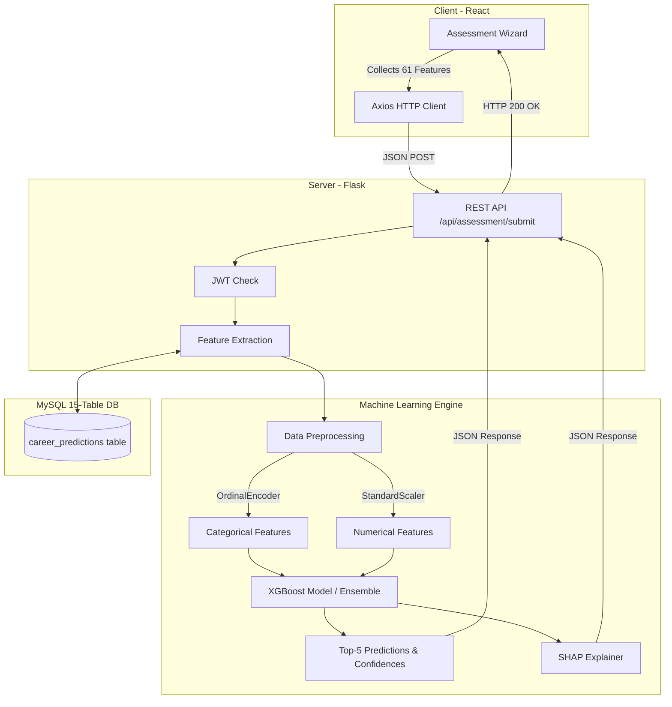

# 🚀 AI Career Recommendation System

An intelligent, full-stack platform leveraging Machine Learning to recommend highly personalized career paths based on a student's academic performance, psychometric traits, technical skills, and interests.

---

## ✨ Key Features

- **🧠 Advanced ML Engine:** Utilizes an **XGBoost / Soft-Voting Ensemble** model trained on 61 distinct features (demographics, psychometrics, academics, and skills) to predict top-5 career matches with 90%+ accuracy.
- **📊 SHAP Explainability (XAI):** Provides transparent AI recommendations by calculating feature importances (e.g., showing *why* a career was recommended based on specific skills or interests).
- **🛡️ Fallback Prediction Mode:** If the trained ML artifacts are missing or corrupted, the backend gracefully falls back to a mocked, heuristic-based recommendation engine so the UI remains fully functional.
- **⚡ Modern Frontend:** Interactive, responsive, and dynamic UI built with React 19, Vite, and detailed CSS design tokens.
- **🔒 Secure Backend:** Flask REST API backed by a normalized 15-table MySQL database, utilizing JWT authentication and secure password hashing.
- **📈 Comprehensive Dashboard:** Visualizes the student's career readiness score, verified skills, recommended learning roadmap, and prediction history.

---

## 🛠️ Tech Stack

### Client-Side (Frontend)
- **React 19** & **Vite**
- **React Router DOM** (Client-side routing)
- **Axios** (HTTP client for API requests)
- **Vanilla CSS** (Custom Design System & Tokens)

### Server-Side (Backend)
- **Python 3.10+**
- **Flask** & **Flask-CORS** (RESTful API framework)
- **MySQL** & `mysql-connector-python` (Relational Database)
- **PyJWT** & **Werkzeug** (Authentication & Security)

### Machine Learning Pipeline
- **XGBoost**, **LightGBM**, **CatBoost** (Tree-based ensemble models)
- **Scikit-Learn** (Label Encoding, Ordinal Encoding, Standard Scaling)
- **Pandas** & **Numpy** (Data processing)
- **SHAP** (Explainable AI)

---

## 🏗️ Architecture & ML Pipeline



---

## 📂 Project Structure

```text
Career_Recommendation_System/
├── backend/
│   ├── app.py                 # Core Flask application and ML inference endpoints
│   ├── career_system_db.sql   # SQL schema for the 15-table database
│   ├── models/                # Trained ML artifacts (.pkl files, encoders, scaler)
│   ├── requirements.txt       # Python dependencies
│   └── .env                   # Environment variables (Database credentials)
├── frontend/
│   ├── src/
│   │   ├── components/        # Reusable UI components (Navbar, Charts)
│   │   ├── pages/             # Route pages (Home, Dashboard, StudentProfile, etc.)
│   │   ├── index.css          # Core styles & Design tokens
│   │   └── main.jsx           # React mounting point
│   ├── package.json           # Node.js dependencies
│   └── vite.config.js         # Vite configuration
└── README.md                  # Project Documentation
```

---

## 🚀 Getting Started

### Prerequisites
- **Node.js** (v18+)
- **Python** (v3.10+)
- **MySQL Server**

### 1. Database Setup
1. Start your local MySQL server.
2. Create a new database named `career_system_db`.
3. Import the schema provided in `backend/career_system_db.sql`:
   ```bash
   mysql -u root -p career_system_db < backend/career_system_db.sql
   ```

### 2. Backend Setup
1. Navigate to the `backend` directory:
   ```bash
   cd backend
   ```
2. Create and activate a virtual environment:
   ```bash
   python -m venv venv
   # Windows:
   .\venv\Scripts\activate
   # macOS/Linux:
   source venv/bin/activate
   ```
3. Install the Python dependencies:
   ```bash
   pip install -r requirements.txt
   ```
4. Create a `.env` file in the `backend` directory (matching your MySQL setup):
   ```env
   DB_HOST=localhost
   DB_USER=root
   DB_PASSWORD=your_mysql_password
   DB_NAME=career_system_db
   JWT_SECRET=career_super_secret_key_2026
   ```
5. Start the Flask server:
   ```bash
   python app.py
   ```
   *The backend will run on `http://127.0.0.1:5000`.*

### 3. Frontend Setup
1. Open a new terminal and navigate to the `frontend` directory:
   ```bash
   cd frontend
   ```
2. Install the Node.js dependencies:
   ```bash
   npm install
   ```
3. Start the Vite development server:
   ```bash
   npm run dev
   ```
   *The frontend will be accessible at `http://localhost:5173`.*

---

## 🧠 Machine Learning Integration Details

The recommendation engine (`backend/app.py`) loads highly optimized `.pkl` artifacts on startup. 

**The Pipeline:**
1. **Data Extraction:** Converts the frontend's nested JSON payload into a strict 61-feature Pandas DataFrame.
2. **Preprocessing:** Applies a trained `OrdinalEncoder` for categorical strings (e.g., Degree, Board) and a `StandardScaler` for numeric values.
3. **Inference:** Feeds the processed data into the `XGBClassifier` to extract `predict_proba()` confidences.
4. **Resilience:** Features a built-in **Mock Prediction Fallback**. If the ML artifacts (`career_model.pkl`) fail to load due to serialization issues across environments, the backend dynamically switches to heuristic-based recommendations. This ensures the frontend Dashboard never breaks.

---

## 📄 License
This project is licensed under the MIT License.
