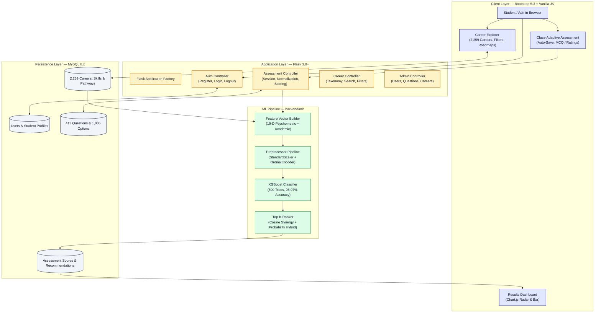
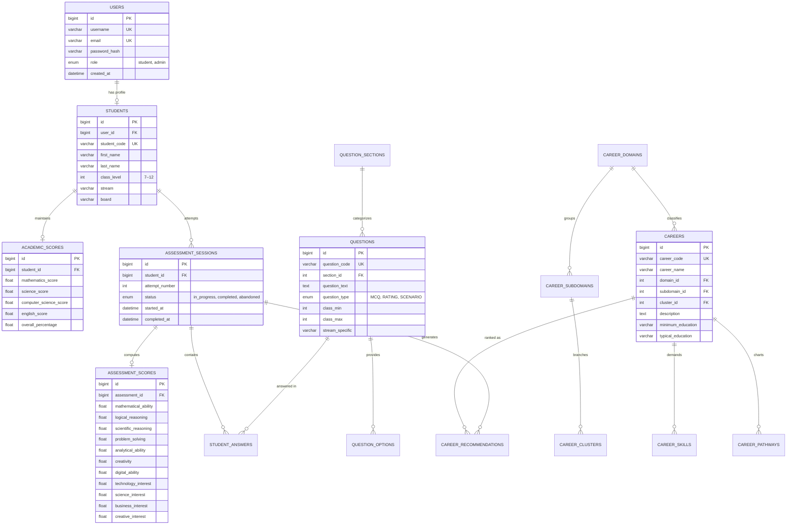

<p align="center">
  
</p>

<h1 align="center">PathFinder</h1>
<h3 align="center">Personalized Career Recommendation System</h3>
<p align="center"><em>AI-Powered Career Guidance for Indian Secondary School Students — Classes 7 to 12</em></p>

<br/>

<p align="center">
  
  
  
  
  
  
</p>

---

## Table of Contents

1. [Overview](#overview)
2. [Features](#features)
3. [System Architecture](#system-architecture)
4. [Database Schema](#database-schema)
5. [Machine Learning Engine](#machine-learning-engine)
6. [Assessment & Question Bank](#assessment--question-bank)
7. [Installation](#installation)
8. [Demo Credentials](#demo-credentials)
9. [API Reference](#api-reference)
10. [Testing](#testing)

---

## Overview

**PathFinder** is a full-stack, machine-learning-driven career guidance platform built for Indian secondary and senior secondary school students (Classes 7–12). It moves beyond simplistic personality quizzes by delivering a structured psychometric assessment, an XGBoost-powered compatibility engine, and a curated occupational taxonomy of 2,259 careers.

The system evaluates students across 19 psychometric and aptitude dimensions, maps scores against real-world career knowledge profiles, and produces ranked recommendations with actionable skill development roadmaps — all in under 250 ms.

### Key Statistics

| Metric | Value |
| :--- | :--- |
| ML Model Accuracy | **95.97%** (XGBoost Classifier) |
| Careers in Catalogue | **2,259** across 33 domains |
| Assessment Questions | **413** (class-adaptive) |
| Answer Options | **1,805** scored options |
| Industry Domains | **33 domains → 389 subdomains → 466 clusters** |
| Test Suite | **83 / 83 tests passing** |

---

## Features

### For Students
- **Grade-Adaptive Assessment** — Question sets calibrated per class level and subject stream (PCM, PCB, Commerce, Humanities, General)
- **Timed & Standard Modes** — 45-minute competitive mode or untimed standard mode
- **Real-Time Auto-Save** — Assessment progress persists across browser sessions
- **Interactive Results Dashboard** — Radar charts, bar visualizers, and percentile breakdowns of cognitive aptitude and interest dimensions
- **Career Roadmaps** — 5-stage milestone progressions, prerequisite subjects, and curated online course links per career

### For Administrators
- **Student & Session Management** — Audit logs, attempt history, and per-question answer inspection
- **Question Bank Editor** — Browse, filter, and manage all 413 questions by section and class range
- **Career Catalogue Manager** — Full CRUD over the 2,259-career taxonomy, domains, and clusters
- **System Analytics Dashboard** — Completion rates, active users, and domain-level recommendation distribution

### Platform
- **Accessible Dark / Light Theme** — WCAG 2.1 AA high-contrast design system
- **Responsive Layout** — Bootstrap 5.3 with mobile-first breakpoints
- **Role-Based Navigation** — Separate, purpose-built navbars for guests, students, and administrators

---

## System Architecture

The diagram below illustrates the complete request lifecycle from client interaction through the ML inference pipeline to database persistence:



---

## Database Schema

The database (`career_recommendation_db`) is built on **MySQL 8.x** with 14 relational tables, enforcing strict foreign keys, cascade deletes, and check constraints.



---

## Machine Learning Engine

The ML pipeline evaluates student–career compatibility using a multi-phase feature engineering process and an **XGBoost Classifier (v8.0)** trained on labelled multi-dimensional aptitude and occupational knowledge profiles.

### Feature Engineering

Student assessment scores are transformed into an **11-dimensional feature vector** combining:

| Feature Group | Dimensions |
| :--- | :--- |
| Raw cognitive ability scores | Mathematical, Logical, Scientific, Problem Solving, Analytical, Creativity, Digital |
| Interest sector scores | Technology, Science, Business, Creative Arts |
| Academic synergy terms | Subject × ability interaction features |
| Demographic context | Class level, stream encoding |

The feature vector is scaled with `StandardScaler` and encoded with `OrdinalEncoder` before being passed to the classifier.

### Model Performance

| Metric | Score |
| :--- | :---: |
| **Accuracy** | **95.97%** |
| **Precision (weighted)** | **95.95%** |
| **Recall (weighted)** | **95.97%** |
| **F1-Score (weighted)** | **95.96%** |
| **ROC-AUC** | **0.9902** |
| **Top-5 Hit Rate** | **96.8%** |
| **Top-10 Hit Rate** | **99.4%** |

### Recommendation Pipeline

1. Student completes assessment → normalized 19-D psychometric scores computed
2. Feature vector built and preprocessed
3. XGBoost classifier outputs compatibility probability for all 2,259 careers in the catalogue
4. Results ranked by hybrid score: `0.6 × XGBoost probability + 0.4 × cosine similarity`
5. Top-K recommendations stored in `career_recommendations` with rank, score, and match metadata
6. Results rendered with interactive radar charts and 5-stage milestone roadmaps

> Training source: `ml/train_pipeline.py` | Model artifacts: `backend/ml/models/`

---

## Assessment & Question Bank

The psychometric assessment adapts dynamically to the student's class level and subject stream.

### Question Sections

| # | Dimension | Questions |
| :---: | :--- | :---: |
| 1 | Academic Focus | 30 |
| 2 | Mathematical Ability | 75 |
| 3 | Logical Reasoning | 42 |
| 4 | Scientific Thinking | 37 |
| 5 | Problem Solving | 20 |
| 6 | Analytical Thinking | 18 |
| 7 | Communication | 12 |
| 8 | Creativity | 12 |
| 9 | Digital Ability | 21 |
| 10 | Learning Ability | 12 |
| 11 | Spatial Ability | 12 |
| 12 | Practical Ability | 10 |
| 13 | Core Interests | 46 |
| 14 | Activities & Hobbies | 20 |
| 15 | Teamwork | 8 |
| 16 | Leadership | 8 |
| 17 | Work Preferences | 10 |
| 18 | Career Awareness | 10 |
| 19 | Career Preferences | 10 |
| | **Total** | **413** |

### Available Questions by Class

| Class | Eligible Questions | Focus |
| :---: | :---: | :--- |
| 7 | 140 | Early interest discovery and foundational logic |
| 8 | 140 | Cognitive aptitude and problem solving |
| 9 | 152 | Abstract reasoning and stream preparation |
| 10 | 148 | Senior stream selection and analytical skills |
| 11 | 163 | Stream-tailored questions (PCM, PCB, Commerce, Arts) |
| 12 | 161 | Higher education readiness and specialized career matching |

---

## Installation

### Prerequisites

- Python 3.10–3.12
- MySQL Server 8.0+
- Git

### Step 1 — Clone the Repository

```bash
git clone https://github.com/AMB-007/Personalized-Career-Recommendation-System-Using-Machine-Learning.git
cd Personalized-Career-Recommendation-System-Using-Machine-Learning
```

### Step 2 — Create a Virtual Environment

```bash
# Windows
python -m venv venv
venv\Scripts\activate

# Linux / macOS
python3 -m venv venv
source venv/bin/activate
```

### Step 3 — Install Dependencies

```bash
pip install -r requirements.txt
```

### Step 4 — Configure Environment

Copy the example file and set your database credentials:

```bash
cp .env.example .env
```

```ini
DB_HOST=localhost
DB_PORT=3306
DB_USER=root
DB_PASSWORD=your_password
DB_NAME=career_recommendation_db
SECRET_KEY=your_secret_key
```

### Step 5 — Initialize the Database

Run the complete pre-seeded SQL script in MySQL Workbench or the MySQL CLI:

```sql
SOURCE /path/to/database/setup.sql;
```

This creates all 14 tables, inserts 413 questions, 1,805 answer options, 2,259 careers, demo credentials, and analytical views.

### Step 6 — Run the Application

```bash
python run.py
```

Open **`http://127.0.0.1:5000`** in your browser.

---

## Demo Credentials

| Role | Username | Password | Notes |
| :--- | :--- | :--- | :--- |
| Administrator | `admin` | `Admin@123` | Full access to admin dashboard, users, questions, and career catalogue |
| Student (Class 12) | `rahul_sharma_12` | `Student@123` | Pre-completed Science-PCB profile with assessment history and recommendations |

New student accounts can be registered at `/register` for any class from 7 to 12.

---

## API Reference

### Authentication — `/auth`

| Method | Endpoint | Description |
| :--- | :--- | :--- |
| `POST` | `/auth/login` | Student or admin authentication |
| `POST` | `/auth/register` | New student registration |
| `GET` | `/auth/logout` | Session invalidation |

### Assessment — `/assessment` & `/api/assessment`

| Method | Endpoint | Description |
| :--- | :--- | :--- |
| `GET` | `/assessment/instructions` | Pre-test guidelines and mode selector |
| `POST` | `/assessment/start` | Initialize a new question session |
| `POST` | `/api/assessment/answer` | Auto-save a single answer with latency tracking |
| `POST` | `/api/assessment/submit` | Trigger scoring, ML inference, and recommendation storage |
| `GET` | `/assessment/results/<id>` | Full results page with charts and printable report |

### Career Explorer — `/career`

| Method | Endpoint | Description |
| :--- | :--- | :--- |
| `GET` | `/career/explorer` | Paginated search with domain, cluster, and education filters |
| `GET` | `/career/<id>` | Detailed career profile with roadmap, skills, and courses |

### Administration — `/admin`

| Method | Endpoint | Description |
| :--- | :--- | :--- |
| `GET` | `/admin/dashboard` | System analytics and completion metrics |
| `GET` | `/admin/users` | Student cohort management and session audit logs |
| `GET` | `/admin/questions` | 413-question bank browser with grade and section filters |
| `GET` | `/admin/careers` | 2,259-career catalogue manager |

---

## Testing

The repository includes an automated unit and integration test suite covering authentication, session state machines, scoring algorithms, ML model loading, and recommendation APIs.

```bash
python -m unittest discover -s tests
```

```
.....................................................................................
----------------------------------------------------------------------
Ran 83 tests in 19.570s

OK
```

All 83 tests pass across the following test modules:

| Module | Coverage |
| :--- | :--- |
| `test_ml_model_loading` | Model artifact integrity and version validation |
| `test_ml_prediction` | End-to-end feature vector → recommendation output |
| `test_ml_api_endpoints` | REST API contract and response schema |
| `test_assessment_workflow` | Session lifecycle: start → answer → submit → results |
| `test_assessment_selection` | Class-adaptive question pool filtering |
| `test_student_profile_and_baseline` | Profile creation, score persistence, and baseline scoring |
| `test_e2e_real_student_flow` | Full student journey from registration to recommendation |
| `test_admin_and_user_history` | Admin audit access and session history retrieval |

---

<p align="center">
  Built with Python · Flask · XGBoost · MySQL · Bootstrap 5
</p>
